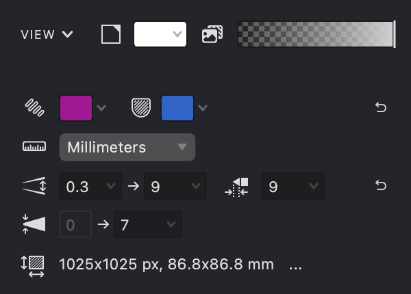

Vexy Lines provides several options to customize how your document and artwork are displayed during the creation process. Adjusting these settings can help you focus on specific elements, improve editing accuracy, and tailor the workspace to your preference.

## Toolbar View Controls

The main **Toolbar** includes quick-access buttons to toggle the visibility of key elements:

{width="177"}

-01.svg) **Highlight Selection** 
When enabled, highlights the edges of current selection.

-01.svg) **Highlight Masks**
Highlight the edges of masks and the grid lines of meshes.

 **Show Fills**
Toggles the visibility of all generated Fill artwork on the Canvas. Turn this off to focus solely on Masks or Source Images.

 **Show Source**
Toggles the visibility of any Source Images associated with the document or active Group.

## View Menu

The **View** option in the main menu bar provides access to a broader range of display settings, including:

*   Zoom level controls and navigation commands.
*   Options to show or hide specific user interface panels (like Properties, Layers, etc.).
*   Settings for the workspace background color.
*   Manual refresh commands and rendering quality options (if applicable).

## Properties Panel (View Section)

The **Properties Panel** contains a dedicated **VIEW** section offering more granular control over display elements:

{width="277"}

### Source Image Opacity

Adjust the transparency level of the visible Source Image.

### Visual Highlights

Customize the colors used to highlight selected Fill edges and Mask boundaries for better visibility against your artwork.

### Background Color
Set a custom background color for the canvas area, which can be helpful for contrast when working with specific image or fill colors.

**Important:** Remember that all view settings other than **Background Color** only affect the display *while you are working* in Vexy Lines. They do not alter the content or appearance of your final exported files.