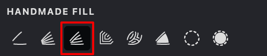
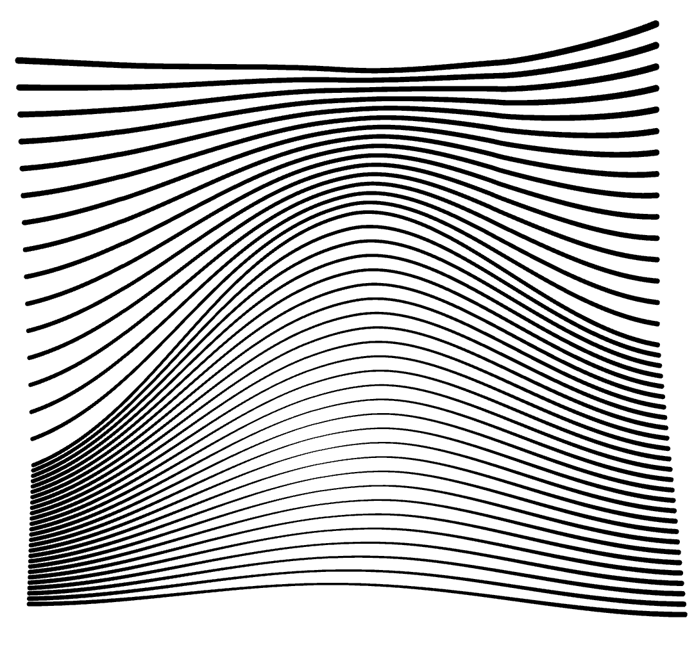
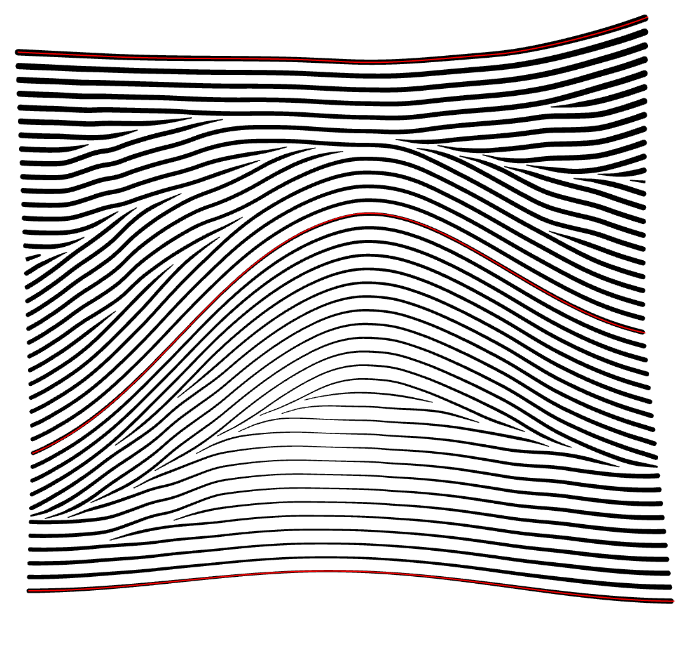
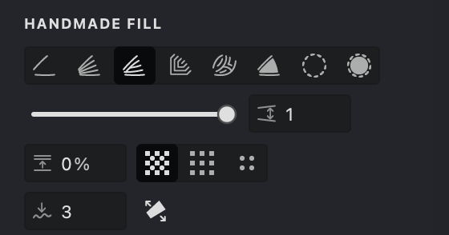

In this filling approach, the behavior is akin to the "Blended" method, but with a key distinction: the fill lines can break and reappear to ensure a consistent fill density. Unlike in "Blended" where lines may converge at narrow points, here they simply disconnect. Moreover, new fill lines are introduced in wider sections to occupy any vacant space, enhancing the uniformity of the fill.

## Enable and Customize a Balanced Fill
{width="300"}

To enable the "Balanced" mode in the Handmade fill, follow these steps:

1. Make sure that you have selected the Handmade fill type.
2. Go to the "HANDMADE FILL" tab.
3. Activate the blending mode by toggling the "Balanced" button.

| blended |  balanced |
| --- | --- |
|{width="300"}|{width="300"}|

## Fill Parameters
{width="300"}

 **Interval** ([units](/v1/docs/units)): Controls the distance between strokes. Smaller values bring the strokes closer, while larger values space them out.

 **Render Even/Odd Strokes**: Add to the fill all the strokes that have an even AND odd ordinal number.

 **Render Only Odd/Even Strokes**: Add to the fill only the strokes that have an even OR odd ordinal number.

 **Smoothness**: Use this parameter to refine the flow of lines and curves, eliminating jagged edges for a polished look.

 **Extending**: extends the strokes beyond the basic curves.

### Interval
1. Locate the **Interval**  parameter.
2. Use the slider or manually enter a value.

> Decreasing intervals darkens the image, while increasing intervals lightens it.

$~$

| balanced interval: 0.5 | balanced interval: 1 | balanced interval:1.5 |
| --- | --- | --- |
|{width="300"}|.png){width="300"}|.png){width="300"}|

### Render Even/Odd Strokes
1. Navigate to the HALFTONE FILL tab and find the buttons for controlling Even & Odd Strokes   modes.
2. These buttons can be toggled on or off based on your preference.
3. Activating these options will either include strokes at both **Even & Odd** positions or restrict them to just **Even** or **Odd** positions.

| even & odd | odd | even |
| --- | --- | --- |
|{width="300"}|.png){width="300"}|.png){width="300"}|

### Smoothness
1. Find the **Smoothness**  option in the HANDMADE FILL tab.
2. Modify the smoothness level by sliding the slider or inputting a desired value.
3. Increasing this setting will result in smoother transitions between strokes in the fill.

| smoothness: 0 | smoothness: 15 | smoothness: 30 |
| --- | --- | --- |
|{width="300"}|.png){width="300"}|.png){width="300"}|

### Extending

1. Locate the **Extending**  option in the HANDMADE FILL tab.
2. Activate this feature by toggling the button.
3. When enabled, the strokes in the fill will no longer be restricted by the basic contours and will extend beyond them.

| extending: off |  extending: on | extending: on |
| --- | --- | --- |
|{width="300"}|.png){width="300"}|.png){width="300"}|

