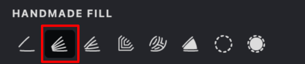
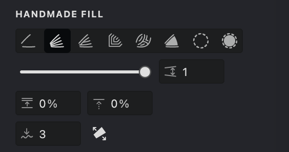
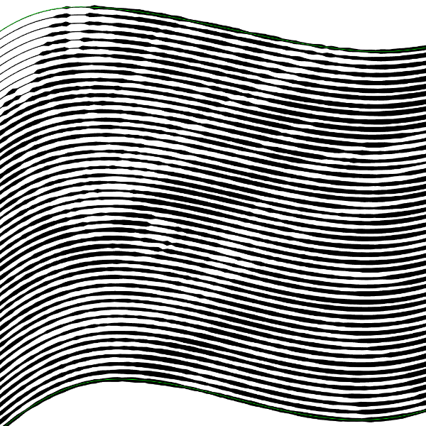
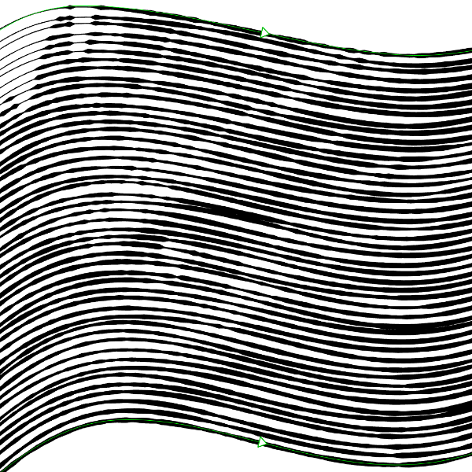
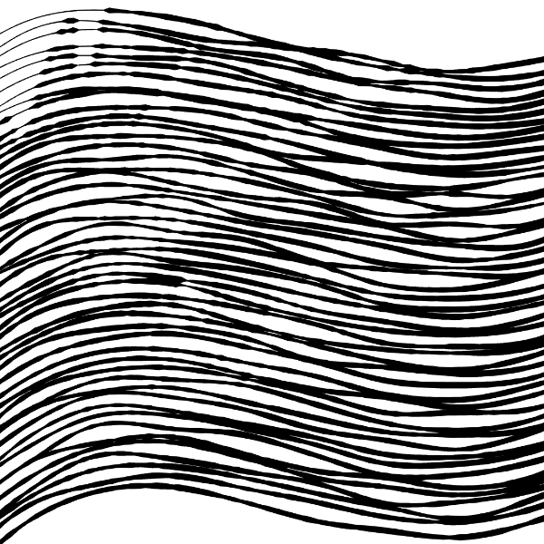

To create and evenly distribute strokes between the contours you have drawn (the basic ones), the **Blend** mode is provided in the **Handmade** fill. Using the parameters of this fill, you can control the smoothness and density of the strokes distribution. There is also an **Extending** parameter in the fill, when enabled, strokes will extend beyond the base contours. When using this option, even one basic contour may be sufficient.

If you move one of the original contours or change the reference point of the original contour, the strokes in the distribution will change accordingly. In addition, new strokes in the transition between the base contours will not have their own reference points.
> If needed, you can break down the strokes into individual contours that will be available for editing.

## Enable and Customize a Blended Fill
{width="300"}

To enable the **Blended** mode in the **Handmade** fill, follow these steps:

1. Make sure that you have selected the Handmade fill type.
2. Go to the **HANDMADE FILL** tab.
3. Activate the blending mode by toggling the **Blended**  button.

| blended: off |  blended: on |
| --- | --- |
|{width="300"}|.png){width="300"}|

### Fill Parameters:

{width="300"}

 **Interval** ([units](/v1/docs/units)): Controls the distance between strokes. Smaller values bring the strokes closer, while larger values space them out.

 **Randomization** (%): Introduces a random variation to the interval distances, enhancing the strokes' natural appearance.

 **Shift** (%): Adjusts the "phase" of the fill pattern by offsetting the first stroke in a direction orthogonal to the strokes. This nuanced adjustment alters the pattern's overall layout.

 **Smoothness**: Use this parameter to refine the flow of lines and curves, eliminating jagged edges for a polished look.

 **Extending**: extends the strokes beyond the basic curves.

In the **Handmade** fill with **Blend** mode, **Allocation Controls** come into play. These are small triangles situated directly on the base curves. Each base curve can have only one such control. The spacing between the lines in the fill is determined by invisible lines connecting these controls. Specifically, the gap between two adjacent strokes is set by the distance between their intersection points with this invisible line. 

You have the freedom to move these controls along the contour, allowing you to fine-tune the fill density between each pair of base contours.

### Interval
1. Locate the **Interval**  parameter.
2. Use the slider or manually enter a value.

> Decreasing intervals darkens the image, while increasing intervals lightens it.

$~$

| blended interval: 1 | blended interval: 1.5 | blended interval: 2 |
| --- | --- | --- |
|{width="300"}|.png){width="300"}|.png){width="300"}|

### Randomization
1.  Find the **Randomization**  setting.
2.  Adjust the slider or enter a percentage to add variation to stroke spacing.

| Randomization: 10% | Randomization: 50% | Randomization: 100% |
| :----------------- | :----------------- | :------------------ |
| {width="300"}|{width="300"}|{width="300"}|

### Shift
1. Locate the **Shift**  parameter.
2. Use the slider or manually enter a value.
3. The **Shift** adjusts the phase of the fill pattern, affecting the position of the first stroke relative to its original position.

| shift: 10% | shift: 50% | shift: 90% |
| --- | --- | --- |
|{width="300"}|.png){width="300"}|.png){width="300"}|

### Smoothness
1. Find the **Smoothness** option in the **HANDMADE FILL** tab.
2. Modify the smoothness level by sliding the slider or inputting a desired value.
3. Increasing this setting will result in smoother transitions between strokes in the fill.

| smoothness: 0 | smoothness: 15 | smoothness: 30 |
| --- | --- | --- |
|{width="300"}|.png){width="300"}|.png){width="300"}|

### Extending

1. Locate the **Extending**  option in the HANDMADE FILL tab.
2. Activate this feature by toggling the button.
3. When enabled, the strokes in the fill will no longer be restricted by the basic contours and will extend beyond them.

| extending: off |  extending: on | extending: on |
| --- | --- | --- |
|{width="300"}|.png){width="300"}|.png){width="300"}|

### Allocation controls

{width="92"}

1. Ensure that the selected **Handmade** fill is set to **Blend** mode.
2. Use your mouse to drag the control along the base contour.
3. As a result, the fill will update to reflect the adjusted intervals.
> Note: Allocation controls are only available if there is more than one base contour in the fill.

$~$

|  |  |
| --- | --- |
|{width="300"}|.png){width="300"}|
