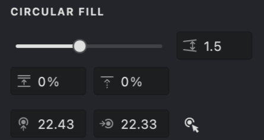
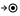

The **Circular** fill creates a series of nested circles that start from a central point.

{width="300"}

## Fill Parameters
{width="300"}
 **Interval** ([units](/v1/docs/units)): Specifies the space between the concentric circles. Lower values produce tighter circles, while higher values spread them out.

 **Randomization** (%): Adds random variation to the interval distances, giving the pattern a more organic look.

 **Shift** (%): Adjusts the phase of the fill pattern by shifting the strokes. A 0% shift means no offset, while 100% produces an offset equal to the interval between strokes.

 **Center** ([units](/v1/docs/units)): Defines the X and Y coordinates of the fill's central point for precise placement.

By adjusting these settings, you can create unique and detailed designs to enhance your digital artwork.

## Add and Customize a Circular Fill

To create a new Circular fill, follow the steps in our [Add a Fill](vb://article/adding-a-fill-1) guide. When the pop-up menu appears, select the "Circular" fill type.

-01.png){width="160"}

Similar to the [Linear](vb://article/linear-fill) fill type, the Circular fill shares the first three parameters — **Interval**, **Randomization**, and **Shift**. It also includes an additional control: the **Center** parameter, which works like the one in the Radial fill type.

### Interval
1. Find the **Interval**  parameter.
2. Adjust the distance between circles by using the slider or entering a value directly.

| interval: 1 | interval: 2 | interval: 3 |
| --- | --- | --- |
|{width="300"}|.png){width="300"}|.jpg){width="300"}|

### Randomization
1. Locate the **Randomization**  parameter.
2. Adjust the slider or input a value manually.
3. Increasing this value makes the spacing between circles less uniform.

| randomization: 10% | randomization: 50% | randomization: 100% |
| --- | --- | --- |
|-01.png){width="300"}|.png){width="300"}|.png){width="300"}|

### Shift
1. Find the **Shift**  wave parameter.
2. Adjust the slider or enter a value manually.
3. The Shift parameter modifies the phase of the pattern, changing the starting position of the strokes.

| shift: 25% | shift: 50% | shift: 90% |
| --- | --- | --- |
|-01.jpg){width="300"}|.jpg){width="300"}|.jpg){width="300"}|

### Center
1. Find the **Center**  options.
2. Two input fields allow you to set the horizontal and vertical coordinates of the fill's center.
3. Adjust these coordinates using the drop-down slider or by entering the values directly.
4. Alternatively, use the "Interactive Center Locator" feature by clicking its button and then clicking on the desired point in your image.

| center: 0,0 | center: 40,40 | center: 40,70 |
| --- | --- | --- |
|-01.png){width="300"}|.png){width="300"}|.png){width="300"}|

## Stroke Properties
Other properties apply to this fill, which you can read about in the relevant articles:
*   [Color](vb://article/color-5)
*   [Image Threshold](vb://article/image-threshold-2)
*   [Stroke Thickness](vb://article/stroke-thickness-2)
*   [Dashed Line](vb://article/dashed-line-1)
*   [Stroke Caps](vb://article/stroke-caps-1)
*   [Emboss](vb://article/emboss-1)
*   [Overlap Control](vb://article/overlap)

## Link to Example
You can use the example file for this article [UM3-Fills-Circular.lines](https://i.vexy.art/vl/examples/UM3-Fills-Circular.lines) to practice adjusting "Circular" fill parameters.