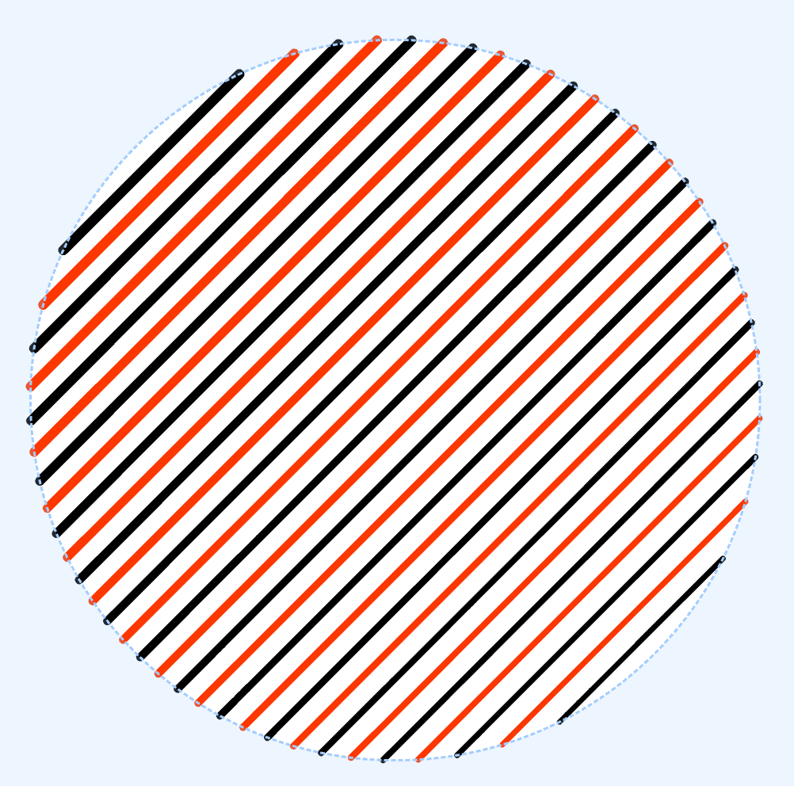
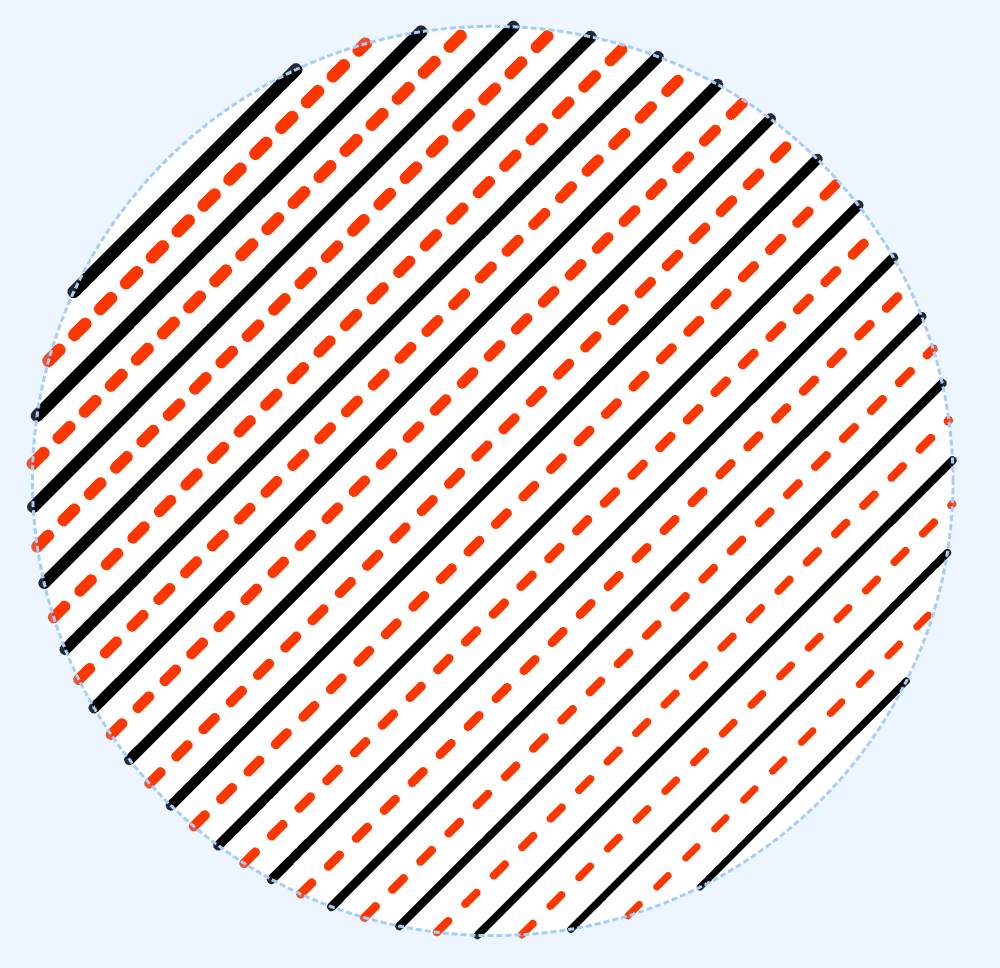
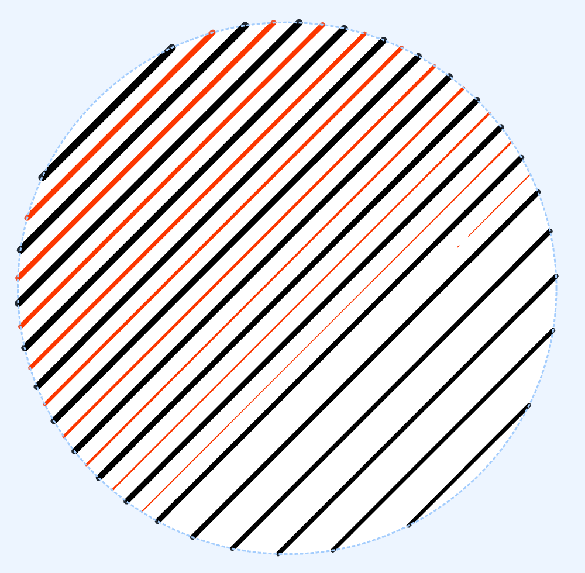
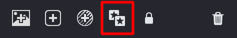
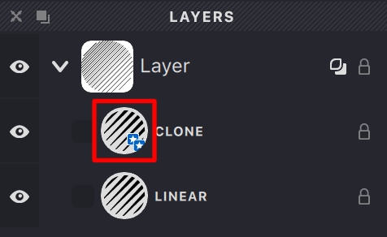
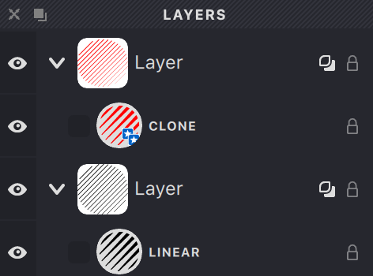
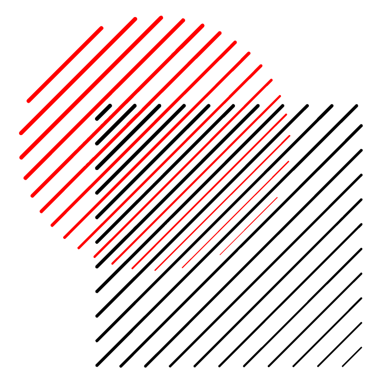
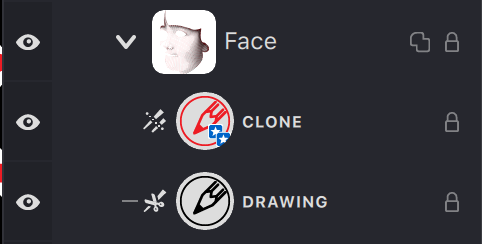
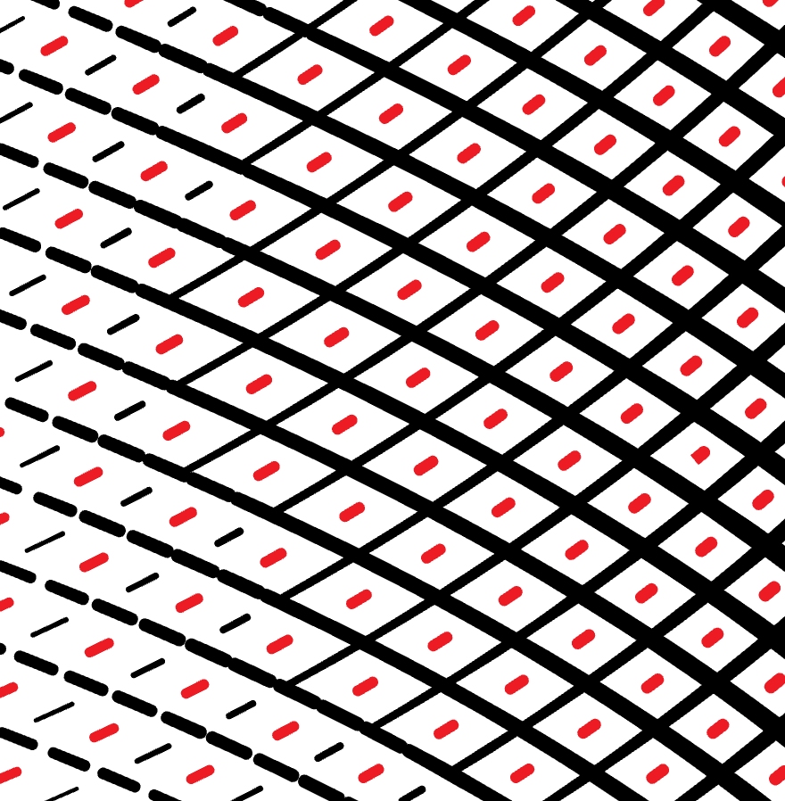
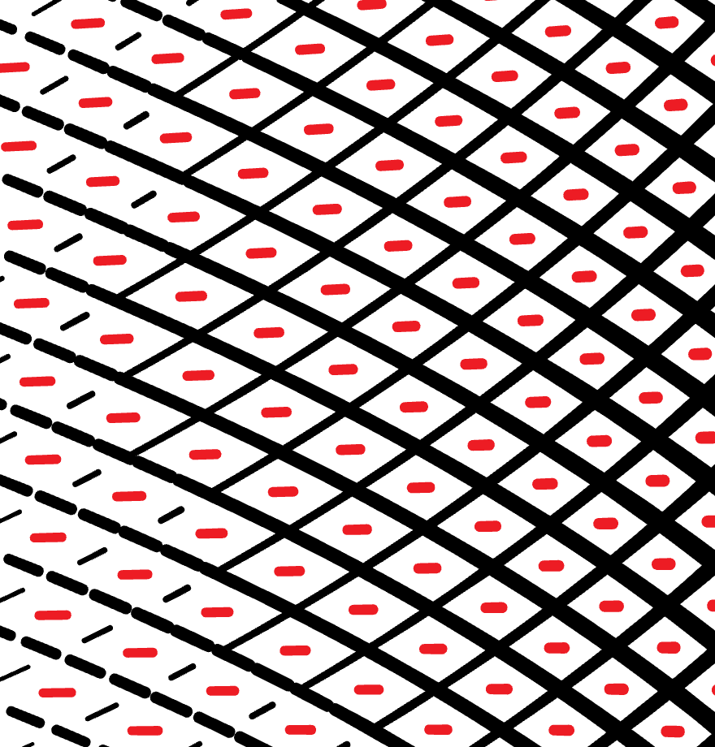

A **Clone** in Vexy Lines is a unique copy of an object. When you create a clone, it retains certain properties from the original object. If these properties are modified in the original, the clone will automatically update to reflect those changes.

However, while the clone maintains some shared properties with the original, it can also have independent attributes. For instance, if the original object has lines set in a specific pattern and you adjust their direction or spacing, the clone will adapt accordingly. But attributes like color or line shift in the clone can be altered without affecting the original. This allows for a balance between uniformity and customization.

Clone with changed **color**.
{width="500"}

Clone with changed **dashes**.
{width="500"}

Clone with changed **image threshold**.
{width="500"}

In Vexy Lines, only the following fill types can be cloned: Linear, Wave, Circle, Spiral, and Handmade. For other fill types, a simple copy of the object will be created.

**To clone a fill:**
1. Select the desired fill.
2. Click the designated button on the Layers panel.

{width="237"}

Or use the **Fill -> Clone** option from the menu.

The cloned object in the Layers panel can be identified by the presence of the icon 
{width="238"}

The cloned fill can be moved to another Layer while preserving its link.

> Learn more about moving fills in the [Layers](/v1/docs/layers-2) panel description.

{width="236"}

The example shows 2 Layers with different masks, one containing the clone and the other the original object.
{width="383"}

Cloned fills are widely used in creating complex fill compositions using the Overlap Control mode.
{width="236"}

The red fill is a clone of a linear fill with the "Allow to be cutted" property enabled, along with the additional "Normal" property.
{width="440"}

**Allow to be cutted** with the additional **Auto** property.
{width="440"}

> You can read more about this fill property in this article [Overlap Control](/v1/docs/overlap-control-1)
