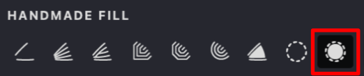
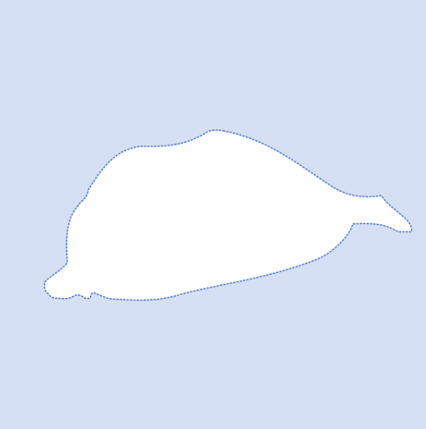
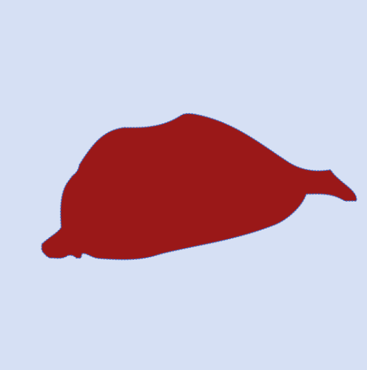

When activated, this function fills the selected mask with the current color, providing a smooth and even coverage.

{width="300"}

|  mask: off | filled mask: on  | 
| --- | --- |
|{width="300"}|{width="300"}|