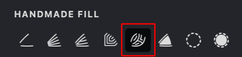
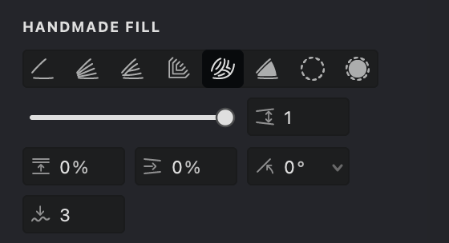
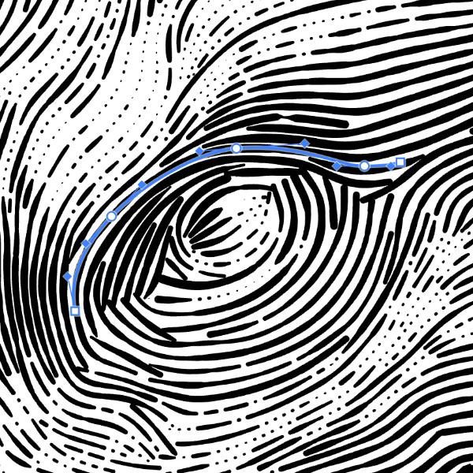
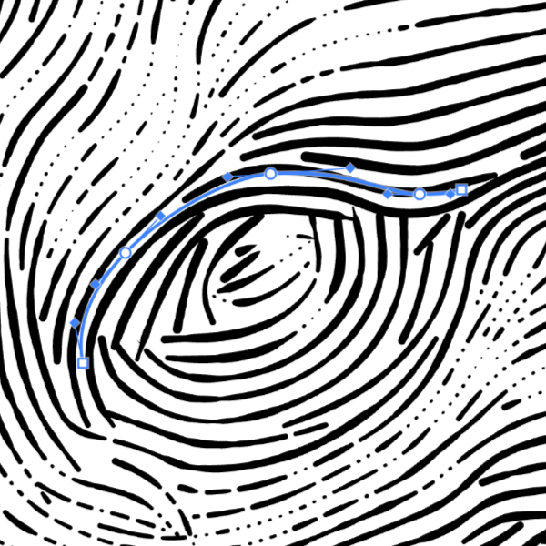
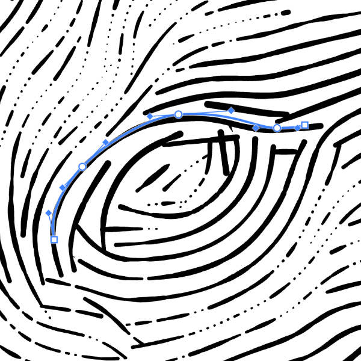
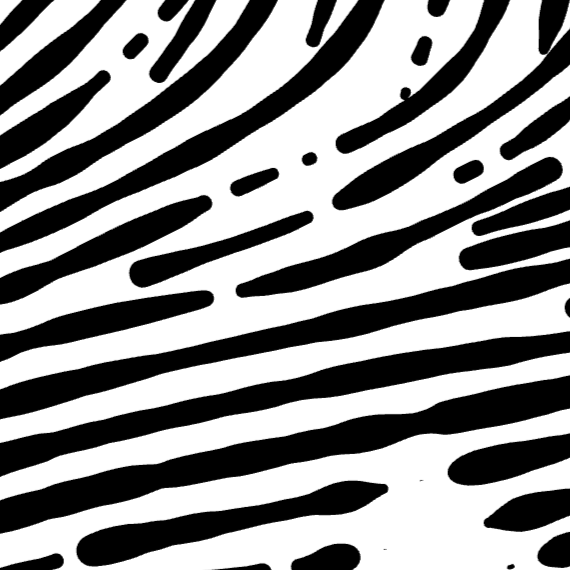
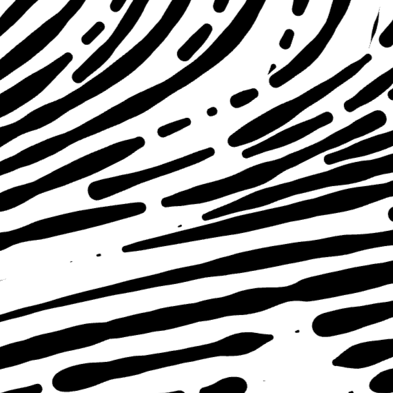
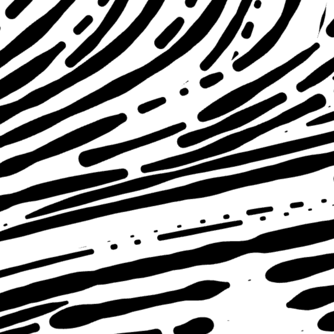

# Flowlines Fill

Flowlines builds a direction field from the underlying curves (a map that stores the local line angle across the image), then traces a dense set of field-guided isolines to cover the area with continuous, “flowing” strokes. 

The result can resemble woodgrain, fluid motion, or topographic linework—lines that naturally wrap around forms instead of following a fixed global angle. Because the field is just an angle per point, you can rotate or invert it to generate counter-flow and clean cross-hatching (e.g., +45°, −45°, or any custom direction) while keeping the same underlying structure.

## Enable and Customize a Flowlines Fill

{width="300"}

To enable the Flowlines mode for Handmade fill:

1. Select Handmade as the fill type.

2. Open the HANDMADE FILL tab.

3. Click the Flowlines button.

## Fill Parameters
{width="300"}

 **Interval** ([units](/v1/docs/units)): Defines the spacing between flowlines. Lower values place the lines closer together, while higher values increase the distance between them.

 **Randomization** (%): Adds controlled randomness to the spacing of the flowlines, creating a more organic and natural-looking result.

 **Smoothness**: Adjusts how smoothly the flowlines follow their paths, reducing sharp transitions and producing cleaner, more fluid curves.

 **Angle** (°): Sets the overall direction of the flowlines. Modify the angle to align them with the image structure or the desired visual flow.

 **Push strength**(%): Controls how strongly strokes push through dense hatching, allowing them to extend deeper between nearby strokes.

### Interval
1. Find the **Interval**  parameter.
2. Adjust the value using the slider or enter it manually.

> Smaller intervals produce denser, darker flowlines with more detail, whereas larger intervals create a lighter appearance with reduced detail.

$ $

| interval: 1 | interval: 1.5 | interval: 2 |
| --- | --- | --- |
|{width="300"}|{width="300"}|{width="300"}|

### Adjusting Randomization

1.  Locate the **Randomization**  setting.
2.  Use the slider or enter a percentage value to introduce variation in stroke spacing.

| randomization: 10% | randomization: 50% | randomization: 100% |
| :----------------- | :----------------- | :------------------ |
|{width="300"}|{width="300"}|{width="300"}|

### Smoothness
1. Find the  **Smoothness** option.
2. Adjust the value using the slider or by entering a number manually.
3. Higher values produce smoother transitions between the fill strokes.

### Adjusting Angle

1.  Find the **Angle**  setting.
2.  Use the circular dial control or enter a specific angle in degrees.

| angle: 0&deg; | angle: 90&deg; | angle: -45&deg; |
| :------------ | :------------ | :------------ |
|{width="300"}|{width="300"}|{width="300"}|

### Setting the Push <!--@Z7LM{-->Strength<!--@Z7LM}-->

1.  Find the **Push Strength**  parameter.
2.  Adjust the value using the control or enter a value manually.

Higher **Push Strength** lets strokes go farther between nearby strokes. Lower values make strokes stop sooner when they meet other lines, creating a denser and more controlled result.

| push strength: 0% |  push strength: 50% |  push strength: 100% |
| :------------ | :------------ | :------------ |
|{width="300"}|{width="300"}|{width="300"}|
   