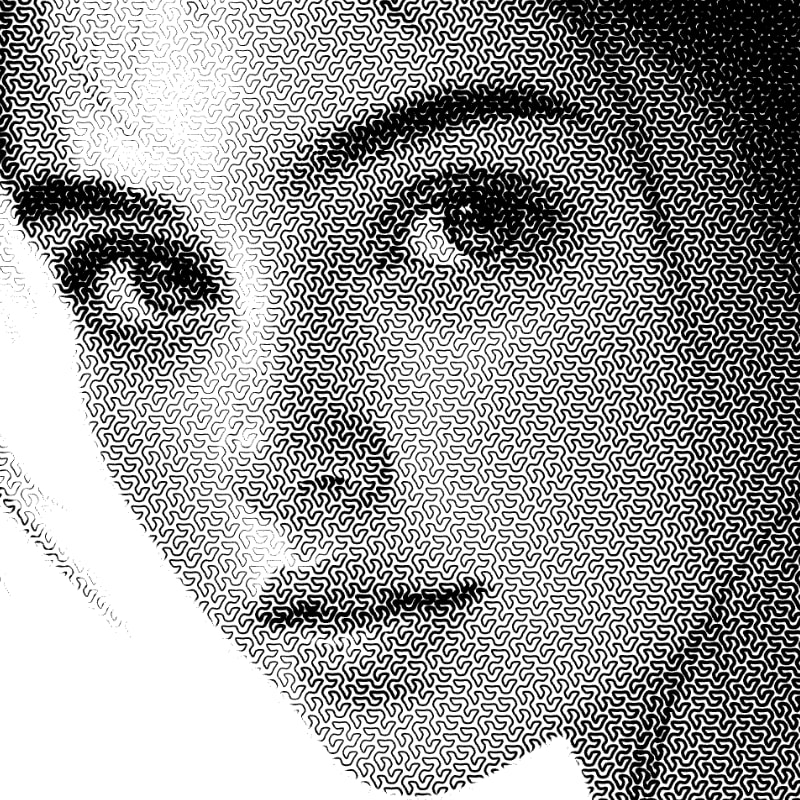
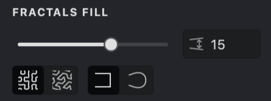
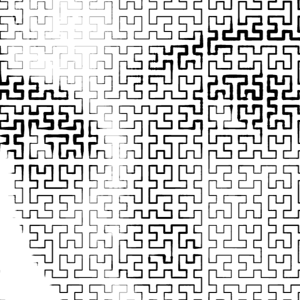
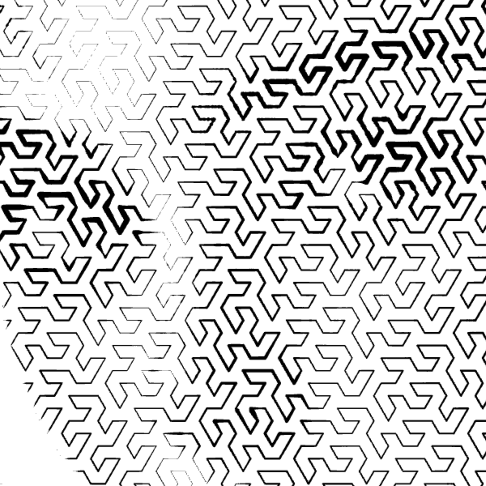
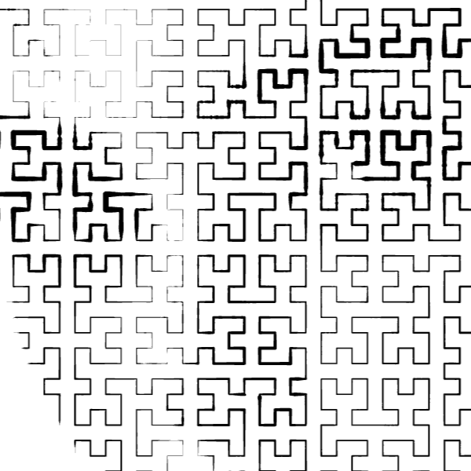
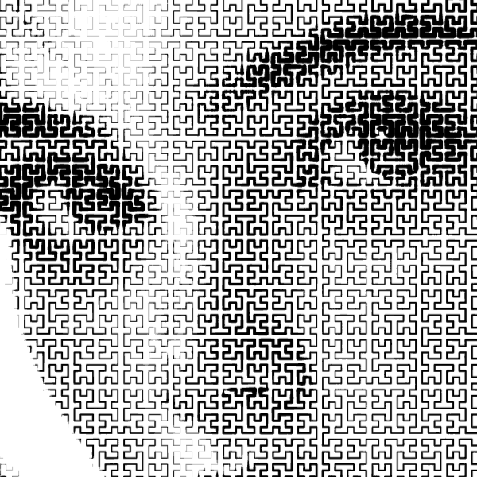
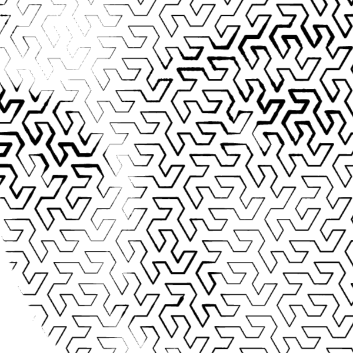
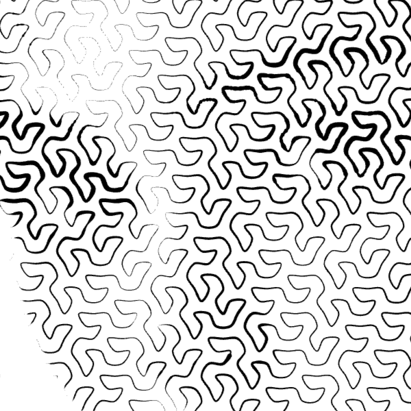
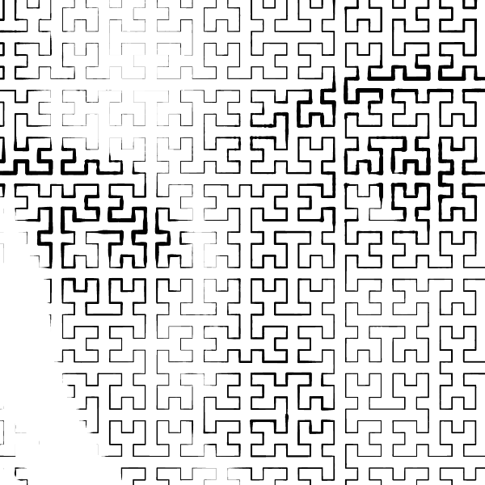
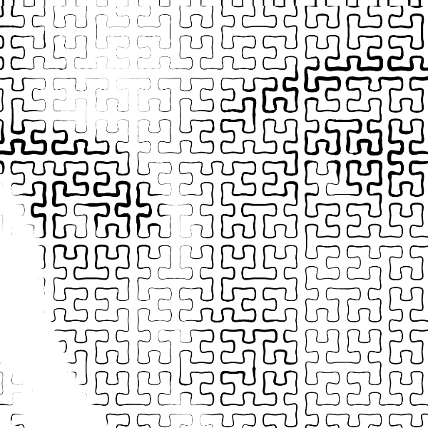

The **Fractals** fill type uses fractal math to create detailed stroke patterns. You can choose between **Hilbert** (square) or **Gosper** (triangular) curves.

{width="400"}

## Fill Parameters
{width="300"}
 **Interval**: Controls the density of the space-filling curve. A lower interval produces a denser, more detailed pattern; a higher interval produces a sparser one.

**Curve type**: Choose between **Hilbert**  (square-based) and **Gosper** (triangle-based) space-filling curves. Each produces a distinct visual structure: Huber fills the area with right-angle turns on a square grid, while Gosper follows a hexagonal path with 60-degree turns.

**Corners**: Switch between **Sharp** and **Round** corners. Sharp keeps the original angular turns of the fractal curve. Round smooths the corners into curves, giving the pattern a softer, more organic appearance.

## Creating and Customizing a Fractals Fill

To create a new **Fractals** fill, you can follow one of the methods outlined in our guide on [Add a Fill](vb://article/adding-a-fill-1). Once the pop-up menu appears, simply select "Fractals".

-01.png){height="" width="160"}

### Curve Type
Use the curve type selector to switch between **Huber** and **Gosper**. The two curve types produce very different visual structures and work well for different kinds of images.

|  Hilbert | Gosper |
| --- | --- |
|{width="300"}|{width="300"}|

### Interval
1. Navigate to the **Interval** setting.
2. Adjust the density by using the slider or manually entering a numerical value.
3. A lower interval produces a denser fill; a higher interval produces a sparser one.

|  Interval: 50 | Interval: 20 |
| --- | --- |
|{width="300"}|{width="300"}|

### Corners
Use the corners selector to switch between **Sharp** and **Round**. Sharp preserves the angular turns of the fractal curve. Round smooths the turns into curves for a softer look.

|  Sharp | Rounded |
| --- | --- |
|{width="300"}|{width="300"}|
|{width="300"}|{width="300"}|

## Stroke Properties
Other properties apply to this fill, which you can read about in the relevant articles:
*   [Color](vb://article/color-5)
*   [Image Threshold](vb://article/image-threshold-2)
*   [Stroke Thickness](vb://article/stroke-thickness-2)
*   [Dashed Line](vb://article/dashed-line-1)
*   [Stroke Caps](vb://article/stroke-caps-1)
*   [Emboss](vb://article/emboss-1)
*   [Overlap Control](vb://article/overlap)
## Link to Example
You can use the example file for this article [UM3-Fills-Fractals.lines](https://www.tracexz.com/um3/UM3-Fills-Fractals.lines) to practice adjusting Fractals fill parameters.
