The **Halftone** fill technique transforms your artwork by arranging dots or geometric shapes in a specific pattern. It uses the tonal values of your original image to vary the density and size of the dots, creating an engaging effect that mimics shading and gradients.

#### Grid-Based Halftone
-01.png){width="400"}
    
In a grid-based halftone, dots are arranged in a fixed grid. Adjust the density and shape of these dots to fine-tune the shading and texture in your printed artwork.

#### Randomised Halftone
-01.png){width="400"}

With the randomised halftone, dot placement is guided by the tonal values of your image, offering a more organic and nuanced representation of shading.

#### Image Density <!--@IODZ{-->Halftone<!--@IODZ}-->
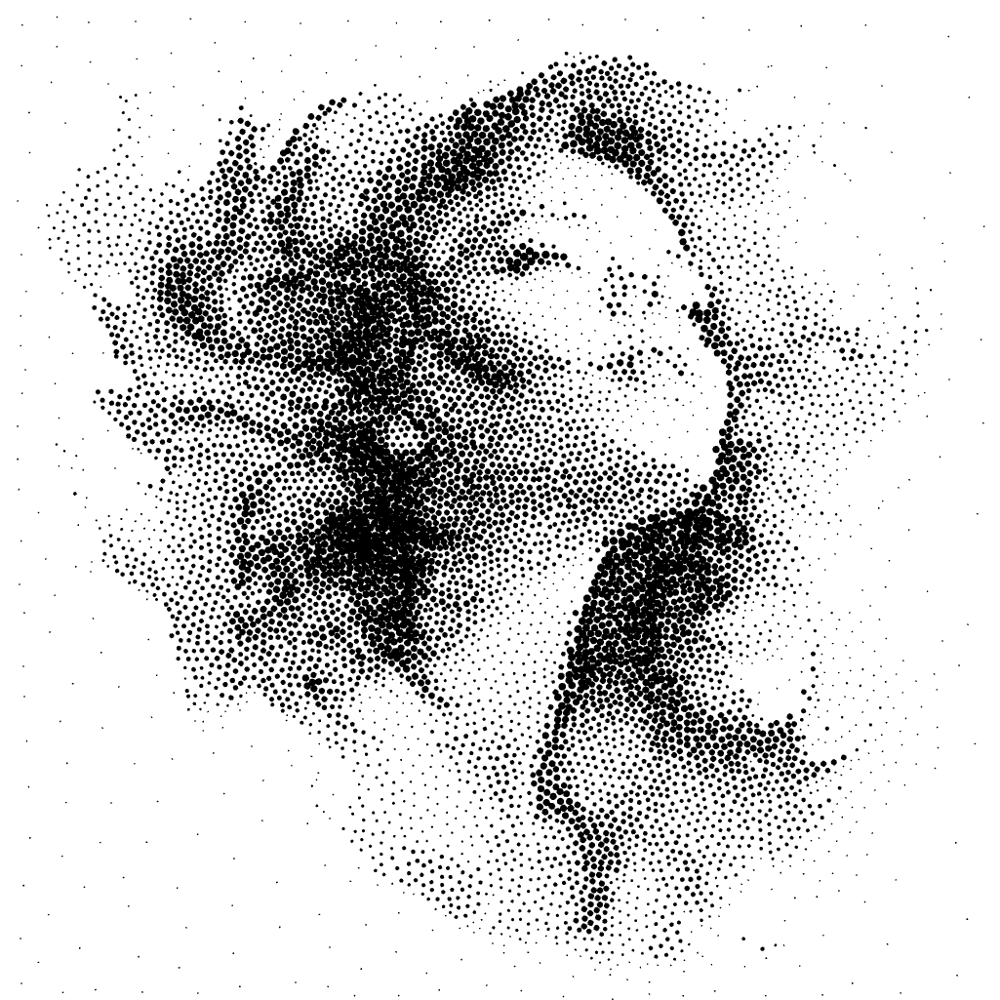{width="400"}
In an image density halftone, dots are distributed by image density, not in a grid pattern. This allows the dot placement to directly follow tonal variations, producing smooth shading and a more natural visual flow.

#### Dot Shapes
Halftone fills let you use a variety of dot shapes—from standard circles to custom SVG imports. Both the distribution and shape of the dots can be adjusted dynamically based on the image tone for precise shading and texture.

-01.png){width="400"}

#### Colors
Vector dots in a halftone fill can be either monochromatic or use colors from the original image, providing a detailed and vibrant representation.

-01.jpg){width="400"}

## Fill Parameters
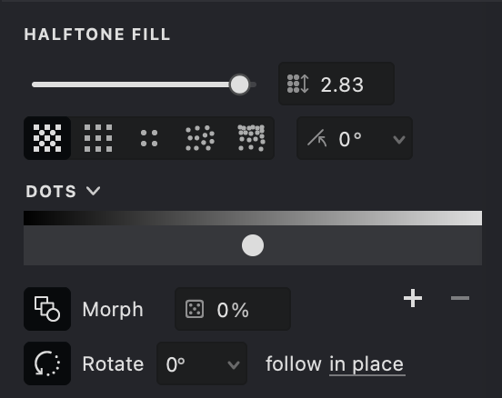{width="400"}
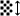 **Pattern Size** ([units](/v1/docs/units)): Sets the spacing between dots. Lower values create a denser fill, while higher values increase the space.

 **Angle** (°): Adjusts the rotation of the dot grid.

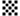 **Render Even/Odd Dots**: Displays dots on both even and odd grid positions for a fuller pattern.

 **Render Only Odd/Even Dots**: Restricts dot placement to either only odd or even grid positions, useful when applying layered fills.

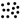 **Random Dot Distribution**: Activates a tone-based random placement of dots instead of a fixed grid.

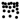 **Image Density Halftone**: Dots are distributed by image density, not in a grid pattern.

 **Contrast**: This parameter controls the contrast of the fill.

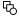 **Morphing**: When active and using compatible dot shapes, this option creates smooth transitions between shapes based on tone. If disabled, each dot remains unchanged.

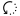 **Dot Rotation** (°): Sets the rotation for individual dots within the pattern.

 **Dot Randomization** (%): Introduces subtle variations to point shapes, creating a more natural and less mechanical appearance.

 **Add/Remove Dot Shape**: Use these controls to manage the dot shapes in your fill list.

By adjusting these parameters in Vexy Lines, you can precisely control your Halftone fill effect. This approach is ideal for replicating continuous-tone images using limited ink colors while providing customizable shading and texture.

## Add and Customize a Halftone Fill

To add a Halftone fill to your design, refer to our [Add a Fill](vb://article/adding-a-fill-1) guide. After opening the menu, select "Halftone" as your fill type.

-01.png){width="160"}

### Pattern Size
1. Navigate to the **Pattern Size**  option.
2. Use the slider or input a numerical value to adjust the spacing between the dots.
3. A lower value reduces the space between dots, increasing detail.

| size: 0.3 | size: 0.5 | size: 1 |
| --- | --- | --- |
|.jpg){width="300"}|.jpg){width="300"}|.jpg){width="300"}|

### Angle
1. Go to the **Angle**  option.
2. Use the slider or manually enter a value to adjust the rotation of the dot grid.

| angle: 0 | angle: 15 | angle: 45 |
| --- | --- | --- |
|{width="300"}|.jpg){width="300"}|.jpg){width="300"}|

### Render Even/Odd Dots
1. In the **HALFTONE FILL** tab, locate the controls for **Even & Odd Dots**  .
2. Toggle these options to either display dots on both even and odd nodes or restrict them to one set.
3. This setting is useful for creating layered fill effects with different dot shapes.

| even & odd | odd | even |
| --- | --- | --- |
|{width="300"}|.png){width="300"}|.png){width="300"}|

### Random Dot Distribution
1. Locate the **Distribute Dots Randomly**  option.
2. Toggle it on to enable tone-based random dot placement or off to use a fixed grid.

| random mode: off | random mode: on |
| --- | --- |
|.jpg){width="300"}|.jpg){width="300"}|

### Image Density <!--@YZ1J{-->Halftone<!--@YZ1J}-->
1. Locate the **Image Density Halftone**  option.
2. Toggle it on to enable image density dot placement.

| random mode: on | density mode: on |
| --- | --- |
|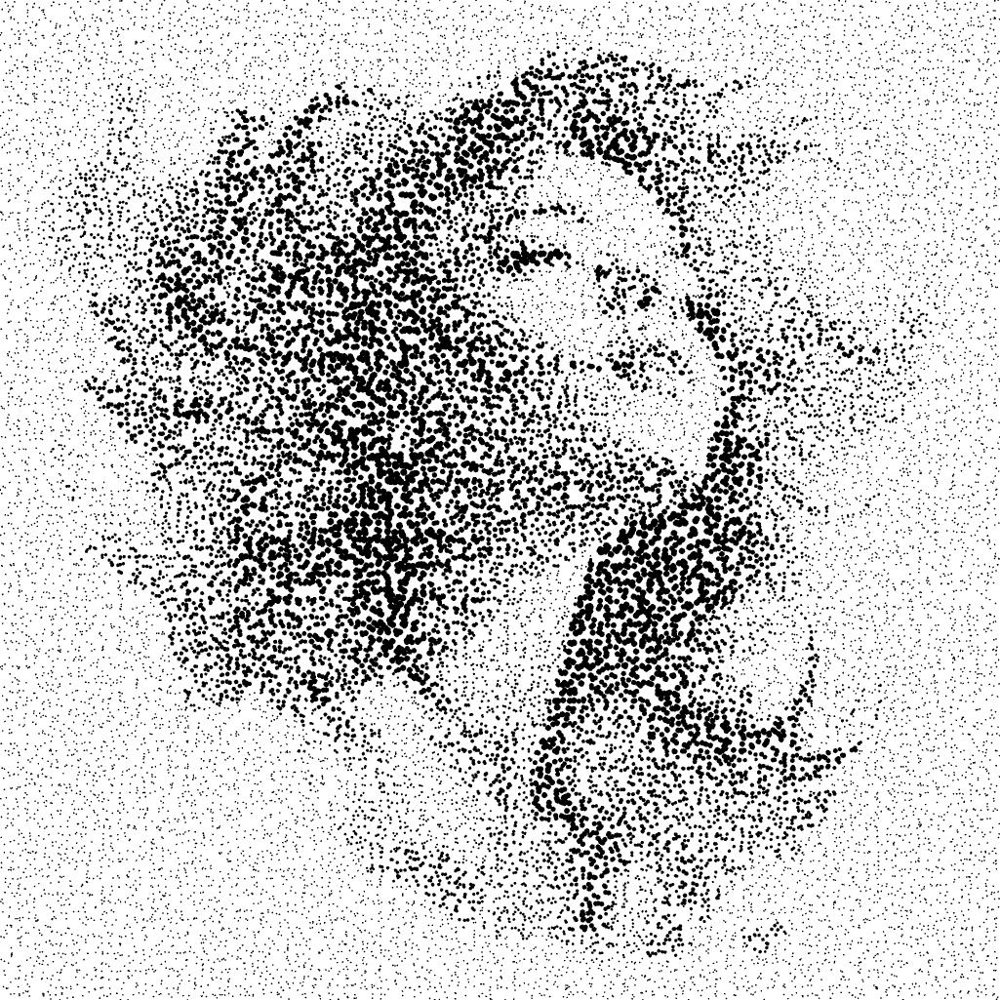{width="300"}|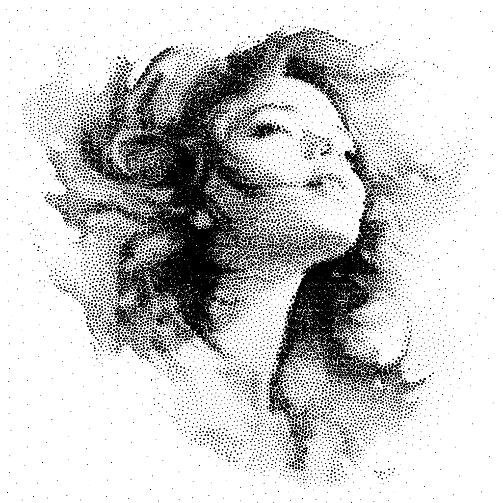{width="300"}|

### Morphing
1. In the **HALFTONE FILL** tab, find the **Morphing**  option.
2. Toggle it on to enable smooth transitions between compatible dot shapes based on tone. If disabled, each dot remains unchanged.

| morphing: on | morphing: off |
| --- | --- |
|.png){width="300"}|.png){width="300"}|

### Dot Rotation
1. Locate the **Dot Rotation**  option.
2. Toggle the button to enable dot rotation.
3. Once enabled, additional controls for adjusting the rotation angle will appear.
4. Use the slider or enter a specific value to set the desired rotation angle.
5. Next, choose the appropriate rotation mode. The available options determine how the dot shapes rotate:
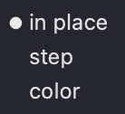{width="80"}
   - **In Place** - Dots have a fixed rotation.
   - **Follow Color** – Dot rotation varies based on the image's color information.
   - **Follow Step** – Dot rotation increments follow a fixed step value.

6. The dot shapes in your fill will now rotate according to the settings you've specified.

| rotation: off | follow color | follow step |
| --- | --- | --- |
|-01.png){width="300"}|.png){width="300"}|-01.png){width="300"}|

### Dot Randomisation
  **Dot Randomisation** feature adds slight variations to point shapes, reducing uniformity and giving the artwork a more natural, hand-drawn feel. It helps avoid a mechanical look while preserving the overall structure.

| 0% | 33% | 100% |
| --- | --- | --- |
|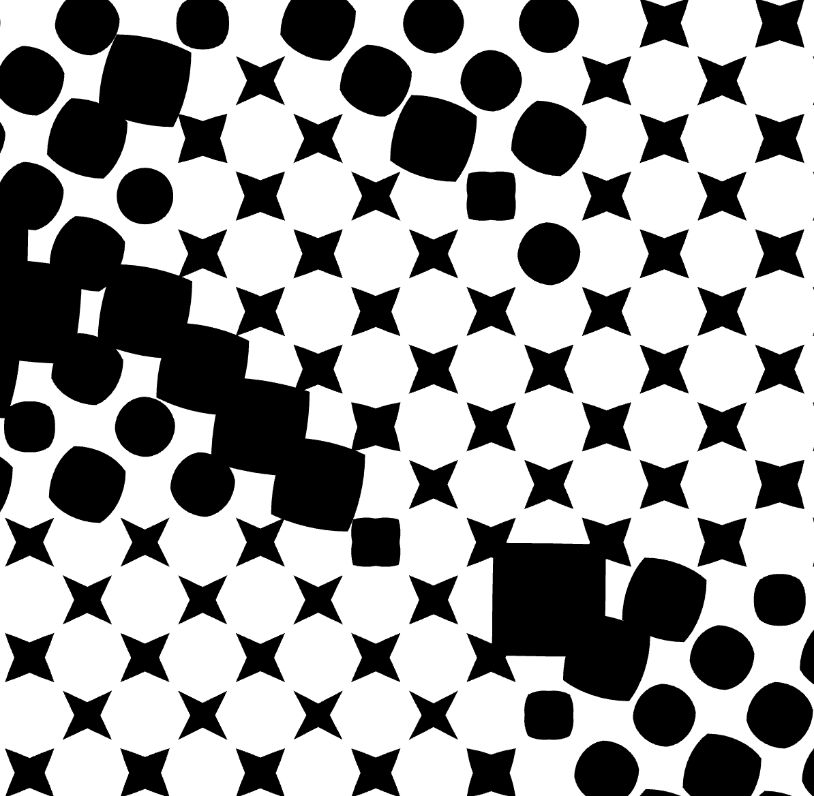{width="300"}|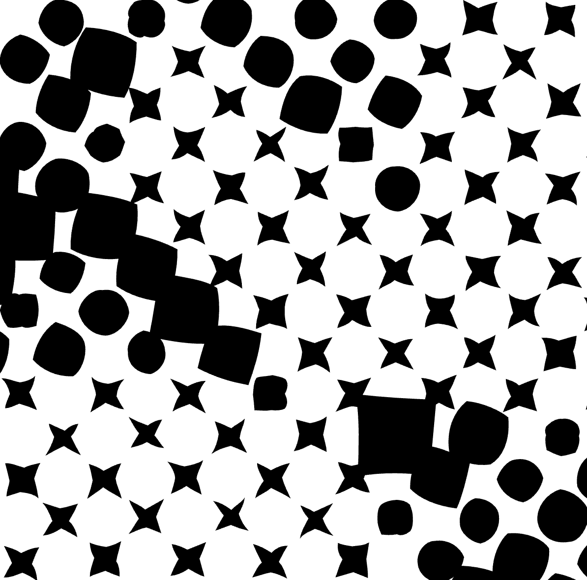{width="300"}|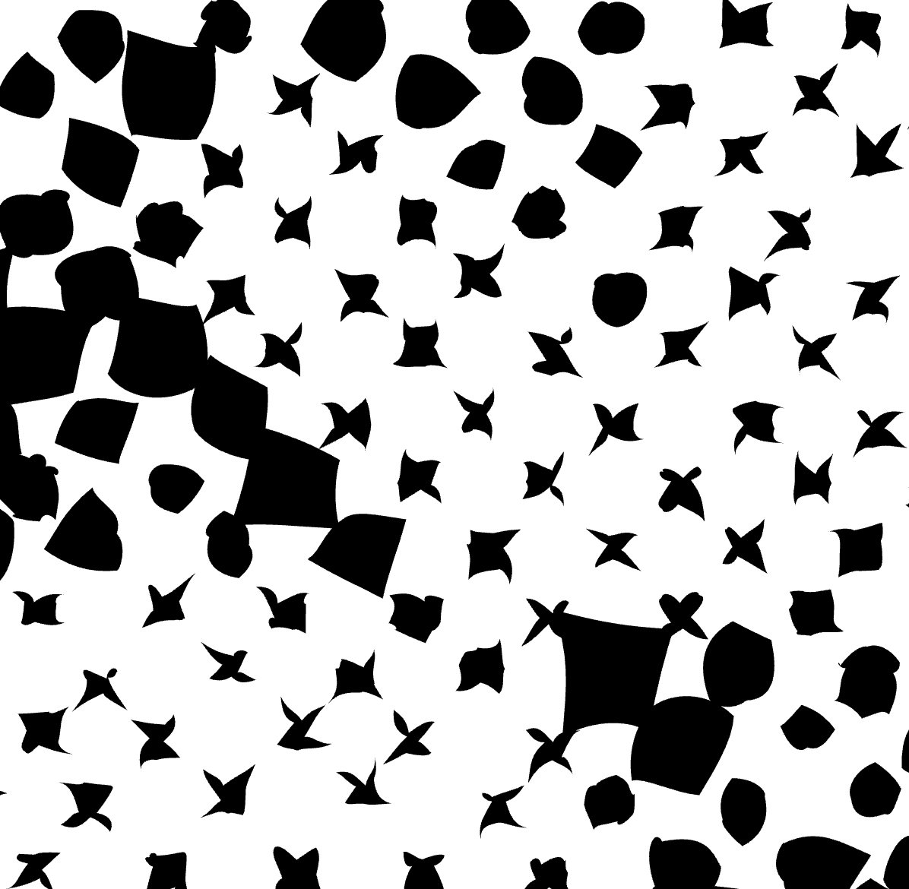{width="300"}|  

### Contrast
 Controls the contrast of the fill, adjusting the difference between light and dark areas. Higher contrast creates a sharper look, while lower contrast results in a softer appearance.
| 0% | 50% |
| --- | --- |
|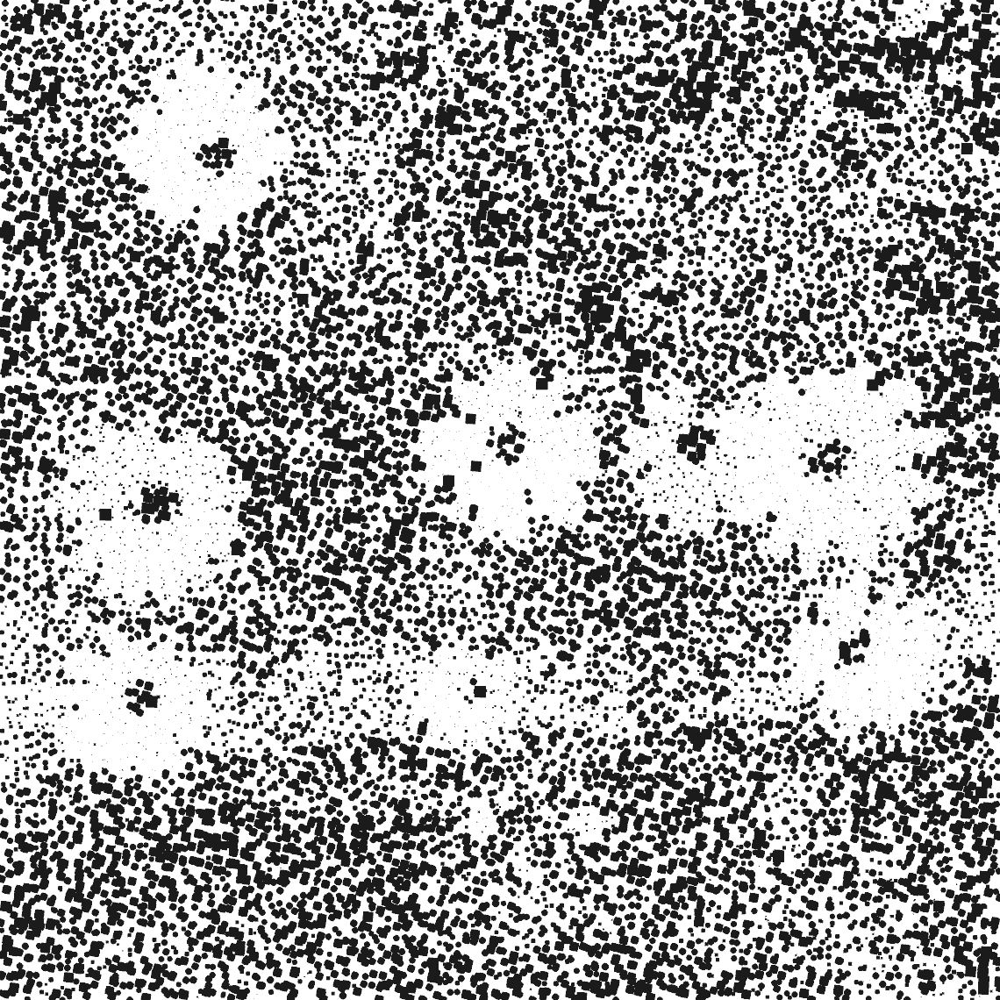{width="300"}|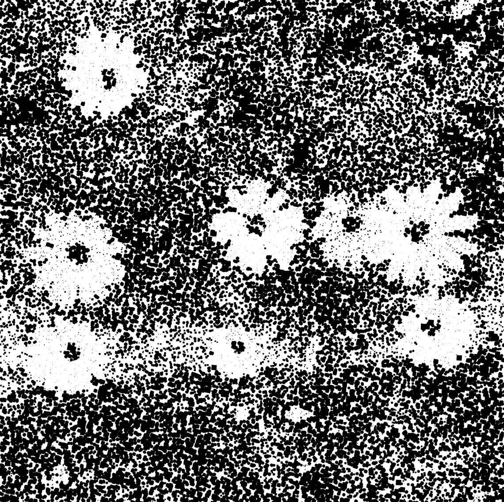{width="300"}|

### Add/Remove/Edit Dot Shapes
1. Locate the **"+"** and **"-"** buttons in the HALFTONE FILL tab. Use these buttons to add or remove dot shapes from the list.

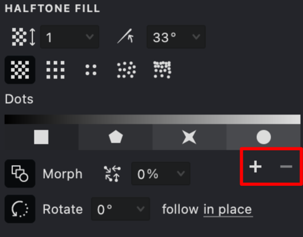{width="300"}

2. Select a predefined dot shape or choose **Custom** to upload your own SVG file.

-01.png){width="140"}

3. Each dot shape you add corresponds to a specific tonal range in the image.

{width="300"}

4. For custom shapes, ensure your SVG file contains a simple, closed line or curve.

5. To adjust the tonal representation, rearrange the order of the dot shapes by dragging them within the list.

| square | square + circle | square + circle + star |
| --- | --- | --- |
|{width="300"}|.png){width="300"}|.png){width="300"}|

> By adjusting these parameters you have precise control over your Halftone fill effect. This method is particularly useful for replicating continuous-tone images using limited ink colors while customizing shading and texture.

## Stroke Properties
Other properties applicable to this fill include:
*   [Color](vb://article/color-5)
*   [Image Threshold](vb://article/image-threshold-2)
*   [Stroke Thickness](vb://article/stroke-thickness-2)
*   [Overlap Control](vb://article/overlap)

## Link to Example
You can use the example file for this article [UM3-Fills-Halftone.lines](https://i.vexy.art/vl/examples/UM3-Fills-Halftone.lines) to practice adjusting Halftone fill parameters.