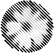
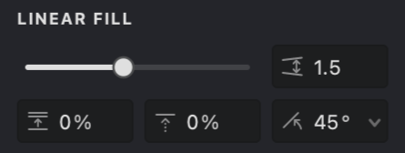

**Linear** fill creates patterns using parallel straight strokes, producing an engraving-like effect common in traditional printmaking. Each parameter offers specific control over the pattern's appearance and behavior, letting you achieve anything from subtle shading to bold, dramatic lines.

{width="300"}

## Linear Fill Settings

Adjust the Linear Fill using the settings found in the **Properties Panel** under the **LINEAR FILL** tab.

{width="300"}

Here's a breakdown of the main settings:

 **Interval** ([units](/v1/docs/units)): Sets the distance between adjacent strokes. Smaller values create denser, darker patterns, while larger values result in lighter, more spaced-out patterns.

 **Randomization** (%): Introduces slight variations to the stroke spacing. Higher values create a more irregular, organic look, reducing visual repetition.

 **Shift** (%): Offsets the entire pattern perpendicular to the stroke direction. This is useful for fine-tuning the pattern's position or aligning multiple overlapping fills.

 **Angle** (°): Controls the orientation of the strokes. Adjust the angle to match the contours or desired flow within your image.

## Adjusting Linear Fill Settings

To modify the Linear Fill, select it in the **Layers Panel** and use the controls in the **Properties Panel**.

### Adjusting Interval

1.  Find the **Interval**  setting.
2.  Drag the slider or enter a specific numerical value.

> **Tip:** Use Interval to control the perceived lightness or darkness of the filled area. Smaller intervals create darker tones.

| Interval: 0.5 | Interval: 1 | Interval: 2 |
| :------------ | :---------- | :---------- |
| -01.png){width="300"} | .png){width="300"} | .png){width="300"} |

### Adjusting Randomization

1.  Find the **Randomization**  setting.
2.  Adjust the slider or enter a percentage to add variation to stroke spacing.

| Randomization: 10% | Randomization: 50% | Randomization: 100% |
| :----------------- | :----------------- | :------------------ |
| .png){width="300"} | {width="300"} | .png){width="300"} |

### Adjusting Shift

1.  Find the **Shift**  setting.
2.  Adjust the slider or enter a percentage to offset the pattern's starting position relative to the stroke direction.

| Shift: 25% | Shift: 50% | Shift: 90% |
| :--------- | :--------- | :--------- |
| .jpg){width="300"} | .jpg){width="300"} | .jpg){width="300"} |

### Adjusting Angle

1.  Find the **Angle**  setting.
2.  Use the circular dial control or enter a specific angle in degrees.

| Angle: 45&deg; | Angle: 90&deg; | Angle: 0&deg; |
| :------------ | :------------ | :------------ |
| -01.jpg){width="300"} | .png){width="300"} | .png){width="300"} |

## Common Properties

**Linear Fill** also uses these common fill properties:

*   [Color](vb://article/color-5)
*   [Image Threshold](vb://article/image-threshold-2)
*   [Stroke Thickness](vb://article/stroke-thickness-2)
*   [Dashed Line](vb://article/dashed-line-1)
*   [Stroke Caps](vb://article/stroke-caps-1)
*   [Emboss](vb://article/emboss-1)
*   [Overlap Control](vb://article/overlap)

## Practice File

Experiment with the **Linear Fill** settings using this Vexy Lines file:
[UM3-Fills-Linear.lines](https://i.vexy.art/vl/examples/UM3-Fills-Linear.lines)
