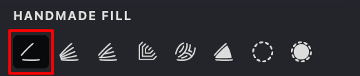
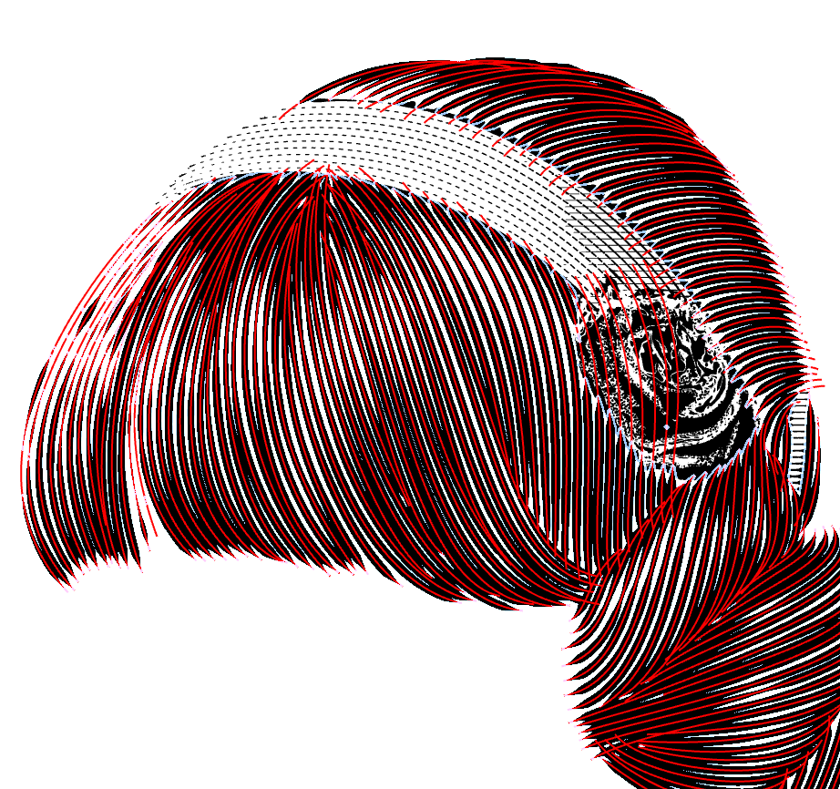
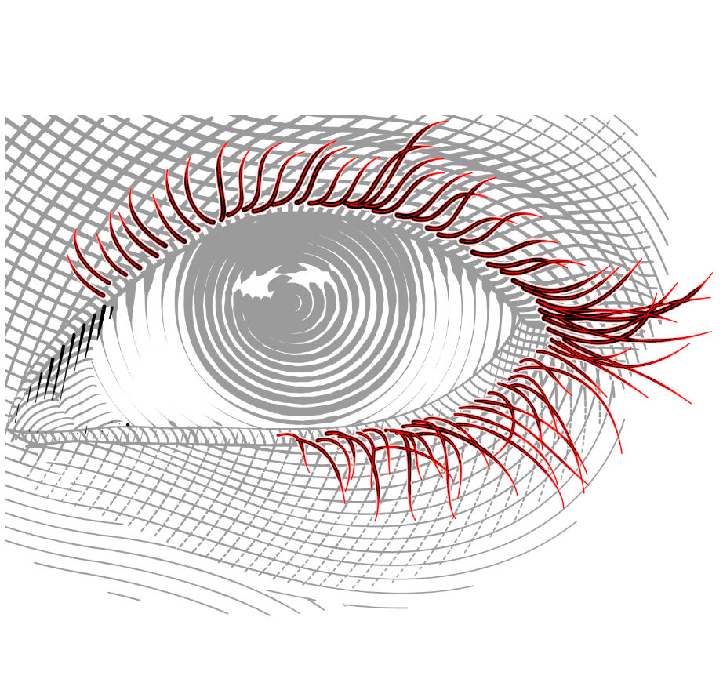
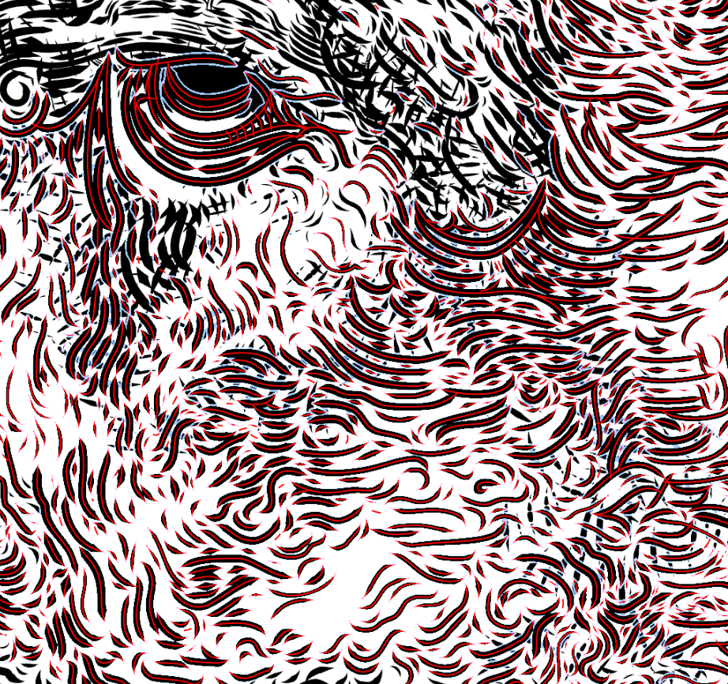

This method simply renders the manually drawn fill.

**To create or edit** a manual type of Handmade fill, ensure that you have selected your Handmade fill or follow the steps described in this topic: [Add a Handmade Fill](vb://article/adding-the-handmade-fill)

After creating, Handmade fills are automatically set to Manual mode. If you are in any other mode but want to switch to Manual — just click the button.

{width="300"}

|  |  |  |
| --- | --- | --- |
|{width="300"}|{width="300"}|{width="300"}|

