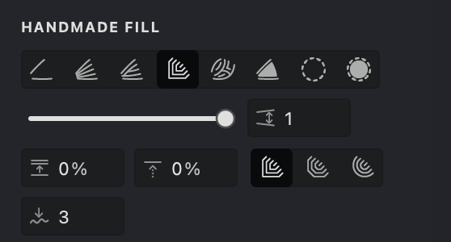

In this filling technique, every contour you draw extends by a distance set by the Interval parameter, ensuring a uniform fill across the entire image. This method guarantees that the gap between individual contours is never less than the specified Interval value.

There are three types of connection to choose from: **Miter**, **Bevel**, and **Rounded**. 

- In **Miter** connection, contours expand in a square shape, utilizing strictly vertical and horizontal lines to form the four sides of a square.
- **Bevel** connection sees the contour lines radiate outwards into eight sectors, resembling an octagon.
- **Round** connection allows the contour lines to spread out in concentric circles, similar to ripples created by drops on water.

Each extension type offers a unique aesthetic, allowing you to achieve the desired texture and depth in your artwork.

## Enable and Customize a Extended Fill

{width="300"}

To enable the "Extended" mode in the Handmade fill, please follow these steps:

1. Ensure that you have selected the Handmade fill type.
2. Navigate to the "HANDMADE FILL" tab.
3. Activate the propagation mode by clicking on the **Extended** button.

## Fill Parameters
{width="300"}

 **Interval** ([units](/v1/docs/units)): This setting allows you to adjust the distance between strokes. Decreasing the value will make the strokes closer together, while increasing the value will spread them out.

 **Randomization** (%): Introduces a random variation to the interval distances, enhancing the strokes' natural appearance.

 **Shift** (%): 
Altering the "phase" of the fill pattern by displacing the initial stroke in a direction perpendicular to the initial strokes. 

### Interval
1. Locate the **Interval**  parameter.
2. Use the slider or manually enter a value.

> Decreasing the intervals enhances the level of detail and darkens the image, whereas increasing the intervals lightens it but results in a loss of detail.

$ $

| interval: 1 | interval: 1.5 | interval: 2 |
| --- | --- | --- |
|.jpg){width="300"}|.jpg){width="300"}|.jpg){width="300"}|

### Randomization
1.  Find the **Randomization**  setting.
2.  Adjust the slider or enter a percentage to add variation to stroke spacing.
### Shift
1. Locate the **Shift**  parameter.
2. Use the slider or manually enter a value.
3. The **Shift** adjusts the phase of the fill pattern, affecting the position of the first stroke relative to its original position.

| shift: 15% | shift: 50% | shift: 75% |
| --- | --- | --- |
|{width="300"}|.jpg){width="300"}|.jpg){width="300"}|

### Extension type

1. Choose one out of three extension types: **Miter**, **Bevel**, or **Rounded**.
2. Fills will be created based on the selected extension type.

 **Miter**: create an extension of strokes with miter connections.

 **Bevel**: create an extension of strokes with octogonal connections.

 **Rouded**: create an extension of strokes with smoother and more curved appearance.

| square | octagonal | circle |
| --- | --- | --- |
|{width="300"}|.jpg){width="300"}|.jpg){width="300"}|

