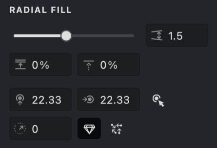

The **Radial** fill type in Vexy Lines creates patterns with linear strokes that radiate outward from a central point.

{width="300"}

## Fill Parameters
{width="300"}

 **Interval** ([units](/v1/docs/units)): Defines the distance between strokes measured at the middle of the radius.

 **Randomization** (%): Adds a touch of variation to the spacing between strokes for a more natural feel.

 **Shift** (%): Modifies the phase of the fill by rotating the strokes around the central point in a clockwise direction.

 **Center** ([units](/v1/docs/units)): Specifies the horizontal and vertical coordinates for the fill's center.

 **Distance** ([units](/v1/docs/radial-distance)): Sets the starting point of the strokes from the fill's center.

 **Auto Distance**: When enabled, automatically calculates the optimal distance between the center and each stroke to prevent overlap.

 **Random Distance**: When enabled, randomly varies the distance of each stroke from the center for a dynamic effect.

By adjusting these parameters, you can create intricate and unique fill patterns to enhance your vector artwork.

## Create and Customize a Radial Fill
To create a new **Radial** fill type, follow the steps outlined in our [Add a Fill](vb://article/adding-a-fill-1) guide. When the pop-up menu appears, select the "Radial" fill type.

.png){width="160"}

Similar to the [Linear](vb://article/linear-fill) fill type, the **Radial** fill shares the first three parameters — **Interval **, **Randomization **, and **Shift**. In addition, it offers four unique controls: **Center** ****, **Distance ****, ****Auto Distance** , and **Random Distance**. These extra settings shape the radial pattern.

### Interval
1. Find the **Interval**  parameter.
2. Adjust the distance between strokes using the slider or by entering a value directly.

| interval:1 | interval:2 | interval:3 |
| --- | --- | --- |
|.png){width="300"}|.png){width="300"}|.png){width="300"}|

### Randomization
1. Find the **Randomization**  parameter.
2. Adjust the slider or enter a value manually.
3. Increasing randomness makes the spacing between strokes less uniform.

| 20% | 50% | 100% |
| --- | --- | --- |
|.png){width="300"}|.png){width="300"}|-01.png){width="300"}|

### Shift
1. Find the **Shift**  parameter.
2. Adjust the slider or enter a value manually.
3. The Shift parameter rotates the fill pattern around the central point, changing the starting position of the strokes.

| shift:25% | shift:50% | shift:90% |
| --- | --- | --- |
|.jpg){width="300"}|.jpg){width="300"}|.jpg){width="300"}|

### Center
1. Look for the **Center**  parameter under the RADIAL FILL section.
2. You will see two input fields for the horizontal and vertical coordinates.
3. Adjust these values using the drop-down slider or by typing directly.
4. Alternatively, use the "Auto Center Detection"  feature to automatically set the coordinates based on your click.

| center: 40,40 | center: 20,15 | center: 40,80 |
| --- | --- | --- |
|{width="300"}|.jpg){width="300"}|.jpg){width="300"}|

### Distance
1. Locate the **Distance**  parameter under the RADIAL FILL section.
2. Adjust its value using the slider or by manually entering your preferred number.
3. This creates a circular gap around the center by defining the starting point of the strokes.

| distance:2 | distance:10 | distance:30 |
| --- | --- | --- |
|{width="300"}|.jpg){width="300"}|.jpg){width="300"}|

###  Auto Distance
1. Locate the **Auto Distance** option.
2. Enable it by clicking the button.
3. When active, the stroke distance from the center is recalculated automatically to prevent overlaps.

| auto:off | auto:on |
| --- | --- |
|.jpg){width="300"}|.png){width="300"}|

#### Random Distance
1. Locate the **Random Distance**  option.
2. Enable it by clicking the button.
3. This randomly adjusts the distance of each stroke from the center, helping to avoid overlaps.

| random:off | random:on |
| --- | --- |
|.png){width="300"}|.png){width="300"}|

## Stroke Properties
Other properties apply to this fill, which you can read about in the relevant articles:
*   [Color](vb://article/color-5)
*   [Image Threshold](vb://article/image-threshold-2)
*   [Stroke Thickness](vb://article/stroke-thickness-2)
*   [Dashed Line](vb://article/dashed-line-1)
*   [Stroke Caps](vb://article/stroke-caps-1)
*   [Emboss](vb://article/emboss-1)
*   [Overlap Control](vb://article/overlap)

## Link to Example
You can use the example file for this article [UM3-Fills-Radial.lines](https://i.vexy.art/vl/examples/UM3-Fills-Radial.lines) to practice adjusting "Radial" fill parameters.

