The **Scribble** fill type mimics the look of hand-drawn lines. It offers adjustable settings to control stroke spacing, curve shape, and line direction—allowing you to create an organic, hand-crafted effect.
  
.png){width="400"}

## Fill Parameters

The following parameters let you fine-tune your scribble fill:

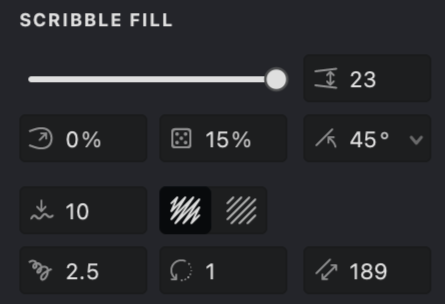{width="300"}

 **Interval** ([units](/v1/docs/units)): Adjusts the spacing between strokes. Lower values produce a denser pattern, while higher values create a more open design.

 **Curviness** (%): Controls the bend of the strokes. Higher percentages yield smoother, more fluid curves; lower percentages result in sharper, more angular turns.

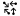 **Randomization** (%): Introduces subtle variations to stroke placement for a more natural, less mechanical look.

 **Angle** (°): Determines the overall orientation of the scribble strokes.

 **Smoothness**: Refines the flow of strokes by reducing jagged edges for a cleaner appearance.

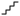 **Details** (%): Adjusts the complexity of the stroke pattern. Increase this value to add intricate lines or decrease it for a simpler design.

 **Rotation** (°): Applies incremental rotation to the scribble pattern, adding a dynamic twist to the design.

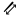 **Height**: Controls the vertical amplitude of the scribble wave, affecting how tall the pattern appears.

 **Zigzag**: Displays the scribble as a continuous zigzag line.

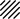 **Lines**: Presents the scribble as a series of linear strokes.

## Add and Customize a Scribble Fill

To create a new **Scribble** fill, follow the instructions in our [Add a Fill](vb://article/adding-a-fill-1). When the selection menu appears, choose the **Scribble** fill type.

-01.png){width="160"}

### Interval
1. In the **SCRIBBLE FILL** section, locate the **Interval**   control.
2. Adjust the spacing between strokes using the slider or by entering a specific value.
3. Lower values create a denser pattern, while higher values yield a more open layout.

| interval: 0.6 | interval: 1 | interval: 1.5 |
| --- | --- | --- |
|-01.png){width="300"}|.png){width="300"}|.png){width="300"}|

### Curviness
1. Find the **Curviness**  option.
2. Use the slider or enter a value manually to adjust the bend of the strokes.
3. Higher percentages yield smoother, flowing curves; lower percentages result in sharper angles.
   
| curviness: 0 | curviness: 50 | curviness: 100 |
| --- | --- | --- |
|-01.png){width="300"}|.png){width="300"}|.png){width="300"}|

### Randomization
1. Locate the **Randomization**  setting.
2. Adjust the slider or enter a value to introduce slight variations in stroke placement.
3. Increasing this value creates a more natural, less uniform pattern.

| randomization: 0 | randomization: 50 | randomization: 100 |
| --- | --- | --- |
|-01.png){width="300"}|.png){width="300"}|.png){width="300"}|

### Angle
1. Find the **Angle**  control.
2. Adjust the slider or input a value to set the overall orientation of the scribble strokes.
3. This value defines the dominant stroke direction.

| angle: 45 | angle: 90 | angle: 10 |
| --- | --- | --- |
|-01.png){width="300"}|.png){width="300"}|.png){width="300"}|

### Smoothness
1. Locate the **Smoothness**  option.
2. Adjust the slider or manually enter a value to smooth out the stroke transitions.
3. Higher values minimize jagged edges for a more refined look.

| smoothness: 0 | smoothness: 15 | smoothness: 30 |
| --- | --- | --- |
|.png){width="300"}|.png){width="300"}|.png){width="300"}|

### Details
1. Locate the **Details**  control in the SCRIBBLE FILL section.
2. Use the slider or input a value to modify the level of intricacy in the fill.
3. Higher values add more fine lines and curves, increasing the pattern's complexity.

| details: 0 | details: 25 | details: 100 |
| --- | --- | --- |
|.png){width="300"}|.png){width="300"}|.png){width="300"}|

### Rotation
1. Locate the **Rotation**  option.
2. Adjust the slider or enter a value to apply incremental rotation to the scribble pattern.
3. This adds a dynamic twist to the design at different detailing levels.

| rotation: 0 | rotation: 5 | rotation: 15 |
| --- | --- | --- |
|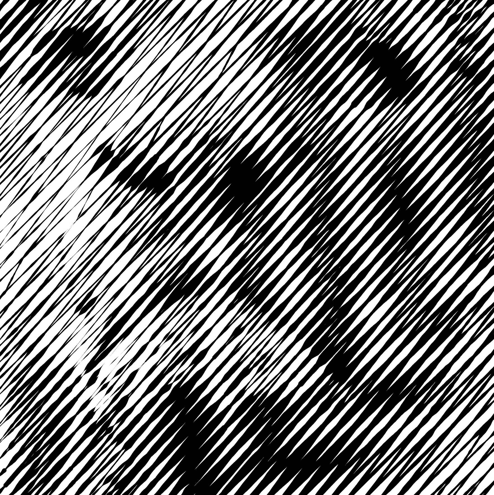{width="300"}|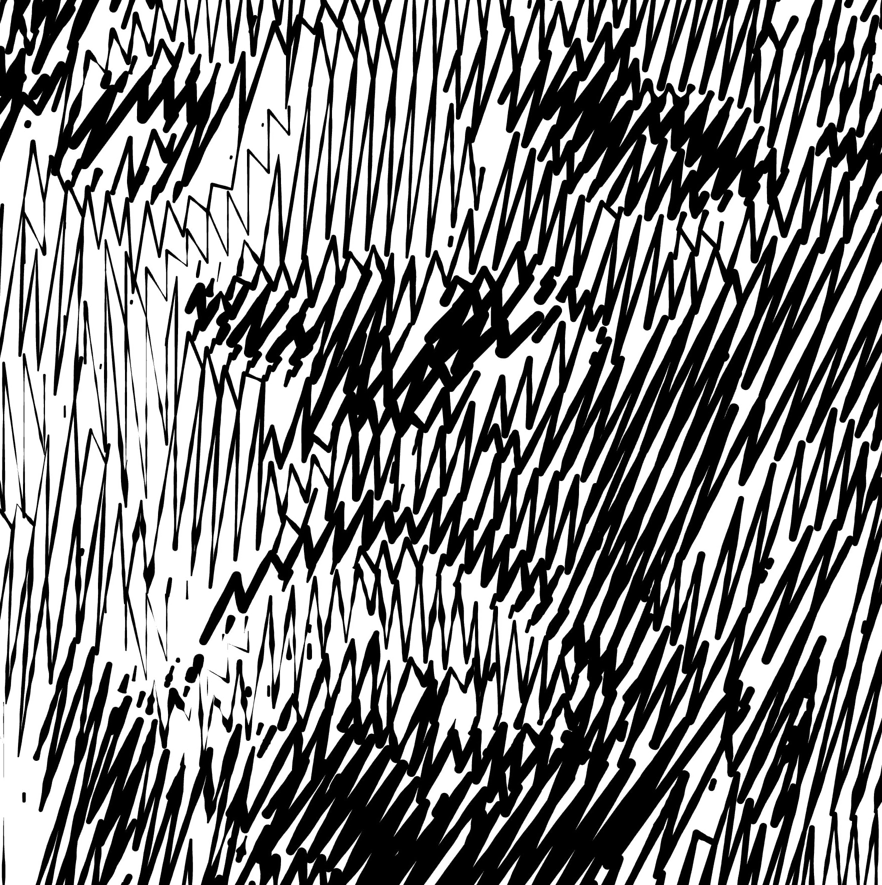{width="300"}|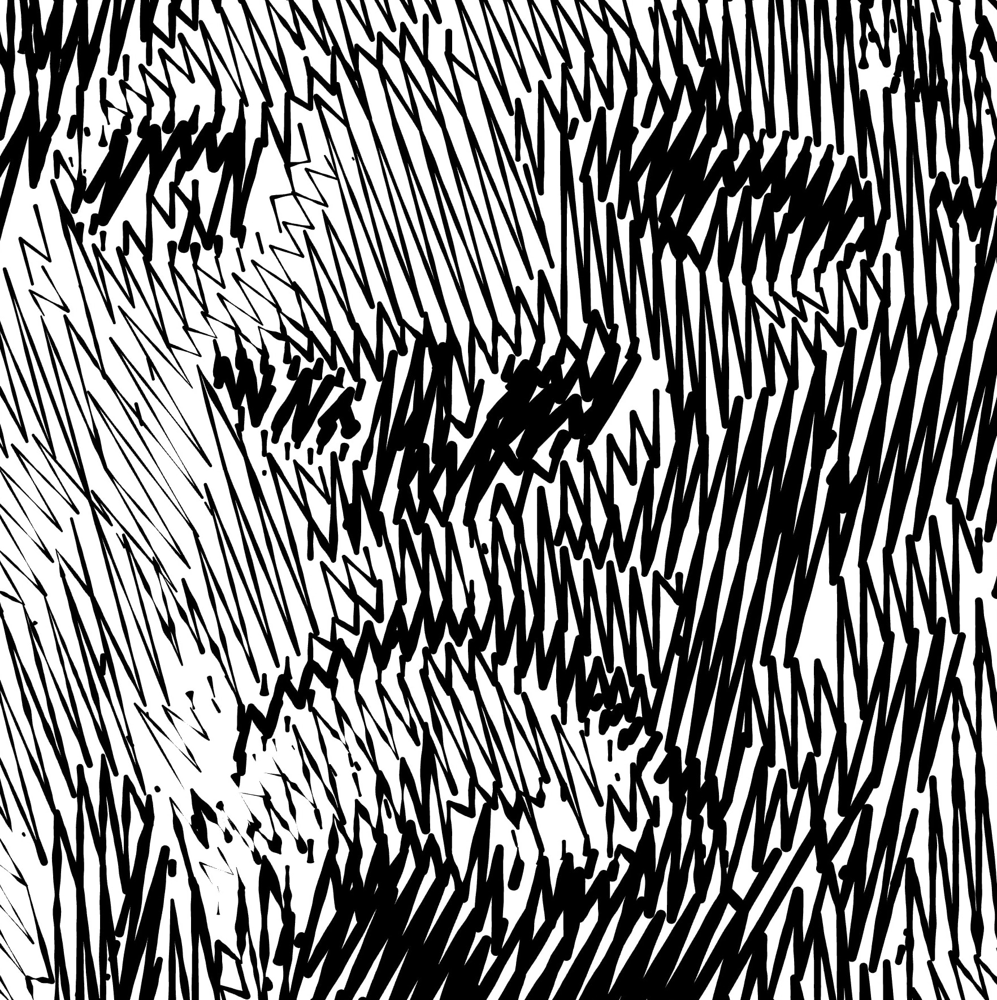{width="300"}|

### Height
1. Find the **Height**  control.
2. Adjust the slider or enter a value to change the vertical amplitude of the scribble wave.
3. This setting determines how tall the scribble pattern appears.

| height: 3 | height: 7 | height: 15 |
| --- | --- | --- |
|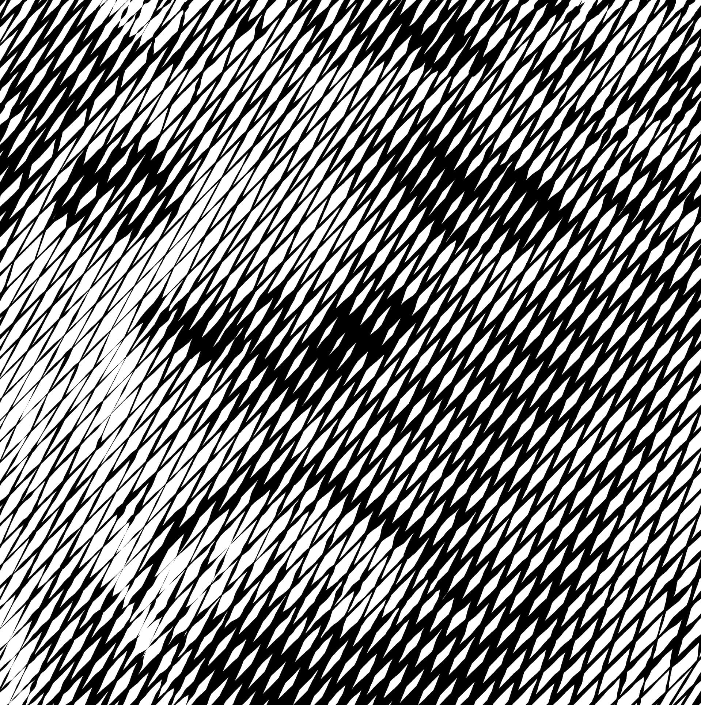{width="300"}|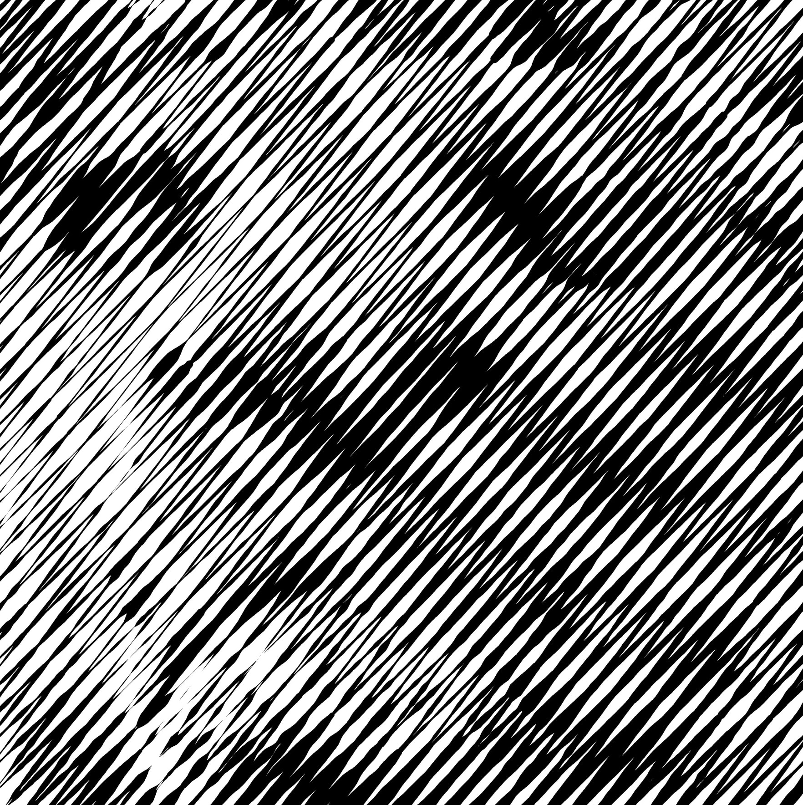{width="300"}|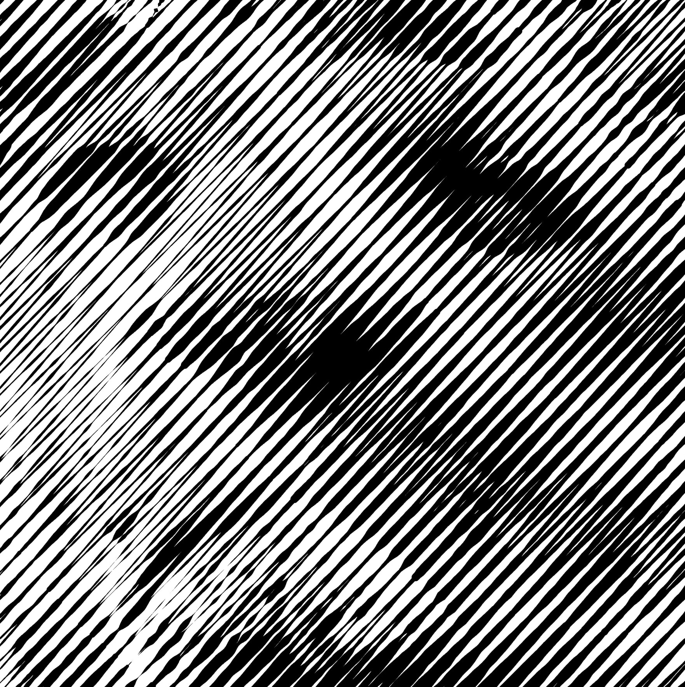{width="300"}|

### Scribble Pattern
Select one of two display modes for your scribble fill: view it as a continuous **zigzag**  line or as a series of individual  **linear strokes**.

| Zigzag | Lines |
|---|---|
|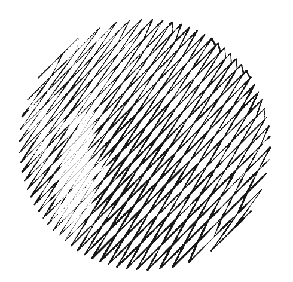{width="300"}|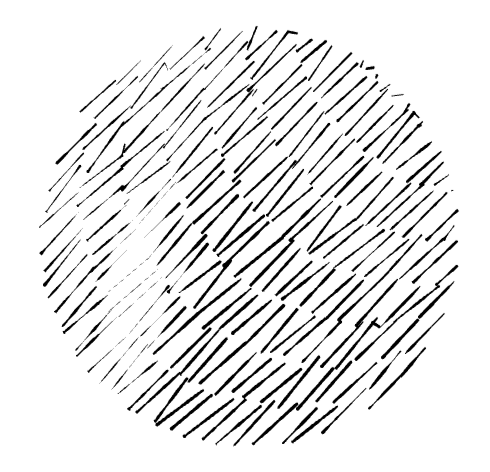{width="300"}|

## Stroke Properties
Other properties apply to this fill, which you can read about in the relevant articles:
*   [Color](vb://article/color-5)
*   [Image Threshold](vb://article/image-threshold-2)
*   [Stroke Thickness](vb://article/stroke-thickness-2)
*   [Dashed Line](vb://article/dashed-line-1)
*   [Stroke Caps](vb://article/stroke-caps-1)
*   [Emboss](vb://article/emboss-1)
*   [Overlap Control](vb://article/overlap)

## Link to Example
You can use the example file for this article [UM3-Fills-Scribble.lines](https://i.vexy.art/vl/examples/UM3-Fills-Scribble.lines) to practice adjusting Scribble fill parameters.
