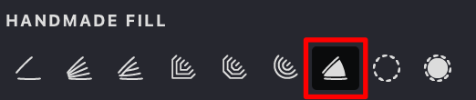

When pressed, this function fills the defined contours with the currently selected color, ensuring a smooth and uniform application. It serves as an additional option for manual strokes, allowing users to enhance their designs by automatically filling enclosed areas while still maintaining control over their freehand strokes.

{width="300"}

|  solid: off | solid: on  | 
| --- | --- |
|{width="300"}|{width="300"}|