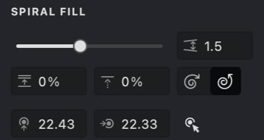
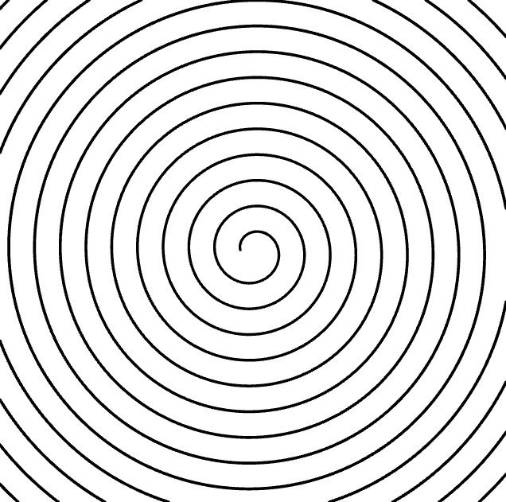
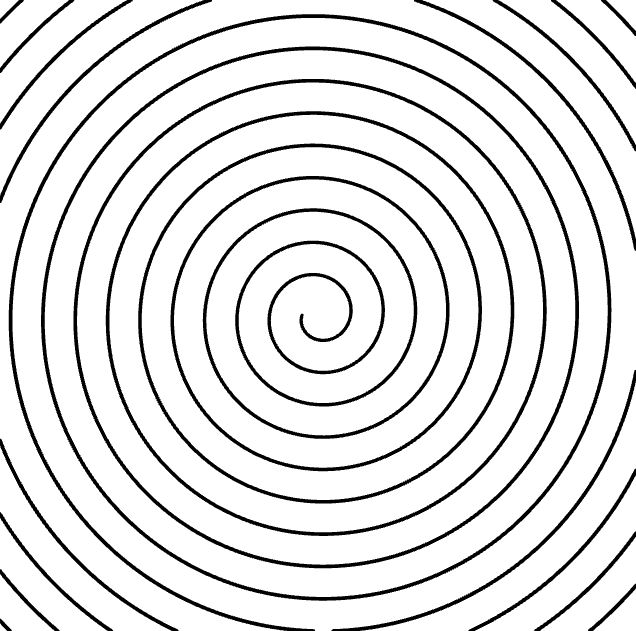

The **Spiral** fill type in Vexy Lines produces a continuous spiral engraving using one smooth line. Use this fill for a clean, mechanical engraving effect in your design.

{width="300"}

## Fill Parameters
{width="300"}

 **Interval** ([units](/v1/docs/units)): Sets the distance between each turn of the spiral. Use a lower value for a tighter engraving and a higher value for more space.

 **Interval Randomization** (%): Adds a small random variation to the spacing for a slightly hand-crafted look.

 **Stroke Shift**: Adjusts the starting point of the spiral turns.

 **Center** ([units](/v1/docs/units)): Determines the center point from which the engraving begins.
<!--@SSJY-->
 **Direction (CW)**: Set the spiral direction to clockwise.  

 **Direction (CCW)**: Set the spiral direction to counterclockwise.

These parameters let you fine-tune the engraving to suit your design.

## Add and Customize a Spiral Fill

To create a new Spiral fill, follow the steps in our [Add a Fill](vb://article/adding-a-fill-1) guide and select **Spiral**.

.png){width="160"}

Fine-tuning your Spiral fill involves adjusting its parameters. Here's a simple guide:

1. Access Properties: Go to the **Properties** panel, usually on the right side of the Vexy Lines interface.

2. Locate Parameter: In the Properties panel, switch to the **SPIRAL FILL** tab and find the parameter you wish to adjust.

Feel free to experiment with these parameters to create unique and dynamic engraving patterns for your vector artwork.

### Interval
1. Find the **Interval**  parameter.
2. Adjust the distance using the slider or by typing a value.

| interval: 1 | interval: 2 | interval: 3 |
| --- | --- | --- |
|-01.png){width="300"}|.png){width="300"}|-01.png){width="300"}|

### Randomization
1. Find the **Randomization**  parameter.
2. Adjust it to add variation to the spacing.
3. Higher values make the engraving less uniform.

| randomization: 10% | randomization: 50% | randomization: 100% |
| --- | --- | --- |
|.png){width="300"}|.png){width="300"}|-01.png){width="300"}|

### Shift
1. Find the **Shift**  parameter.
2. Adjust it to change the starting angle of the spiral.
3. This alters the overall orientation of the engraving.

| shift: 15% | shift: 50% | shift: 70% |
| --- | --- | --- |
|.jpg){width="300"}|.jpg){width="300"}|.jpg){width="300"}|

<!--@BDFI{-->### Direction
1. Locate the **Direction** parameter.
2. Select the rotation direction: **CW**  (clockwise) or **CCW**  (counterclockwise).
3. Change this parameter as needed to reverse the rotation direction.<!--@BDFI}-->

| direction: CW | direction: CCW |
| --- | --- |
|{width="300"}|{width="300"}|

### Center
1. Find the **Center**  parameter.
2. Set the horizontal and vertical coordinates to define the engraving's center.
3. You can adjust these values using the slider, entering them manually, or using the Interactive Center Locator.

| center: 40,40 | center: 80,0 | center: 40,80 |
| --- | --- | --- |
|.png){width="300"}|.png){width="300"}|.png){width="300"}|

## Stroke Properties
Additional stroke properties include:
*   [Color](vb://article/color-5)
*   [Image Threshold](vb://article/image-threshold-2)
*   [Stroke Thickness](vb://article/stroke-thickness-2)
*   [Dashed Line](vb://article/dashed-line-1)
*   [Stroke Caps](vb://article/stroke-caps-1)
*   [Emboss](vb://article/emboss-1)
*   [Overlap Control](vb://article/overlap)

## Link to Example
You can use the example file [UM3-Fills-Spiral.lines](https://i.vexy.art/vl/examples/UM3-Fills-Spiral.lines) to practice adjusting Spiral fill settings.