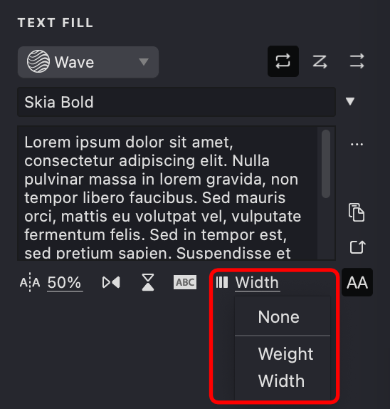
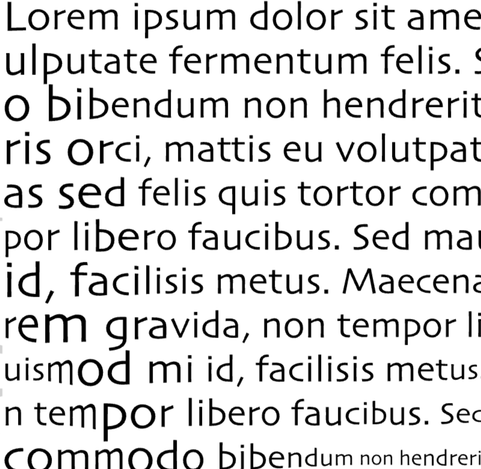
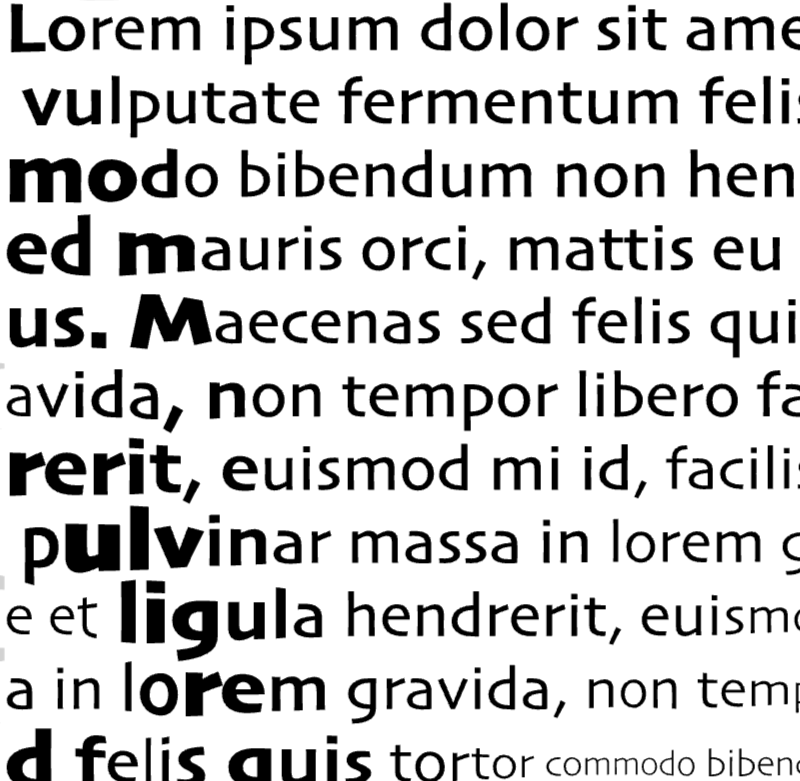
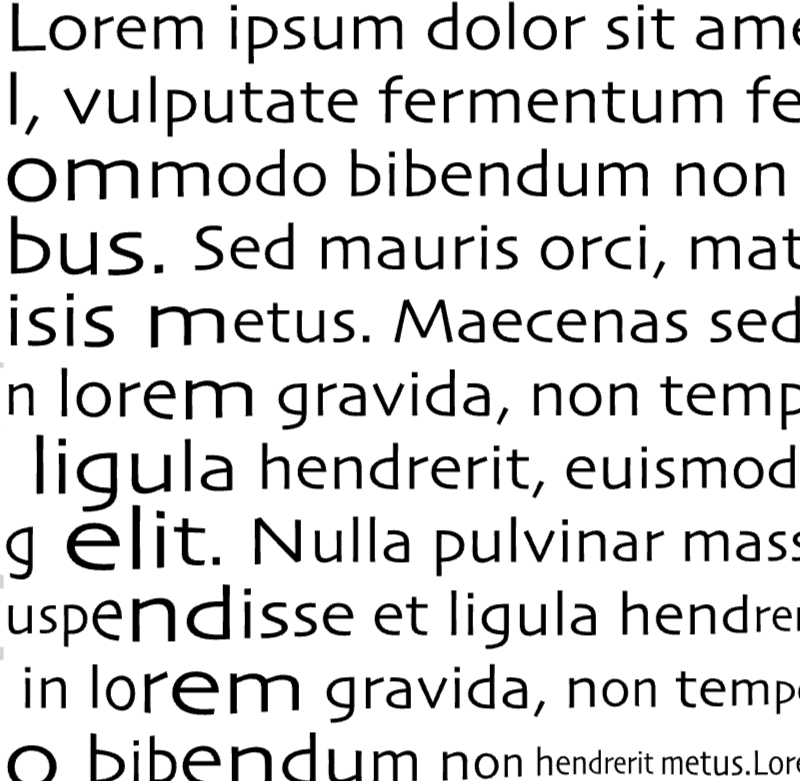

The **Text** fill lets you use your own text as a pattern in your artwork. It adjusts the text to follow the strokes and shapes in your design and offers many customization options. You can pick a base template to set the flow of the text, and the image tone will automatically change the text size, weight, and color. Other options include repeating the text, pasting from your clipboard, generating random text, converting text to uppercase, and flipping the text. You can also add a solid background behind each letter for better visibility.

{width="400"}

## Fill Parameters

-01.png){width="300"}

**Base**: Choose a template fill to set the flow of text lines.

**Text**: Enter the text you want to use in the fill.

**Font**: Pick the typeface for your text fill.

**Repetition**: Decide how the text repeats. Choose whether it repeats continuously with or without line breaks, or not at all.

**Paste**: Insert text directly from your clipboard.

**Random**: Generate random placeholder text for quick testing.

**Uppercase**: Convert all the fill text to uppercase letters.

**Tracking**: Adjust the spacing between individual characters.

**Flip**: Flip the text horizontally or vertically.

**Background**: Add a solid color background behind each letter for better contrast.

**Variable**: If variable font is selected, here you can select the variable axis to animate.

## Add and Customize a Text Fill

To create a new Text fill, follow the steps in our [Add a Fill](vb://article/adding-a-fill-1) guide. When the pop-up menu appears, select the "Text" fill type.

{width="160"}

### Base Fill

{width="300"}

1. Open the **TEXT FILL** panel and locate the **Base fill** dropdown menu.
2. Click the dropdown to see a list of available fill templates.
3. Choose a template to guide your text lines; this template sets the flow and direction of the text.

> Note: Only fills on the same layer (excluding Halftone, Trace, or Text types) will be available.

{width="300"}

| base: Wave | base: Linear | base: Spiral |
| --- | --- | --- |
|{width="300"}|.png){width="300"}|.png){width="300"}|
  
### Text

{width="300"}

1. Find the **Text** section.
2. Type your text directly or load it using the "..." button.
3. Make sure the text is in plain format. The entered text will fill the design based on your settings.

| ABCDEFGH | The Text Fill feature... | +=\*=  |
| --- | --- | --- |
|{width="300"}|.png){width="300"}|.png){width="300"}|

### Font

{width="300"}

1. In the TEXT FILL properties panel, click the **Font** dropdown button.
2. Select the font you want from the menu. The text will update to the chosen typeface.
3. You can use font name filter to find the font you need.
4. Variable fonts are marked with special icon. You can find variable fonts using "Variable" or "var" in the filter.

| Arial Regular | Apple Chancery | Bodoni Ornament |
| --- | --- | --- |
|{width="300"}|.png){width="300"}|.png){width="300"}|

### Repetition

1. Locate the **Repetition** options.
2. Choose the cycle mode that controls how the text repeats—whether continuously with or without line breaks, or not at all.
3. The mode you select will affect the layout of the text in the fill.

{width="300"}

| text |  repeat by words | repeat by lines  | line by line |
| --- | --- | --- | --- |
|-01.png){width="300"}|.png){width="300"}|.png){width="300"}|-01.png){width="300"}|

### Paste

1. Find the **Paste** button.
2. Make sure you have copied your desired text from another application.
3. Click **Paste** to insert the text from your clipboard into the fill.

{width="300"}

### Random Text

1. Click the **Random** button.
2. Random placeholder text will be generated for quick testing.

{width="300"}

| random text | random text | random text |
| --- | --- | --- |
|.png){width="300"}|.png){width="300"}|.png){width="300"}|

### Uppercase

1. Click the **Uppercase** button in the TEXT FILL properties panel.
2. All text in the fill will immediately convert to uppercase.

> Uppercase characters have more uniform height compared to lowercase letters, which can create more consistent and visually balanced fill strokes. This uniformity is particularly beneficial when creating text fills where you want even distribution and predictable spacing across your artwork.

{width="300"}

| upper case: off | upper case: on |
| --- | --- |
|.png){width="300"}|.png){width="300"}|

### Tracking

1. Find the Tracking control.
2. Choose a spacing value from the dropdown.
3. The space between characters will update based on your selection.

{width="300"}

| -100u | 0 | 200u |
| --- | --- | --- |
|.png){width="300"}|.png){width="300"}|.png){width="300"}|

### Flip

1. Locate the **Flip** buttons.
2. Toggle the horizontal and/or vertical buttons to flip the text.
3. The text characters will mirror according to the selected flip option.

{width="300"}

| text | flip: horizontal | flip: vertical |
| --- | --- | --- |
|.png){width="300"}|.png){width="300"}|.png){width="300"}|

### Background

1. Find the **Background** control.
2. Toggle this option to turn on or off a solid background behind each character.
3. This setting improves legibility by adding contrast to the text.

{width="300"}

> Typically used when text overlaps or in mesh mode, the background color matches the base fill color.

### Overlapping

| background: off | background: on |
| --- | --- |
|.png){width="300"}|.png){width="300"}|

Overlapping text when using Text fill with a mesh applied to the layer. The background setting helps maintain text clarity when characters overlap due to mesh deformation.

| background: off | background: on |
| --- | --- |
|.jpg){width="300"}|.jpg){width="300"}|

### Variable Fonts

If a **variable font** is selected, you can select the variable axis to animate. Most fonts have only one axis, typically weight, but some fonts have multiple axes. 

{width="300"}

Use Weight axis to animate the thickness of the letters. 

| none | weight axis | width axis |
| --- | --- | --- |
|{width="300"}|{width="300"}|{width="300"}|

## Stroke Properties
Other properties apply to this fill, which you can review in the relevant articles:
*   [Color](vb://article/color-5)
*   [Image Threshold](vb://article/image-threshold-2)

## Link to Example
You can use the example file for this article [UM3-Fills-Text.lines](https://i.vexy.art/vl/examples/UM3-Fills-Text.lines) to practice adjusting Text fill parameters.