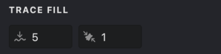
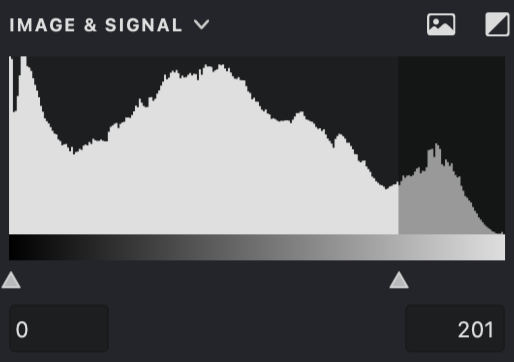

The **Trace** fill converts raster images into clean vector artwork. It analyzes your image's colors and shapes to create precise vector paths, making it easy to transform photographs and bitmap graphics into scalable vector designs.

{width="400"}

## Fill Parameters
{width="300"}

 **Smoothing**: Controls how smooth the traced edges appear. Higher values create smoother curves, while lower values follow the original edges more closely.

 **Small Spots: ** ([units](/v1/docs/units)): Defines the smallest detail that will be included in the trace. Smaller elements will be filtered out, helping reduce noise in the final result.

## Add a Trace Fill

To create a new Trace fill, follow the steps in our [Add a Fill](vb://article/adding-a-fill-1). When prompted, select "Trace" from the fill type menu.

-01.png){width="160"}

### Adjust Image Threshold

The **Trace** fill analyzes your image based on brightness levels. Here's how to control which parts of your image get traced:

1. Open the **Properties** panel
2. Navigate to the **IMAGE & SIGNAL** tab
3. Use the minimum and maximum threshold sliders to define which brightness levels should be included in the trace

{width="300"}
For more details about threshold settings, see the [Image Treshold](vb://article/image-threshold-2) article.

| threshold: 0 - 96 | threshold: 0 - 160 | threshold: 70 - 160 |
| --- | --- | --- |
|{width="300"}|.png){width="300"}|.png){width="300"}|

### Smoothing
The **Smoothing**  parameter lets you control how precisely the trace follows the original image:

1. Find the **Smoothing**  control.
2. Adjust using the slider or enter a value directly.
3. Higher values create smoother, more simplified shapes.
4. Lower values follow the original edges more closely.

| smoothing: 0 | smoothing: 10 | smoothing: 25 |
| --- | --- | --- |
|{width="300"}|.png){width="300"}|.png){width="300"}|

### Small Spots
Use this parameter to filter out unwanted small details:

1. Locate the **Small Spots**  setting.
2. Adjust the value to control which details are included
3. Higher values remove more small elements from the trace
4. Lower values preserve more fine details

| Small spots: 0 | Small spots: 10 | Small spots: 30 |
| --- | --- | --- |
|{width="300"}|.png){width="300"}|.png){width="300"}|

## Additional Properties
The Trace fill supports these additional properties:
*   [Color](vb://article/color-5)
*   [Image Threshold](vb://article/image-threshold-2)

## Practice File
Try out the Trace fill parameters using this example file: [UM3-Fills-Trace.lines](https://i.vexy.art/vl/examples/UM3-Fills-Trace.lines)