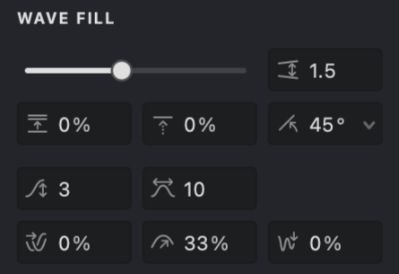

**Wave** fill generates patterns using parallel wavy strokes to produce a smooth, flowing effect. It's ideal for creating organic, dynamic textures while retaining precise control over both wave shape and pattern distribution.

{width="300"}

## Fill Parameters

{width="300"}

 **Interval** [units](vb://article/units-of-measurement): Sets the distance between wave strokes. Lower values create denser patterns, while higher values produce lighter ones.

 **Randomization** (%): Adds natural variation to the spacing of wave strokes. Useful for avoiding mechanical-looking patterns.

 **Shift** (%): Offsets the pattern perpendicular to the stroke direction. Particularly useful when combining multiple fills.

 **Angle** (°): Controls the orientation of the waves. Use it to match the natural flow of your design.

 **Wave Height** ([units](/v1/docs/units)): Defines the amplitude of your waves. A lower value flattens the fill, while a higher value emphasizes the curvature.

 **Wave Length** ([units](/v1/docs/units)): Determines the distance between successive peaks. Larger values produce a more relaxed, extended wave.

 **Phase Shift** (%): Adjusts the horizontal position of the waves. This control is essential when aligning multiple wave fills.

 **Wave Fading** (%): Gradually reduces wave height to create a smooth transition into a flat line.

 **Curviness** (%): Modifies the overall shape of the waves, allowing you to shift from angular to more smoothly curved strokes.

## Adjust Wave Fill Parameters

Access these controls via the **Properties** panel in the **WAVE FILL** tab.

### Interval
1. Locate the **Interval** control .
2. Adjust with the slider or type in your preferred value.

> Lower values yield a denser, darker appearance; higher values give a lighter, more open pattern.

| interval: 0.5 | interval: 1 | interval: 2 |
| --- | --- | --- |
|-01.png){width="300"}|.png){width="300"}|.png){width="300"}|

### Randomization
1. Find the **Randomization**  parameter.
2. Adjust the slider or input a value manually.
3. The more you increase randomness, the less predictable the outcome becomes.

| randomization: 10% | randomization: 50% | randomization: 100% |
| --- | --- | --- |
|.jpg){width="300"}|.png){width="300"}|.png){width="300"}|

### Shift
1. Find the **Shift**  wave parameter.
2. Adjust the slider or input a value manually.
3. The **Shift** parameter alters the phase of the fill pattern, thereby changing the initial position of the stroke in relation to its original placement.

| shift: 25% | shift: 50% | shift: 90% |
| --- | --- | --- |
|.jpg){width="300"}|-01.jpg){width="300"}|.jpg){width="300"}|

### Angle
1. Locate the **Angle**  parameter in the same section.
2. Use the drop-down visual control or manually enter a value to set the rotation angle, such as 26°.

 Experiment with different angles to see their effects on your design.
 

| angle: 0&deg;  | angle: 90&deg; | angle: -45&deg; |
| --- | --- | --- |
|.png){width="300"}|.png){width="300"}|.png){width="300"}|

### Wave Height
1. Look for the **Wave Height**  parameter.
2. Adjust its value by choosing from the drop-down slider or directly inputting the desired value. 
3. This property determines the height of the waves in your fill. At a value of 0, the waves will become straight lines.

| height: 10 | height: 25 | height: 40 |
| --- | --- | --- |
|{width="300"}|.png){width="300"}|.png){width="300"}|

### Wave Length
1. Locate the **Wave Length**  parameter.
2. Adjust it using the slider or by manually entering a value.
3. This property determines the distance between neighboring waves. Increasing this value will reduce the number of waves, making your lines smoother. Decreasing it will increase the number of waves, making your fill pattern denser.

| length: 10 | length: 40 | length: 80 |
| --- | --- | --- |
|.jpg){width="300"}|.png){width="300"}|.png){width="300"}|

### Phase Shift
1. Locate the **Phase Shift**  parameter.
2. Adjust it using the slider or by manually entering a value.
3. This property sets the phase shift of the wave, or the horizontal displacement of the wave. This feature can be used to combine different **Wave** fills.

> If you're new to Strokes Maker, think of this as a way to adjust the starting point of your wave pattern. 

| shift: 0% | shift: 25% | shift: 50% |
| --- | --- | --- |
|.jpg){width="300"}|.png){width="300"}|.png){width="300"}|

### Wave Fading
1. Locate the **Wave Fading**  parameter.
2. Adjust it using the slider or by manually entering a value.
3. The wave height of your fill will gradually disappear and the fill will become less saturated.

> This means that you can control how quickly your wave pattern fades out. A high fading value will make your waves fade quickly into straight lines, while a lower value will maintain the wave's height for longer.

| fading: 0% | fading: 50% | fading: 100% |
| --- | --- | --- |
|{width="300"}|.jpg){width="300"}|.jpg){width="300"}|

### Curviness
1. Locate the **Curviness**  parameter.
2. Adjust it using the slider or by manually entering a value.
3. When increasing the value of this property, the wave will become smoother, while decreasing it will make the wave sharper.

| curviness: 0% | curviness: 33% | curviness: 70% |
| --- | --- | --- |
|-01.png){width="300"}|.png){width="300"}|-01.png){width="300"}|

## Additional Properties
**Wave** fill supports these extended properties:
*   [Color](vb://article/color-5)
*   [Image Threshold](vb://article/image-threshold-2)
*   [Stroke Thickness](vb://article/stroke-thickness-2)
*   [Dashed Line](vb://article/dashed-line-1)
*   [Stroke Caps](vb://article/stroke-caps-1)
*   [Emboss](vb://article/emboss-1)
*   [Overlap Control](vb://article/overlap)

## Practice File
Experiment with Wave fill parameters using this example file: [UM3-Fills-Wave.lines](https://i.vexy.art/vl/examples/UM3-Fills-Wave.lines)