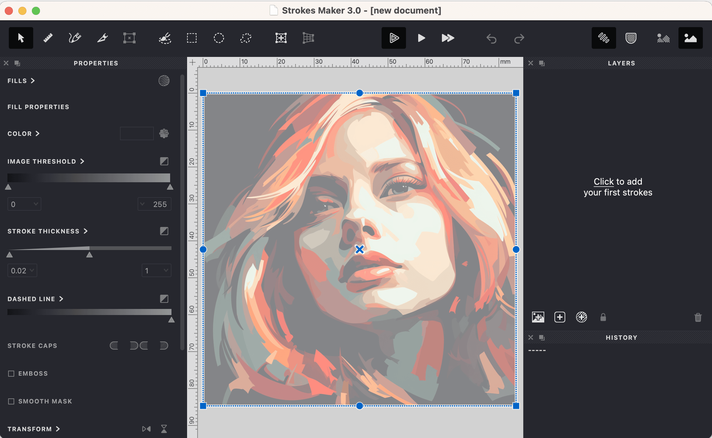
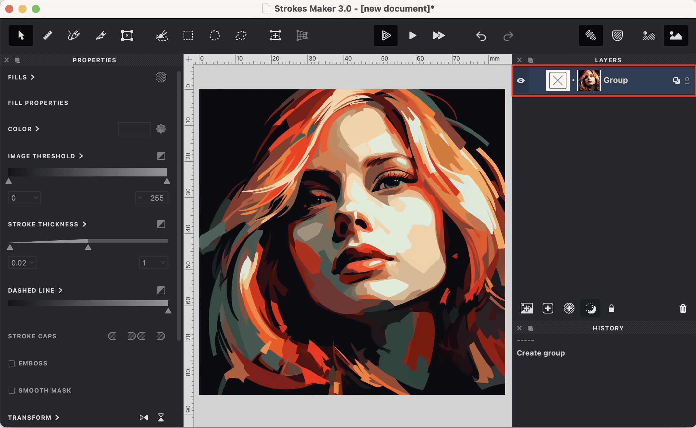
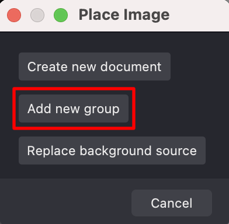

To create a new group that includes an image, follow these steps:

1. Go to the menu and select **Layer -> Add Source**.
2. In the dialog box that appears, choose the file with the desired image.
3. Confirm your selection and position the image within the document.

{width="1050"}

4. Press {*⏎*} to confirm the image placement or press {*Esc*} to cancel the operation.
5. A new group will be created with the selected image.

{width="1050"}

### Adding a Group via Drag-and-Drop

Another way to create a group in Vexy Lines is by using the drag-and-drop method. Here's how:

1. Locate the image you want to use, for instance, in a folder on your computer.
2. Drag and drop the image into the Vexy Lines document.
3. An action dialog will appear.
{width="196"}
4. Select **Add new group** and position the image within the document.
5. Press {*⏎*} to confirm the image placement or press {*Esc*} to cancel the operation.
6. A new group with the chosen image will be created.

