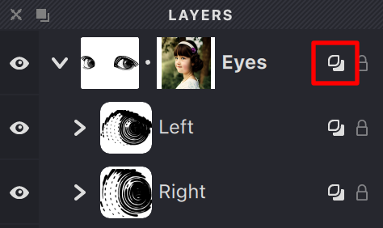

Groups in Vexy Lines can use an Overlay feature that gives you more control over how masks affect your artwork.

## How Group Overlay Works

Think of Group Overlay as an extension of how masks typically work. Here's what it does:

- When Group Overlay is **turned on**, any Overlay masks in the group will affect not just the layers within that group, but also any layers beneath the group in your document hierarchy.

- When Group Overlay is **turned off**, Overlay masks only affect the layers within their own group.

This feature gives you precise control over which parts of your artwork are affected by masks.

{width="237"}

>In the example above, there won't be any under-eye fillings because the Overlay property is enabled for the Eyes group.

## When to Use Group Overlay

Group Overlay is particularly useful when:

- You need a mask to affect multiple layers across different groups
- You're creating complex illustrations where elements need to interact across your layer hierarchy
- You want to create cutout effects that span across your entire document

To toggle the Group Overlay feature, simply select your group and use the Overlay checkbox in the Layers panel.

