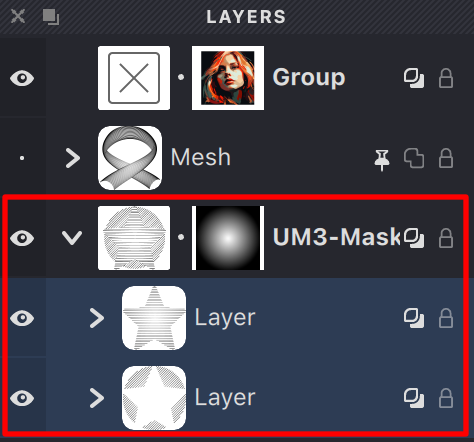

You can import .lines files directly as groups, keeping all their structure intact.

When you import an .lines file, Vexy Lines creates a new group containing all the objects from that file. This makes it easy to reuse elements across documents or combine multiple designs.

**Here's how to import an .lines file:**

1. Go to the **File** menu and select **Import -> Strokes**

2. Browse to find the file you want to import, select it, and confirm your choice

3. A new group will appear in your Layers panel with the same name as the imported file. All the objects and group structures from the original file will be preserved exactly as they were

{width="237"}

This is perfect for bringing in components you've created in other projects, or for combining work from multiple team members into a single document.

