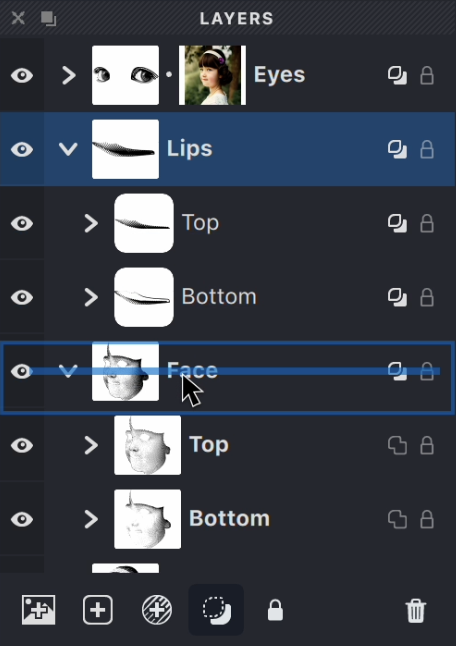
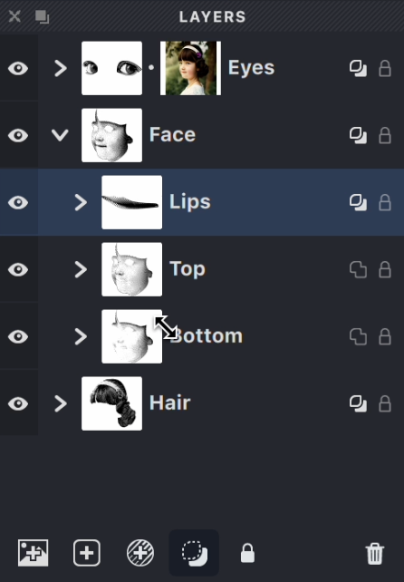

As your artwork evolves, you'll often need to reorganize your layers and groups. 

**Moving objects between groups helps you:**

- Keep your artwork organized as your design develops
- Group related elements together for easier editing
- Experiment with different layouts by rearranging components
- Apply different source images to specific elements
- Create logical hierarchies for complex illustrations
- Make your document more manageable and easier to navigate

You can **move both Layers and Groups between different groups** using the Layers panel. To do this:

1. Click and hold the desired Layer or Group with your mouse.
2. Drag it to the target group or to the root group of the document in the Layers panel.

| Starting to drag the 'Lips' group | 'Lips' group placed inside the 'Face' group |
| --- | --- |
|{width="228"}|{width="228"}|

> For more details on moving objects, refer to the article [here](/v1/docs/layers-2)

