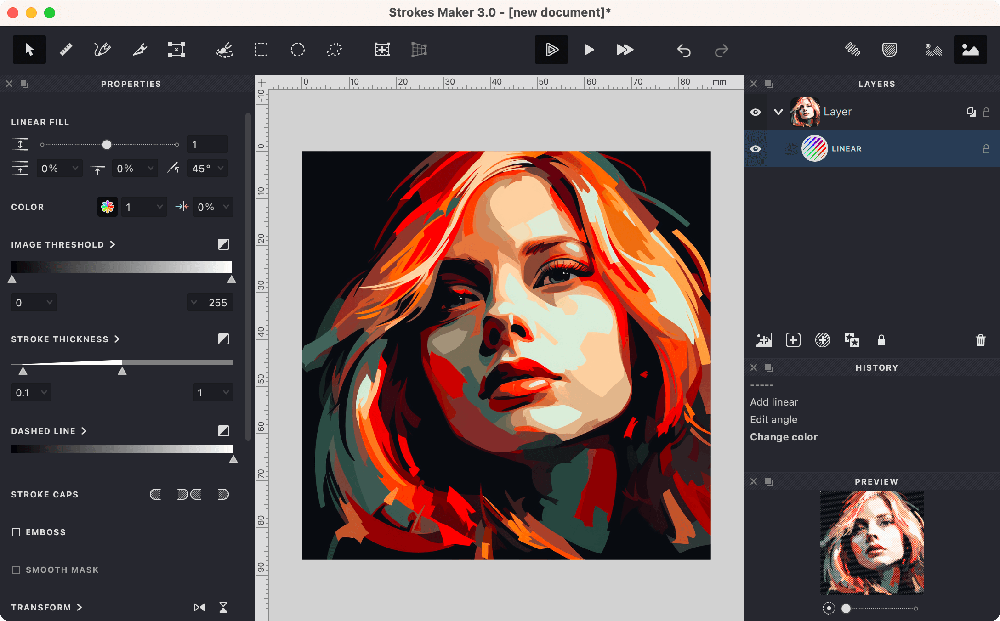
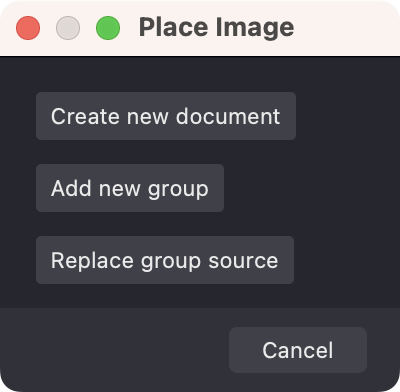
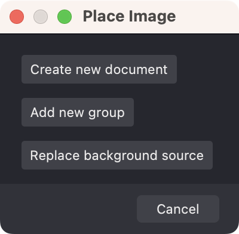
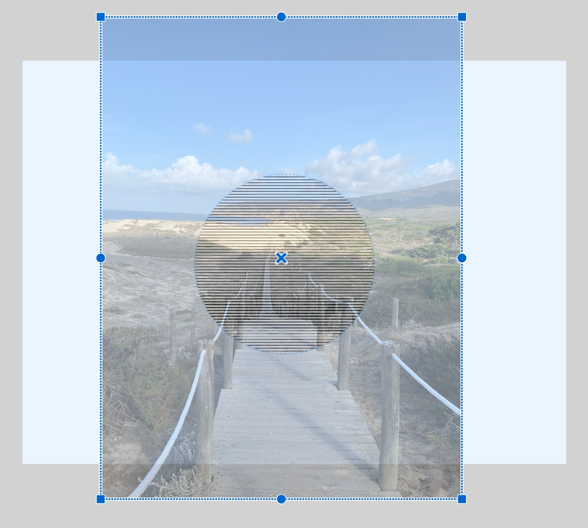
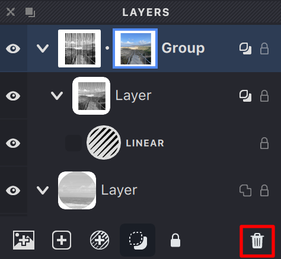
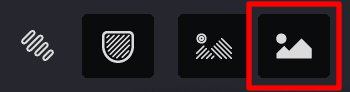
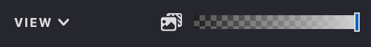

A Source Image is an imported raster image that serves as the foundation for your creations in Vexy Lines. Vexy Lines uses this image to determine stroke thickness, dashes, embossing, and other fill properties.

{ width="800"}

A Vexy Lines document can contain multiple source images. Each image can be linked to a specific group. All fills within the layers of that group and its subgroups will use the image of the nearest group in the hierarchy for calculations.

When an object is selected, the document's background will display the Source Image associated with that object, if the Source Image visibility is turned on.

The first image is added to the document when you create it and is linked to the document's root group. To add an image to the document, simply drag and drop it into the program's workspace. This action will trigger a dialog with available options.

You can:
- Create a new document based on the uploaded image.
- Add a new group with this image.
- If a group in the document is selected, you can either replace the image in the selected group or simply add the image to this selected group.

{width="200"}

If no groups were selected in the document, you'll be prompted to replace the document's original image.

{width="200"}

After adding the image, you can adjust its size and position relative to the document's dimensions.

{width="400"}

Press {*⏎*} to apply changes or {*Esc*} to cancel.

Now, in the Layers panel, to the right of the preview icon, there's an icon of the group's associated image. This indicates that all fills in the group will be calculated based on this image.

Clicking on the image icon will select it, making the image available for transformations or deletion. To delete the image selected in this way, simply press the {[Delete]} button or {*Del*}/{*Backspace*} on the keyboard.

{width="250"}

For convenience, Vexy Lines offers the ability to toggle the visibility of the Source Image or adjust its transparency smoothly.

To turn off visibility, use the button on the Toolbar.

{width="175"}

You can read more about the Toolbar in this article [Toolbar](/v1/docs/toolbar).

To adjust the image's transparency, use the slider on the View panel.

{width="264"}

Learn more about the View panel in the article [View](vb://article/view-2).