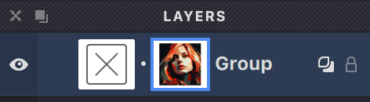
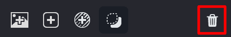

After adding a source image to a group, you'll notice a small image icon appears next to the group in the Layers panel. 

{width="236"}

This icon tells you that all fills in this group will use this image as their reference.

Want to adjust your source image? Just click on its icon in the Layers panel to select it. Once selected, you can reposition, resize, or make other changes to it.

## Show and Hide Source Images

As you work, you'll likely want to adjust how visible your source image is. Vexy Lines makes this easy with two handy options:

Need to completely hide or show your source image? Use the visibility toggle button in the Toolbar:

{width="175"}

For more details about the Toolbar, check out the [Toolbar](/v1/docs/toolbar) article.

Want more subtle control? Adjust the transparency using the slider in the View panel:

{width="264"}

You can learn more about the View panel in the [View](vb://article/view-2) article.

## Replacing the Source Image

Ready for a different reference image? Here's how to swap it out:

1. Select the group whose source image you want to change
2. Either:
   - Go to **Layer -> Replace Source** in the menu, or
   - Simply drag and drop a new image into Vexy Lines while your group is selected
3. Position and adjust your new image as needed
4. Once confirmed, your new image will replace the old one, and all fills in the group will update accordingly

### Removing the Source Image

To remove a source image from a group:

1. Select the image by clicking its icon in the Layers panel
{width="236"}

2. Then either:
   - Click the  button in the Layers panel, or
   - Press the Delete (⌫) or Forward Delete (⌦) key on your keyboard
{width="236"}