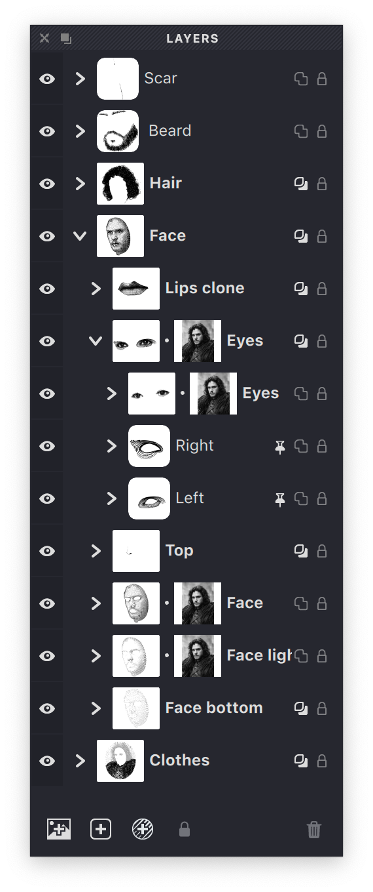

Groups are organizational containers that help you structure complex documents. Think of groups as folders that can hold layers, other groups, and source images.

{width="285"}

## What Groups Do

A group can include:
- Multiple layers containing your artwork
- Other groups (sub-groups) for deeper organization
- A source image to guide your work

Groups make it easier to:
- Organize related elements together
- Control visibility of multiple layers at once
- Apply source images to specific parts of your design
- Move multiple objects simultaneously

## Source Images in Groups

Each group can have its own source image. This allows different parts of your document to reference different images:

- If a group has a source image, all layers within it use that image
- If a group lacks a source image, it inherits the image from its parent group
- The document's main source image acts as a default

## Group Overlay

Groups can have the Overlay property enabled, which affects how masks within the group interact with layers below:

- When enabled: Mask Overlay layers within the group affect layers beneath the group
- When disabled: Mask Overlay layers only affect other layers within the same group

{width="239"}

> Learn more about groups in the dedicated [Groups section](vb://article/groups-1).