The Layers panel is an essential part of the Vexy Lines interface, designed to help you organize your document structure, quickly select objects, and access their properties. Think of it as your document navigator and control center.

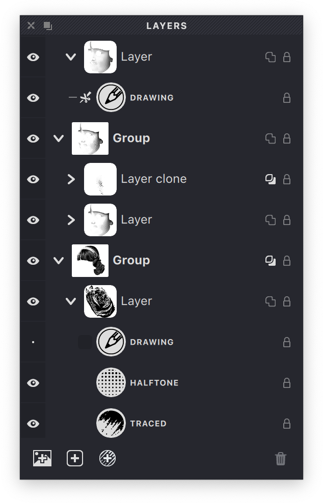{width="300"}

The main area of the panel displays the tree structure of your current document. Objects appear in the same order they're arranged in your artwork, with items at the top of the panel appearing on top in your design. The tree includes groups, layers, and fills, with groups and layers that can be expanded or collapsed for easier navigation. Each row displays a preview icon - groups and layers show a thumbnail, while fills display an icon representing their fill type.

Every object in the panel has 'View' and 'Lock' properties that you can toggle by clicking the corresponding icons. The View icon controls visibility, while the Lock icon prevents accidental changes.

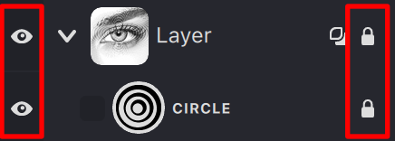{width="218"}

You can rename groups and layers by clicking on their name or by selecting **Rename** from the context menu.

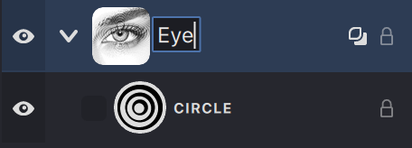{width="218"}

> The title text of a fill cannot be changed; this title shows the type of fill.

To quickly view and edit a single object, click it in the Layers panel while holding {*⌥*} — all other objects will be temporarily hidden. To exit this mode, simply click another object in the Layers panel.

To expand or collapse all objects at the current hierarchy level, click the arrow while holding {*⌥*}. All nested objects will also be expanded or collapsed.

Click the arrow while holding {*⌘⌥*}/{*⌃⌥*} to expand or collapse all objects in the entire document.

Similarly, {*⌥*}-click the eye icon to show or hide all objects at the current hierarchy level, including nested ones.

{*⌘⌥*}/{*⌃⌥*}-click the eye icon to show or hide all objects in the entire document.

$~~~$

Different object types have their own set of properties, which can be adjusted by clicking the icons in each row.

At the bottom of the panel, you'll find useful buttons for managing your document structure:

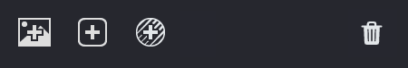{width="225"}

 Add a new group.

 Add a new Layer.

 Add a new Fill.

 Delete object.

Depending on what you have selected, additional buttons may appear:

* When a Layer is selected:
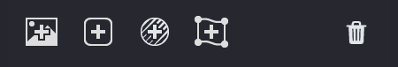{width="225"} 

 Toggles Mesh mode for advanced layer transformations.

* When a Fill is selected:
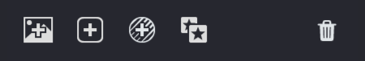{width="225"}

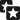 Creates a clone of the selected fill.

### Objects
Let's explore how different object types are displayed in the Layers panel and which properties are available for each.

#### Fills
Fill objects show an icon representing their type, along with a non-editable label indicating the fill style.

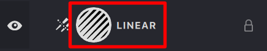{width="218"}

To the left of the icon is an area showing the Overlap Control status. If this property is disabled, you'll see a dark empty rectangle. Clicking this area cycles through different Overlap Control states:

If a fill is allowed to be cut:

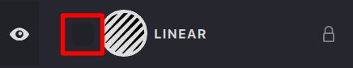{width="218"}

If the fill is cutting locally within the current Layer:

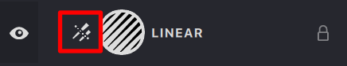{width="218"}

If the fill is cutting globally within the entire document:

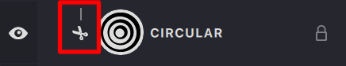{width="218"}

If the fill is cutting (locally or globally) and is allowed to be cut:

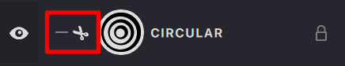{width="218"}

When you select a Fill, a clone button appears at the bottom of the panel. A clone is a fill that inherits the main fill's properties but allows you to change certain properties and stroke settings.

{width="218"}

> You can read more about Clones in this article [Clones](/v1/docs/clones)

#### Layer

When you select a layer, the **Set Mesh** option becomes available. This feature lets you wrap all the fills within the layer into a specific mesh shape. By default, you can choose from six predefined mesh shapes, each of which can be customized to suit your needs.

{width="218"}

> For more detailed information about working with meshes, refer to this article: [Mesh](/v1/docs/mesh-3)
 
 $~~$
 
When a fill is within a Layer that has Mesh mode enabled and the **Hidden strokes removal** property is active, you'll see an icon on the right side of the fill's row indicating which side of the Mesh the fill is assigned to. Similar to how a sheet of paper has two sides, fills can be placed on the front side, back side, or both sides of a Mesh.

{width="218"}

You can cycle through these options by clicking on the icon:

 Fill on both sides.

 Fill on the front side.

 Fill only on the reverse side.

| both | front | back |
| --- | --- | --- |
|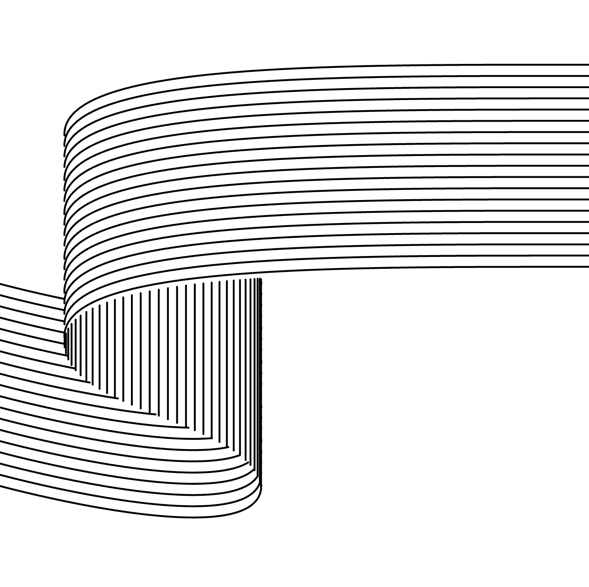{width="300"}|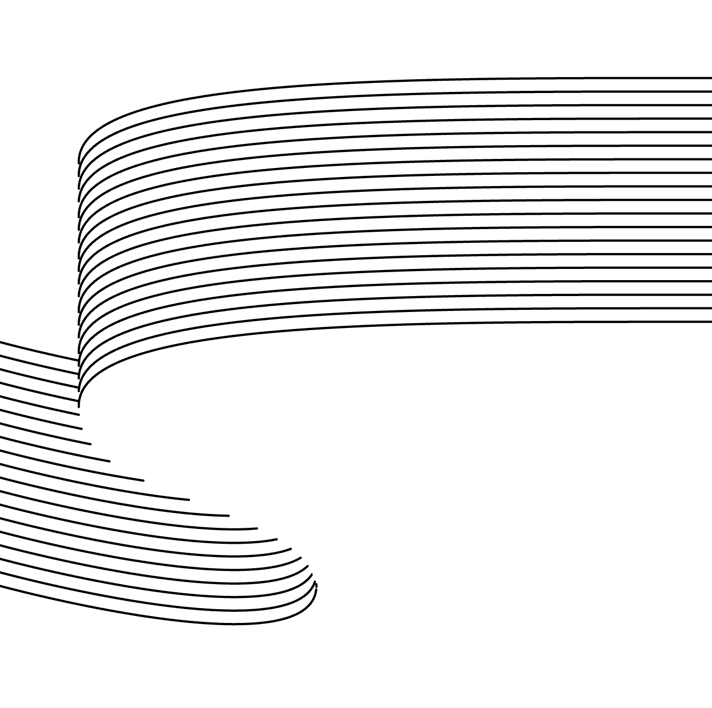{width="300"}|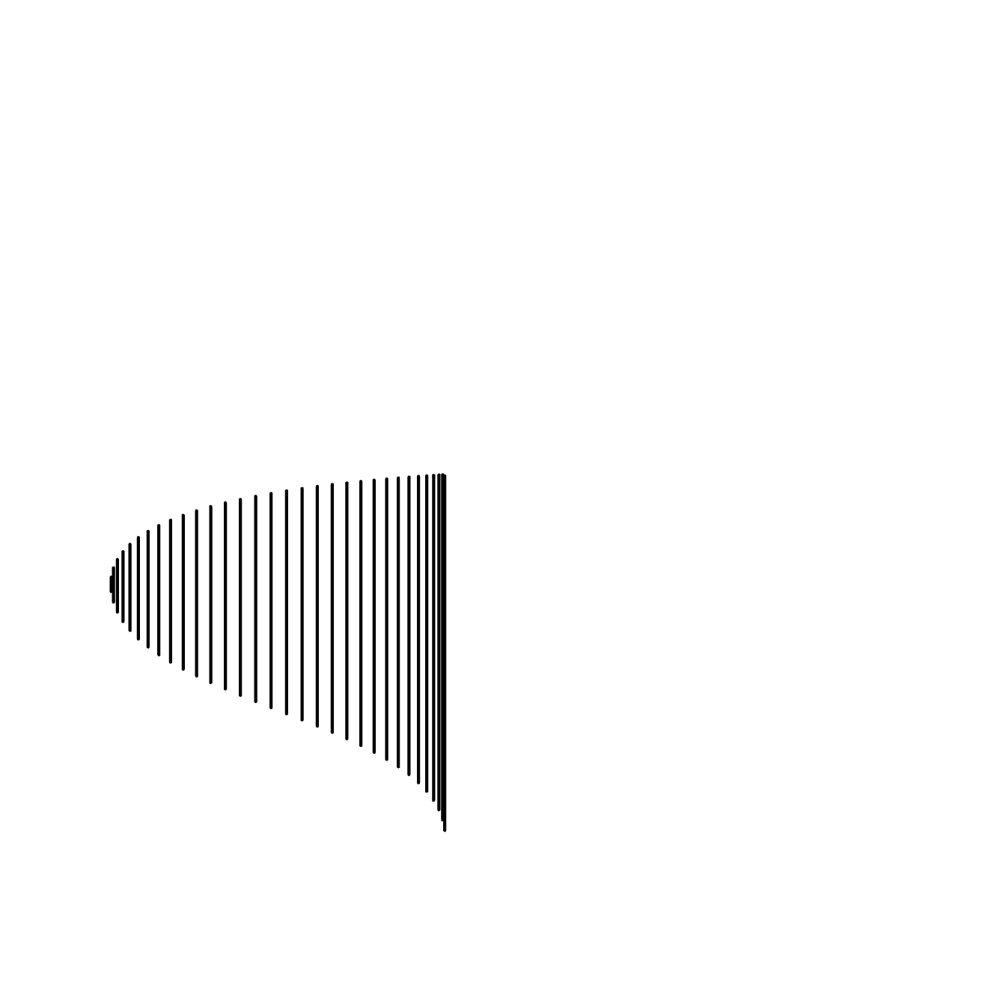{width="300"}|

This powerful feature allows you to create objects with different fill styles on each side of the Mesh.

> The example below shows two fills with horizontal and vertical lines, assigned to different sides of the Mesh.

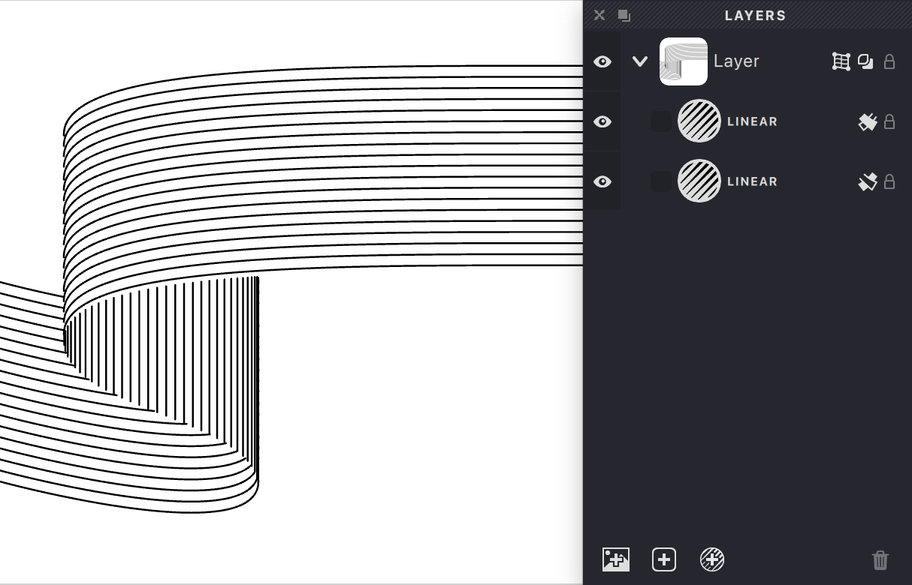{width="620"}

In the Layer object row, besides the Preview and Lock buttons, there is a Mask Overlay button. This button activates the "opaque mask" property. In other words, all masks under this mask will either be "Shaded" if the mask is in Smooth mask mode, or the area of this mask will be excluded from other masks.

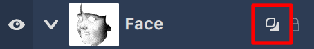{width="227"}

| mask overlay: off | mask overlay: on |
| --- | --- |
|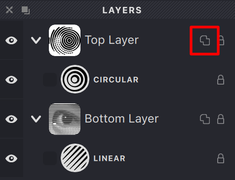{width="250"}|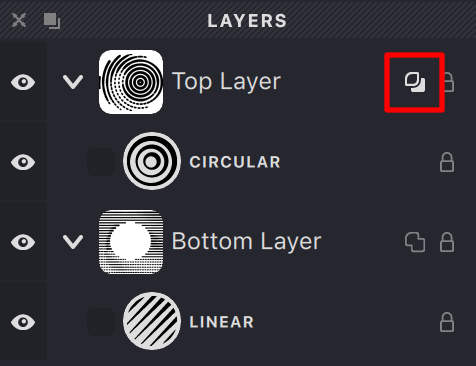{width="250"}|
|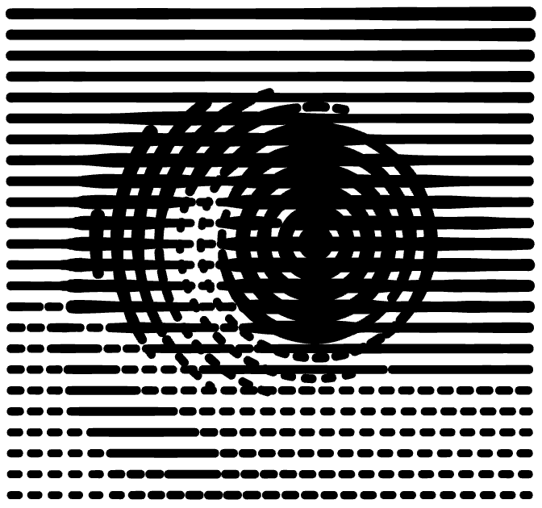{width="250"}|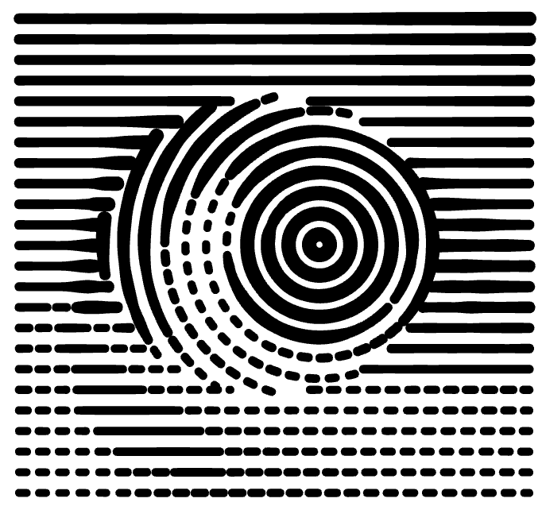{width="250"}|

> You can read more about working with masks in this article [Mask](/v1/docs/mask-2)
 
If the Layer object is in the Mesh state, it becomes possible to "Pin" masks to the Mesh object. In this case, when applying standard transformations to the Mesh object, the mask will change accordingly.

{width="218"}

| original object | unpinned | pinned |
| --- | --- | --- |
|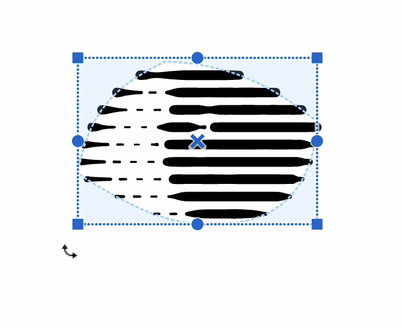{width="300"}|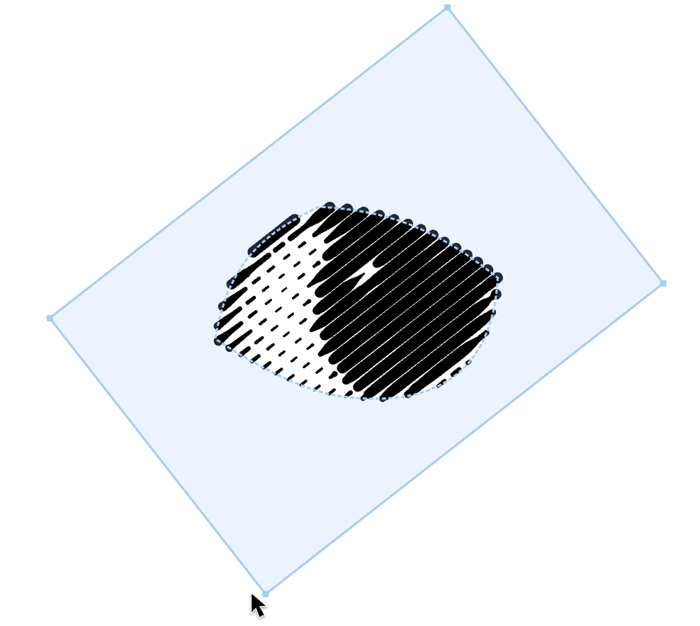{width="300"}|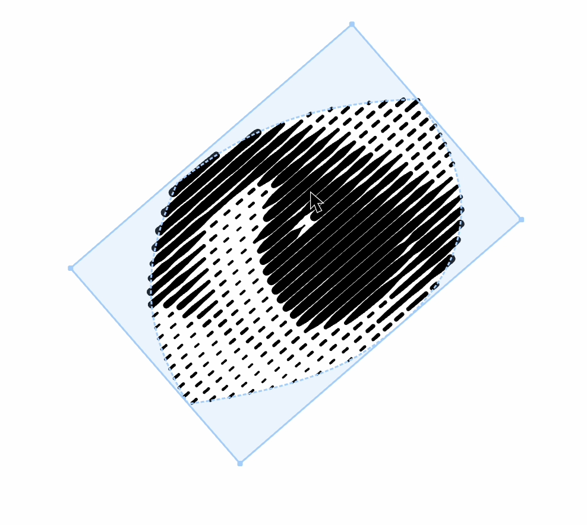{width="300"}|

#### Group

In the Group object row, besides the Preview icon, there can also be a Source image icon, as different groups can have different Source images. You can click on the Source image icon; this will highlight the image, giving you the option to either resize or reposition it, or to delete it.

> For information on how to add a Source image to a group and more details on this topic, see this article [Source images](/v1/docs/source-images).

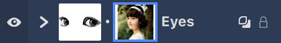{width="218"}

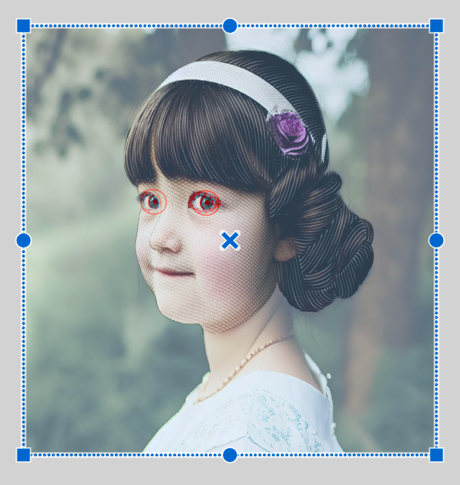{width="218"}

To delete, press {*Del*}/{*Backspace*} on the keyboard or the **Delete** icon in the Layers panel.

A group can contain other groups, which in turn can contain layers with non-transparent masks (Mask Overlay). To allow non-transparent masks from different groups to interact, the Mask Overlay property must be enabled in the group. If this property is disabled, masks will only interact within the confines of that group.

{width="239"}

#### Ordering

Using the Layers panel, you can easily change the order of objects. To change the position of an object within the document's object hierarchy, hover over the row in the Layers panel, press and hold the mouse button to grab the object, and then drag the object to a new position.

Удерживайте клавишу {*⌥*} при перетаскивании объекта, чтобы создать его копию.

| mouse press | drag | release |
| --- | --- | --- |
|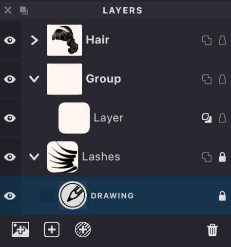{width="250"}|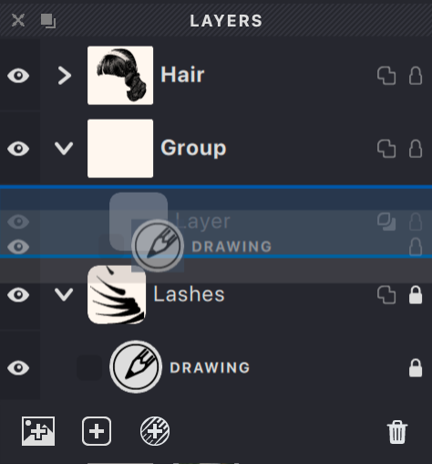{width="250"}|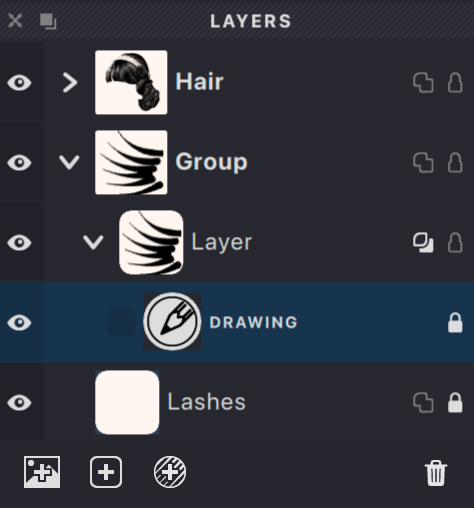{width="250"}|