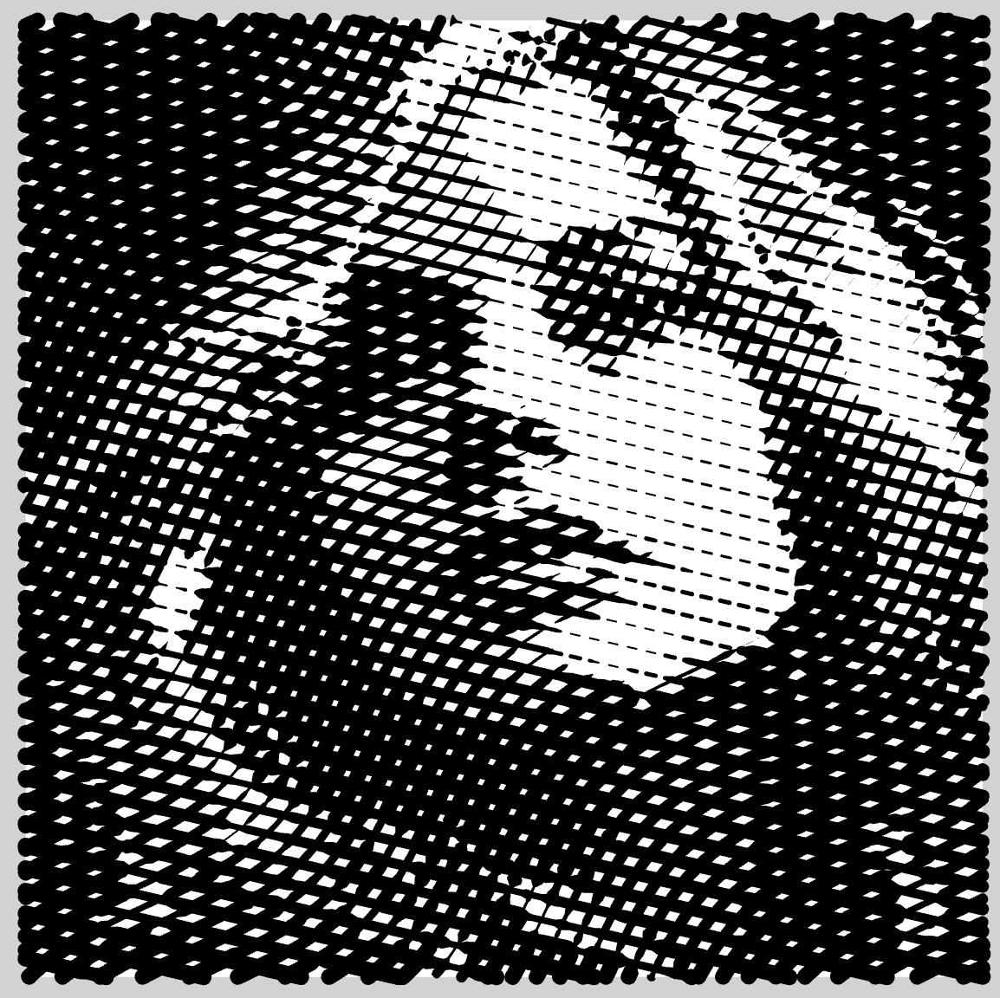
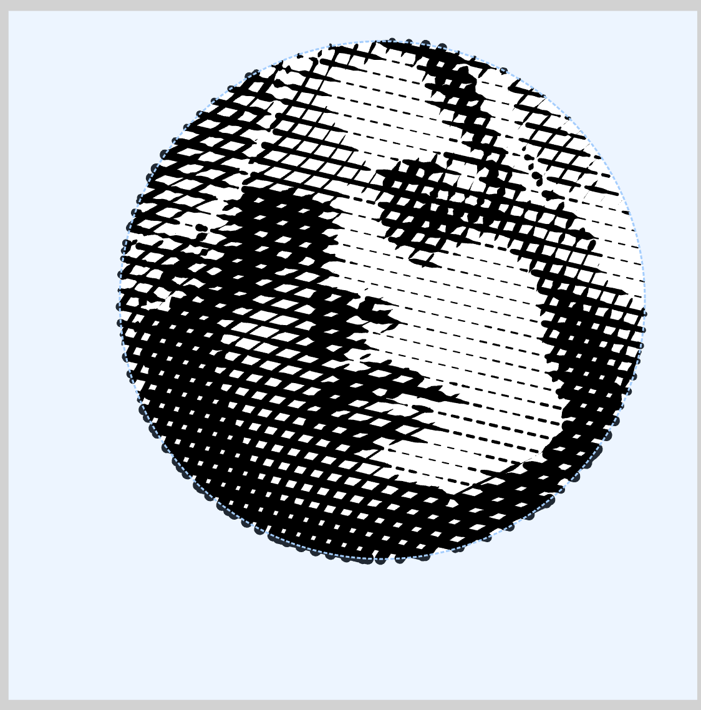
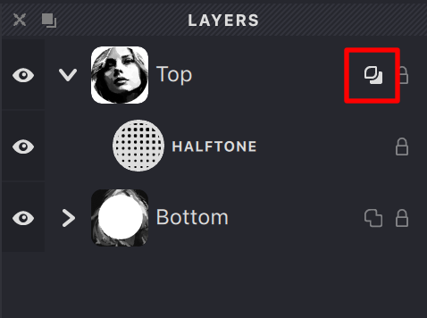
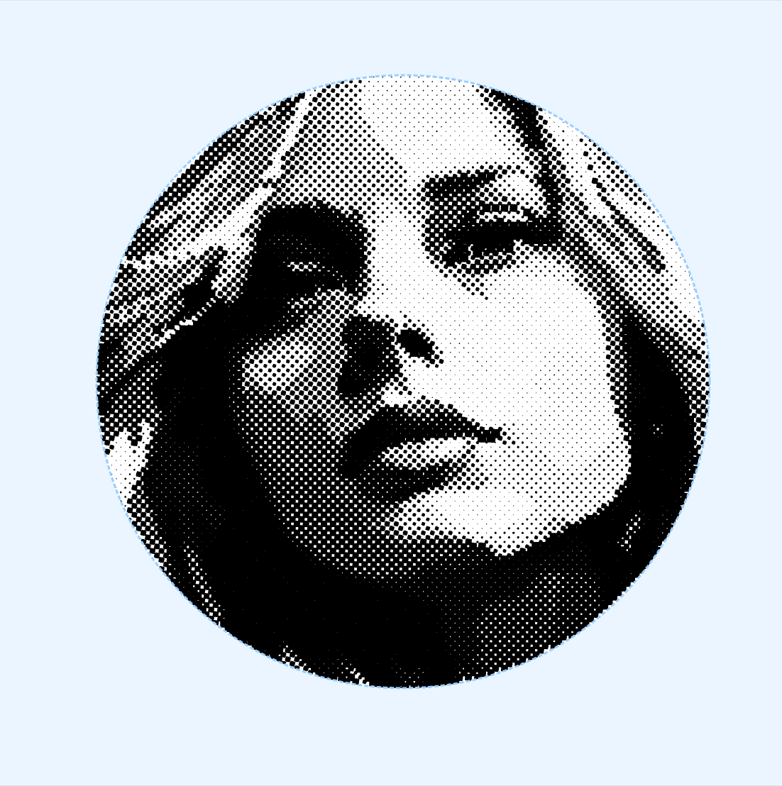
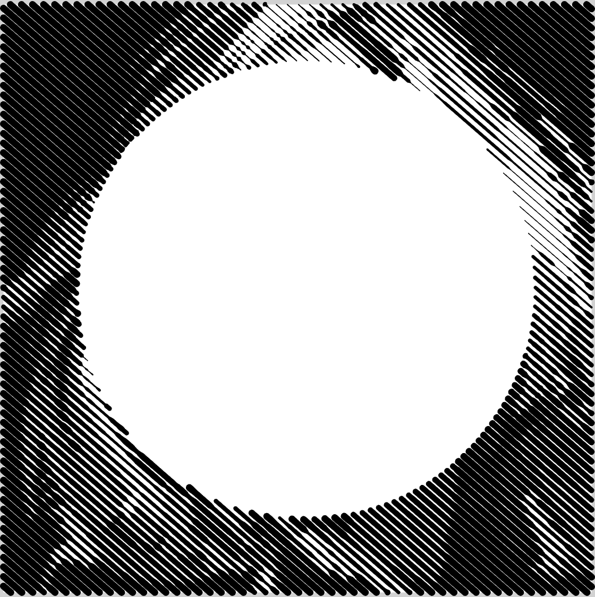
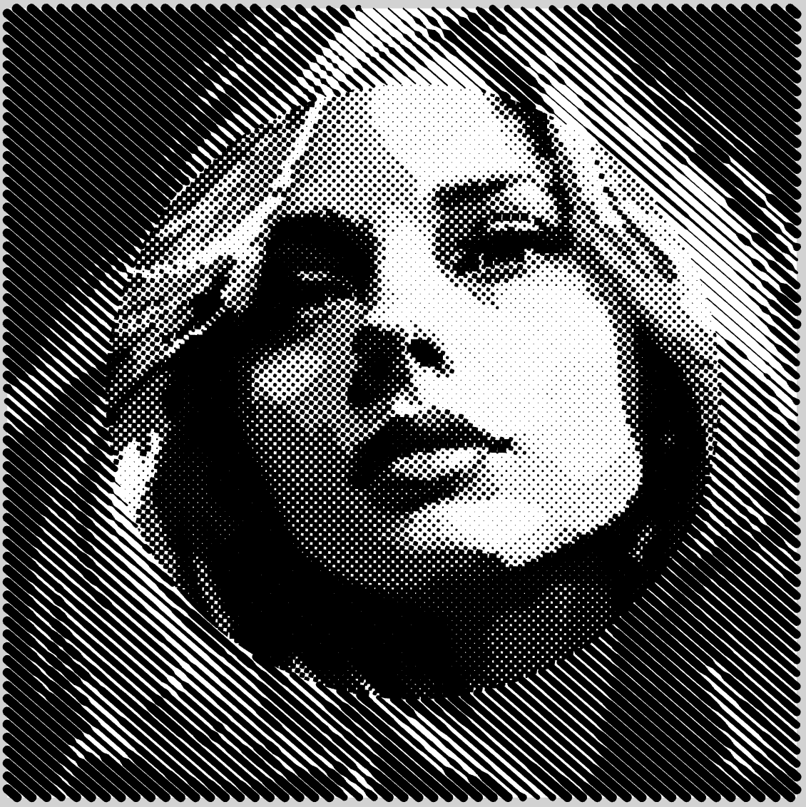
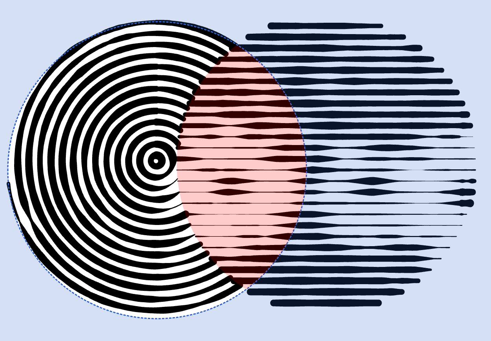
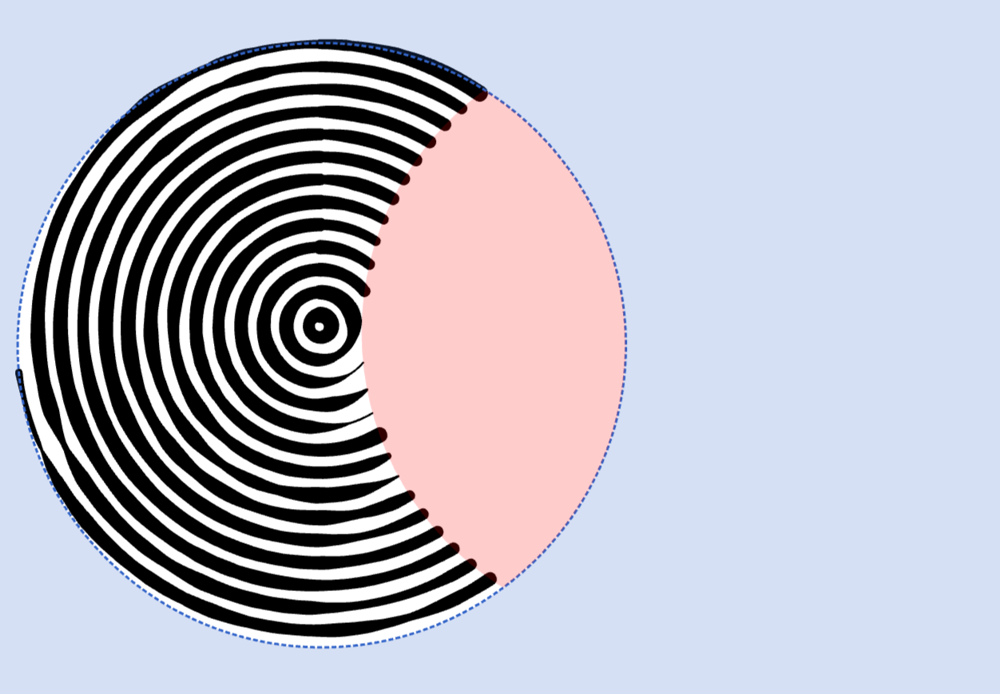

A mask allows you to hide or reveal parts of an image on a layer. 

| Layer: No Mask | Layer: Masked |
| --- | --- |
|{width="300"}|{width="300"}|

Think of a mask as a stencil - the fill is only visible in areas where the mask allows it to show through. Each layer can contain one mask that affects all fills within that layer.

White areas of the mask show your fills, while black areas hide them. This gives you precise control over which parts of your artwork are visible.

## Creating Masks

You can create masks using several tools:
- Brush tool for freehand painting
- Rectangle tool for geometric shapes
- Ellipse tool for circular areas
- Freeform tool for custom shapes

## Mask Overlay

The layer has a Mask Overlay property. When enabled, the mask becomes solid and opaque for layers positioned below the current layer.

{width="239"}

| Layer: Top, Overlay: On | Layer: Bottom | Top + Bottom |
| --- | --- | --- |
|{width="300"}|{width="300"}|{width="300"}|

The Mask Overlay feature is useful when you want to:
- Create cutout effects
- Prevent lower layers from showing through
- Build complex, layered compositions

If the current mask is overlapped by opaque masks above it, the covered areas will be highlighted in red for clarity.
{width="626"}

{width="626"}

## Advanced Options

Masks can be further enhanced with properties like:
- **Smooth Mode**: Creates soft, blended edges
- **Opacity**: Controls the transparency level
- **Feather**: Adds blur to mask edges

> For detailed information about working with masks, see the dedicated [Mask chapter](/v1/docs/mask-2).