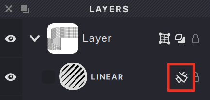

The Mesh property of the layer provides an advanced level of flexibility by allowing you to manipulate fills using a grid-based system. This feature helps you create unique transformations and effects.

The following predefined mesh shapes are available:

&nbsp;&nbsp;Rectangle
&nbsp;&nbsp;Donut
&nbsp;&nbsp;Rising wave
&nbsp;&nbsp;Falling wave
&nbsp;&nbsp;Rising ribbon
&nbsp;&nbsp;Falling ribbon

*Note:* Meshes do not affect certain fill types such as trace, handmade, autowireframe, or scribble fills.

## Activating Mesh Mode

1. Select the layer you want to work with
2. Click the **Mesh** button in the Layers Panel toolbar
{width="218"}
3. Choose one of the predefined mesh shapes
4. The mesh grid appears on your layer and a toggle appears in the layer row
{width="218"}

## Front and Back Sides

When a layer has Mesh mode enabled, fills can be assigned to different sides of the mesh:

{width="218"}

-  Fill appears on both sides
-  Fill appears only on front side
-  Fill appears only on back side

## Removing a Mesh

To remove a mesh from a layer:

1. Select the layer with the active mesh
2. Either:
   - Navigate to **Layer → Mesh → Remove**
   - Click the mesh icon in the layer row
{width="215"}

> For detailed information about working with meshes, see the dedicated [Mesh chapter](/v1/docs/mesh-3).
   