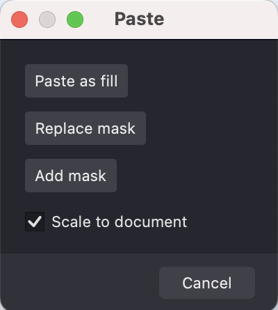
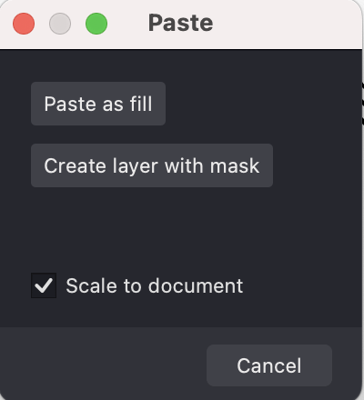

Easily import a pre-designed mask using an SVG file.

To do so, follow these steps:
1. Navigate to **File -> Import -> Artwork** from the menu. 
2. In the dialog box that appears, choose the SVG file you wish to import.
3. Then, decide on the action you'd like to take:

If a specific Layer is selected:
* **Replace Mask**: This will substitute the mask in the currently selected Layer.
* **Add Mask**: This will append a new mask to the chosen Layer.

{width="200"}

If no Layer is selected, you'll be given the option to create a new layer that includes the imported mask.

{width="200"}

If you want the mask to match the document's dimensions, ensure the **Scale to document** option is checked.

Following these steps will either add a new layer with the imported mask to your document or integrate the mask into an existing layer.

{width="500"}