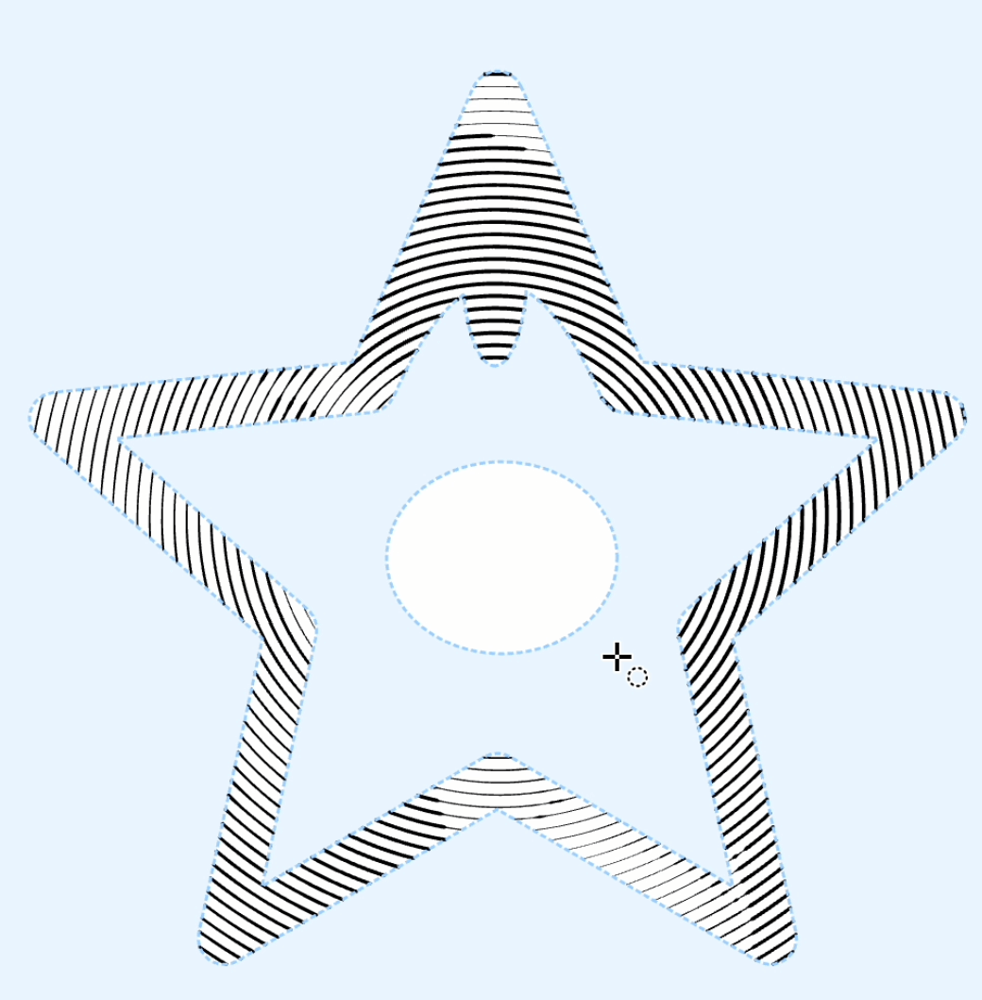
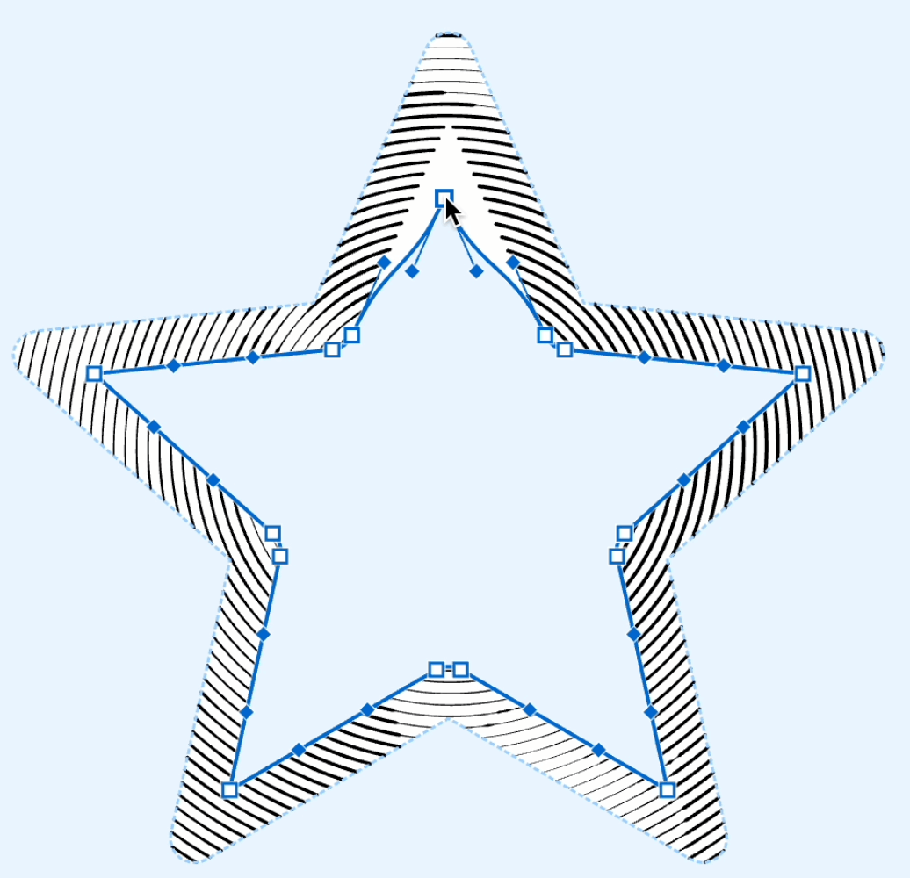
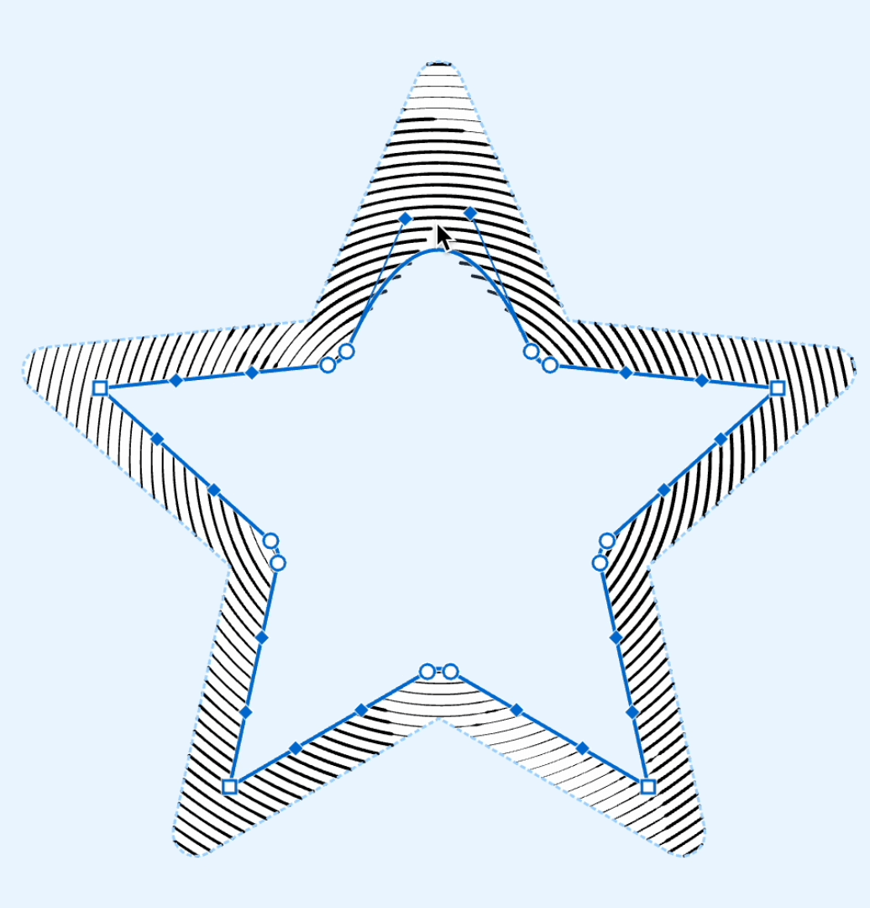
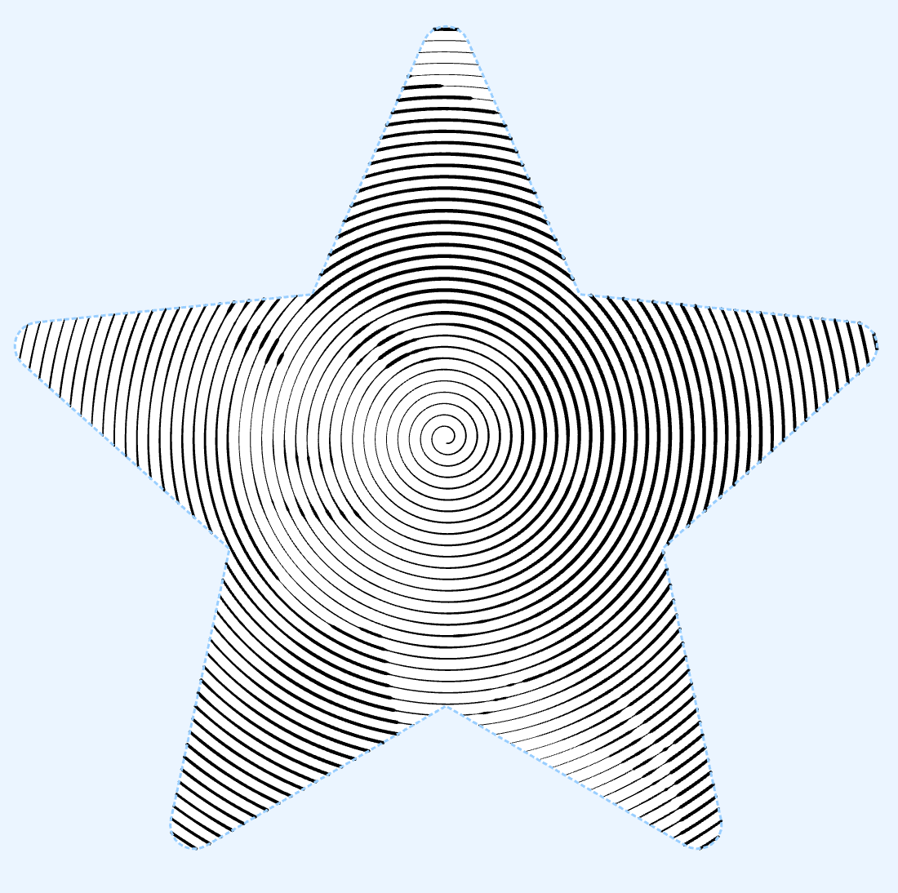
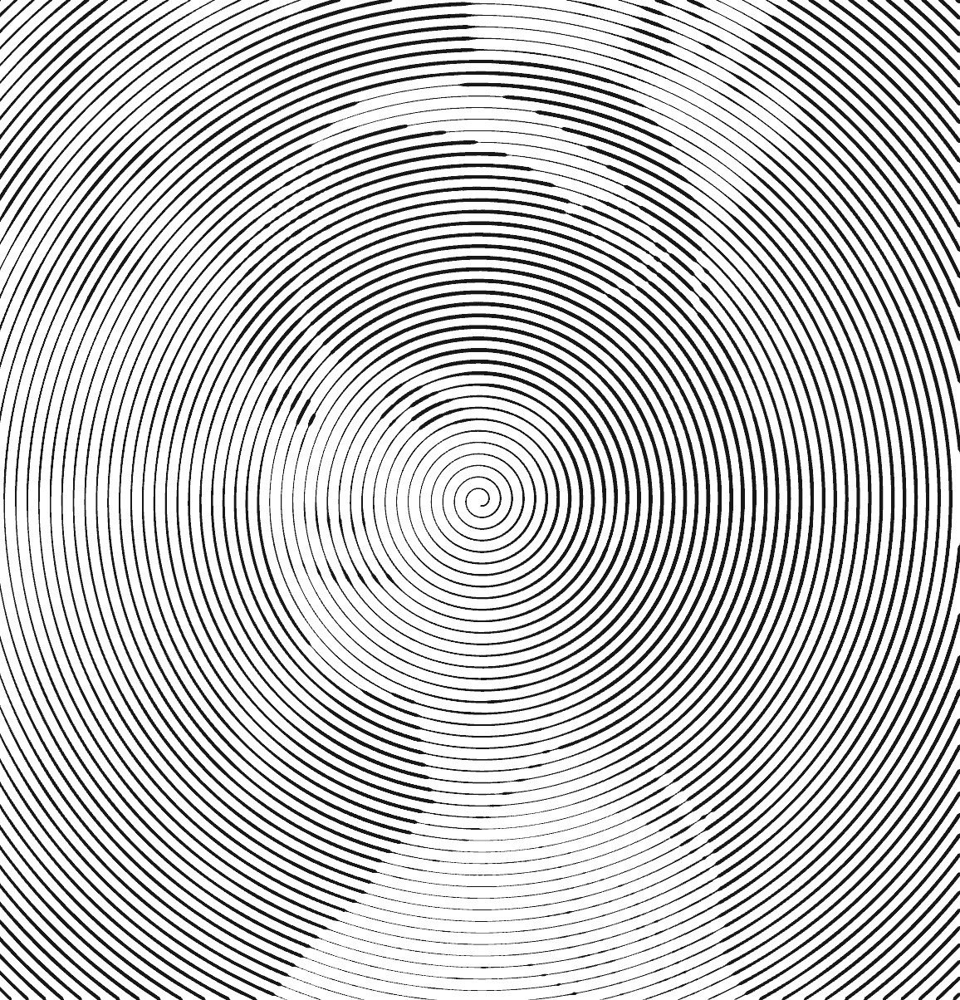
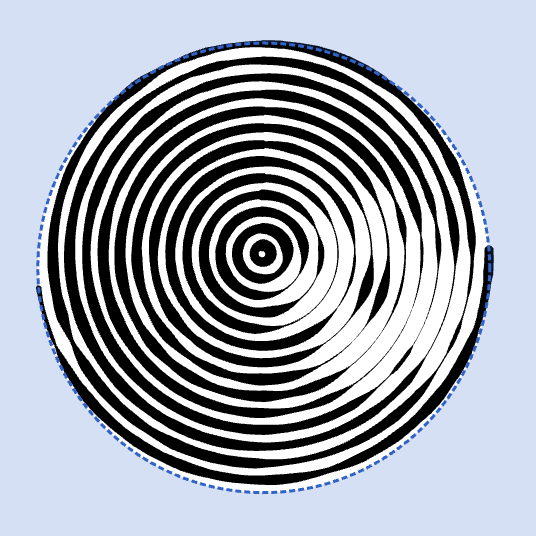
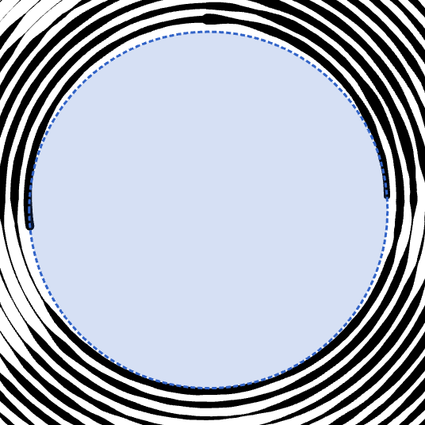

You can easily modify the mask on your chosen **Layer**. Use tools like the **Brush**, **Rectangle**, **Ellipse**, and **Freeform** to draw new sections or erase unwanted areas.
{width="518"}

For more precise edits, utilize the **Editor** tool. 

Start by selecting a curve on the mask. You can choose multiple curves by holding down the {*⇧*} key while clicking. Once selected, you can drag individual or multiple points to adjust their positions.

> Dive deeper into the Editor tool's capabilities in the [Editor](/v1/docs/editor) article.

{width="518"}

### Add and Remove Points

**To insert points**, either use the **Knife** tool or simply click on the desired curve spot with the **Editor** tool while holding the {*⌥*} key.
{width="518"}

**To remove points and segments**, select and delete specific curves using the {*Backspace*} or {*Del*} keys.

{width="518"}

**To remove the whole mask**, delete all of its curves. Doing so will apply fills to the entire document area.

{width="518"}

### Inverting Mask
!!!2 Для инвертирования маски используйте меню **Layer -> Invert Mask**
| mask: normal | mask: inverted|
| --- | --- |
|{width="300"}|{width="300"}|
