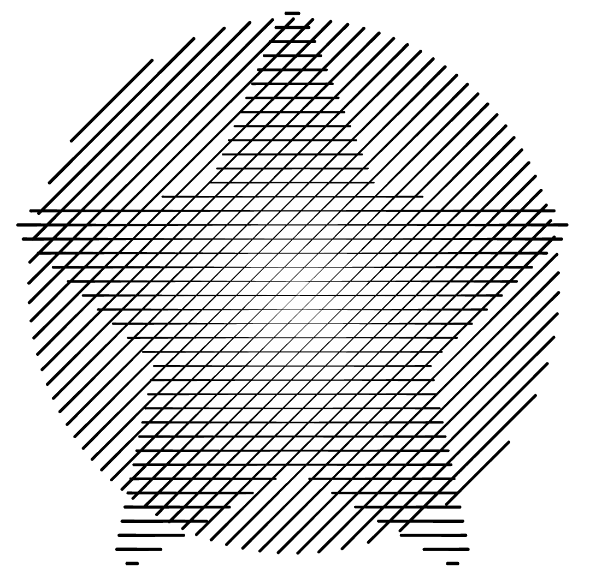
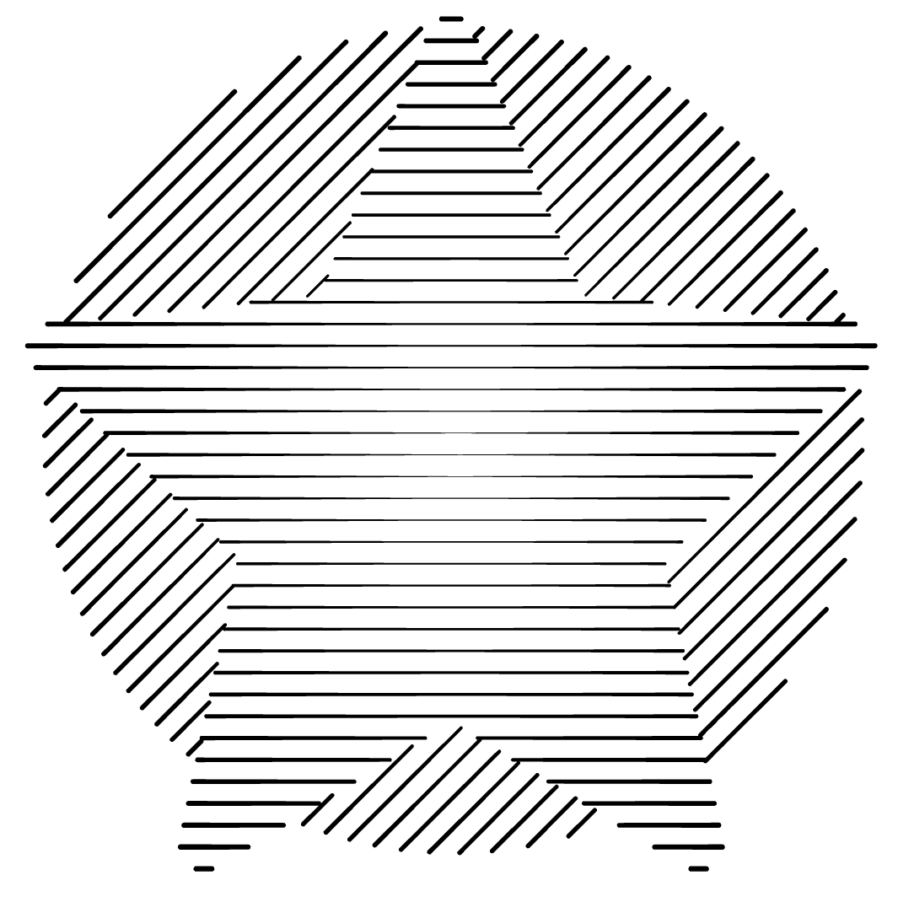
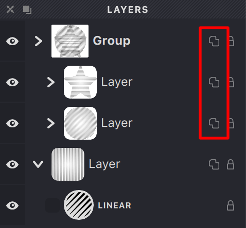
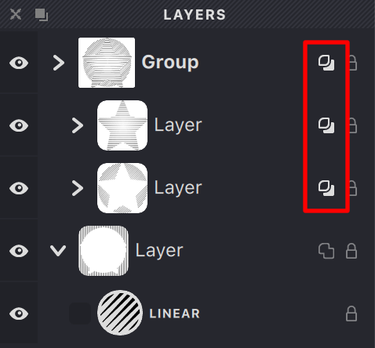
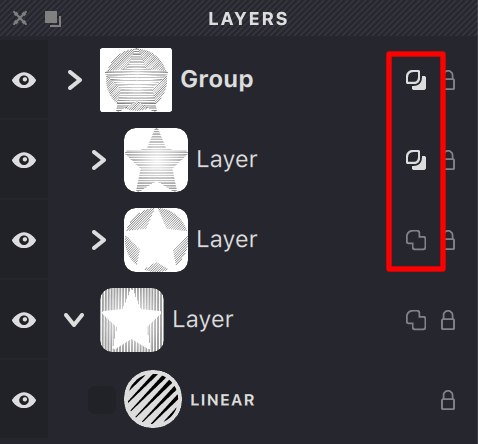
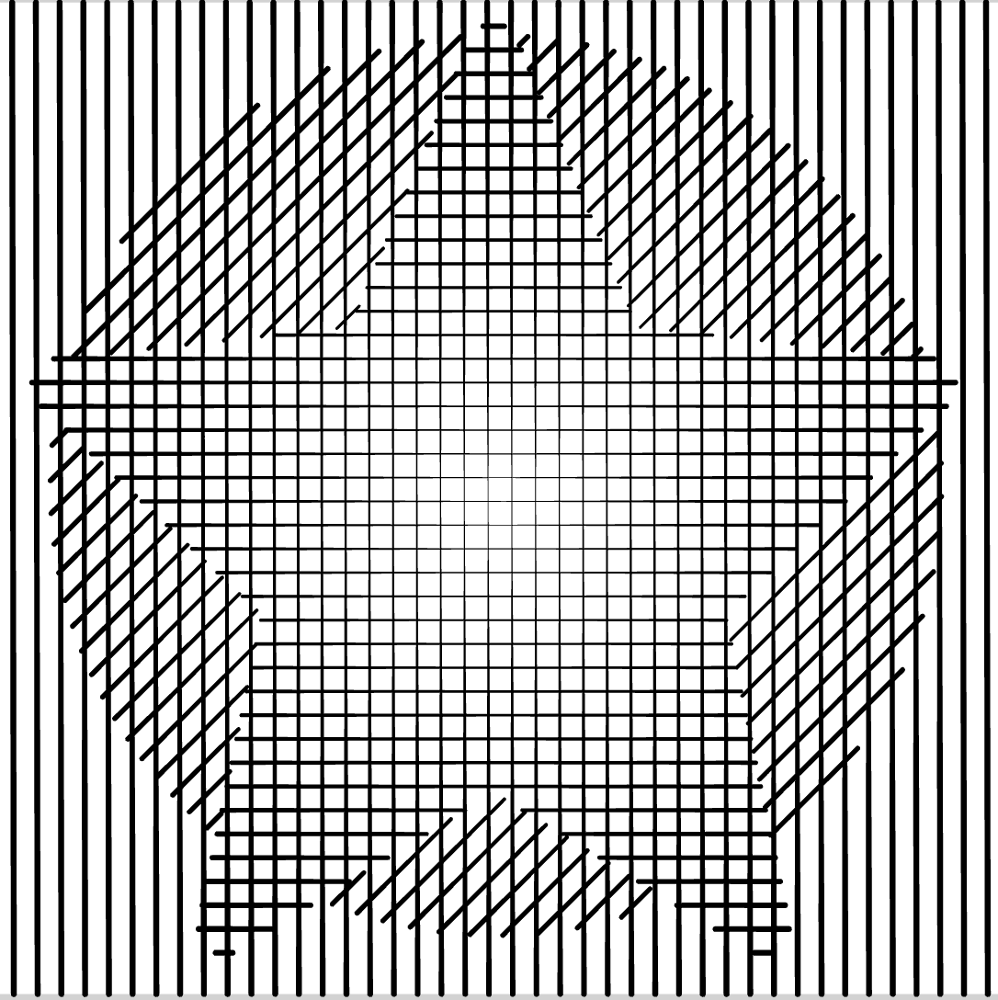
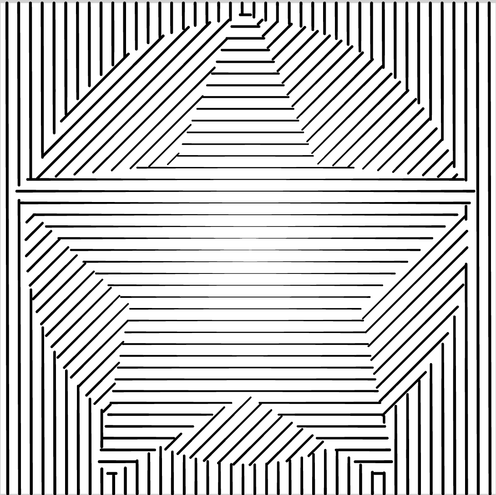
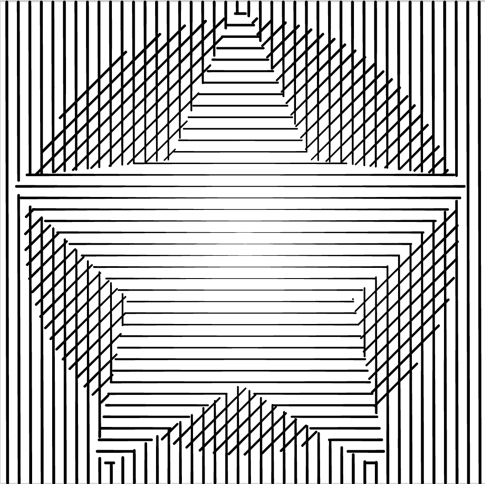
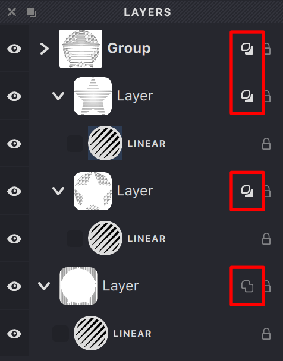

### Overlay

In Vexy Lines, each layer has an **Overlay** option. When turned on, the mask becomes solid, covering its selected area and hiding any masks below it. Essentially, a layer with the activated **Overlay** will be displayed on top of other underlying layers.

| overlay: off | overlay: on|
| --- | --- |
|{width="300"}|{width="300"}|

The Overlay's behavior is also influenced by the group's Overlay setting:

* If the group's Overlay is on, its masks will cover any layers below the group.
* If it's off, the masks will only affect layers within that group.

| group overlay: off |  group overlay: on |  group overlay: on |
| --- | --- | --- |
|{width="238"}|{width="238"}|{width="238"}|
|{width="300"}|{width="300"}|{width="300"}|

You can enable or disable the **Overlay** property in the **Layers** panel. The **Overlay** icon is located on the right side, next to the **Group** or **Layer** line.

{width="238"}
