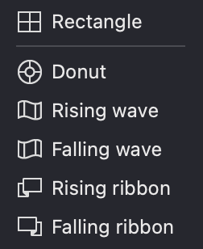

Adding a mesh to your layer is the first step toward creating advanced transformations and effects in Vexy Lines. A mesh allows you to manipulate your artwork in ways that would be difficult or impossible with standard vector editing tools.

Before adding a mesh, make sure you have:
- Created at least one layer with fills
- Selected the layer you want to apply the mesh to
- Considered which mesh shape will best suit your design goals

## Adding Mesh

1. Ensure a Layer is selected.  
2. In the **Toolbar** of the Layer panel, click the **Set Mesh** button.  
{width="218"}

3. Choose a desired **Mesh shape** from the list.
{width="126"}

As a result:  
- The selected shape will be applied to the chosen Layer.  
- A **Mesh icon** will appear in the Layer row, allowing you to toggle the **Mesh mode** on or off by clicking it.  
{width="218"}

## Mesh Templates
Vexy Lines offers several predefined mesh shapes, each suited for different artistic purposes:

| Template | Example Use Case |
|--------------|------------------|
| &nbsp;&nbsp;Rectangle | Creating perspective in architectural designs |
| &nbsp;&nbsp;Donut | Creating circular labels or badges |
| &nbsp;&nbsp;Rising wave | Creating wave patterns or flowing fabrics |
| &nbsp;&nbsp;Falling wave | Creating waterfall-like designs |
| &nbsp;&nbsp;Rising ribbon | Creating spiraling or twisted shapes |
| &nbsp;&nbsp;Falling ribbon | Creating descending spiral patterns |

Once you've added a mesh to your layer:

1. Your fills will be transformed according to the mesh's shape
2. The mesh grid becomes visible when the layer is selected
3. You can edit the mesh using the **Editor** tool
4. Fills can be assigned to the front side, back side, or both sides of the mesh
5. You can toggle the mesh on/off using the mesh icon in the layer row

## Tips for Choosing the Right Mesh

- **Start simple**: Begin with the Rectangle mesh for basic transformations
- **Match shape to purpose**: Choose a mesh shape that closely resembles your desired final form
- **Consider complexity**: More complex meshes (like ribbons) may require more editing
- **Plan ahead**: Think about how you'll want to manipulate the mesh before selecting a type
- **Experiment**: Don't hesitate to try different mesh types to see which works best

For more detailed information about working with meshes after adding them, see the dedicated [Mesh chapter](/v1/docs/mesh-3).