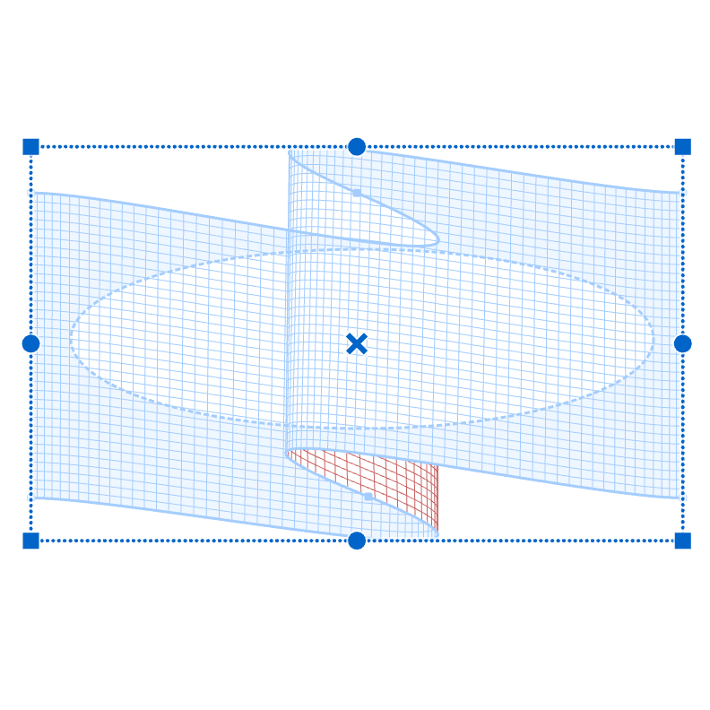
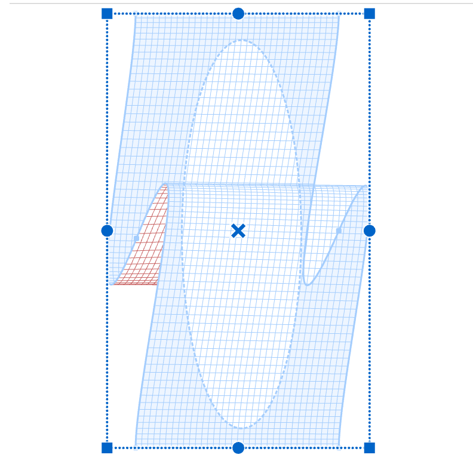
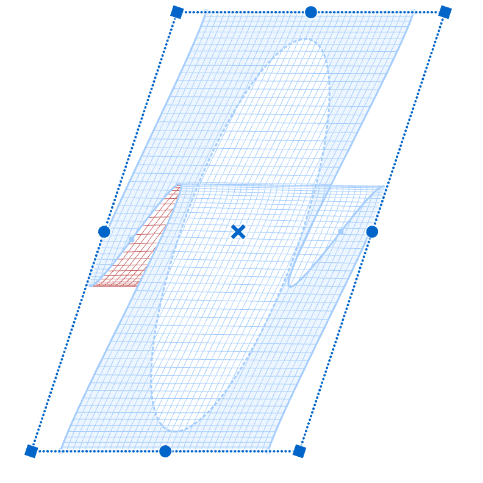
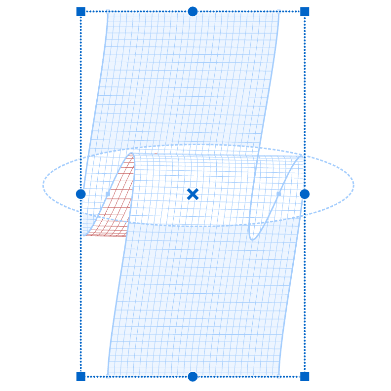
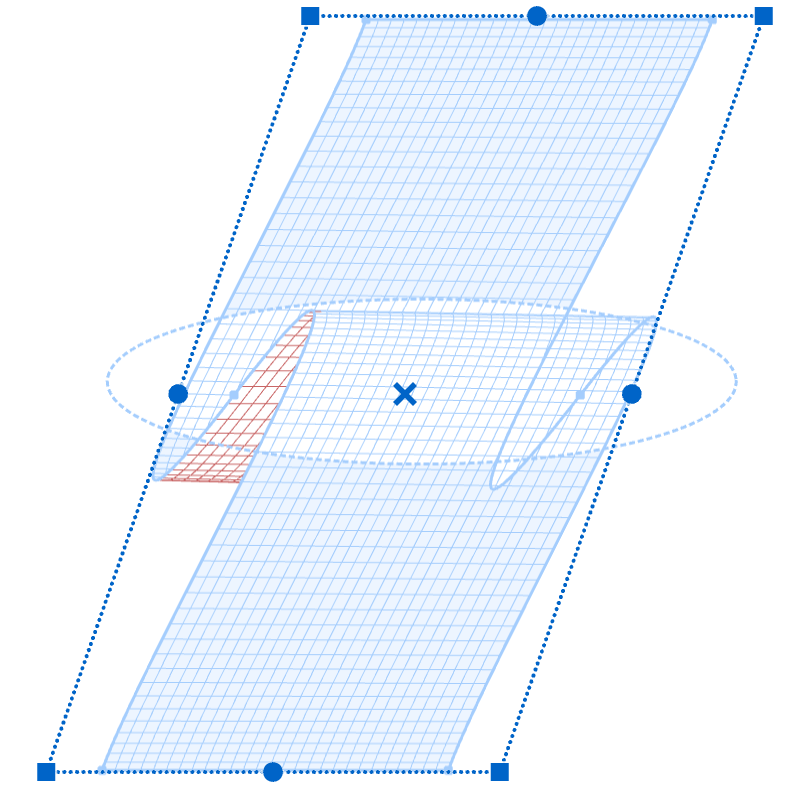

When a layer has a **Mesh**, its mask comes with a **Pinned** option. This feature allows the mask to move in sync with the Mesh. When you adjust the Mesh by moving, rotating, or resizing it, the mask follows along accordingly.

In Mesh mode, the mask within this Layer gains an additional **Pinned** property. This feature is designed to "pin" the mask to the Mesh object. When in the Pinned state, all standard transformation operations (move, rotate, resize) applied to the Mesh will also be applied to the mask.

| pinned mask | rotate | shear |
| --- | --- | --- |
|{width="300"}|{width="300"}|{width="300"}|

| unpinned mask | rotate | shear |
| --- | --- | --- |
|{width="300"}|{width="300"}|{width="300"}|

You can enable or disable this property from the Layers panel. To the right of the Mesh object, an icon appears. By clicking on this icon, you can toggle the Pinned property on and off.

{width="218"}

