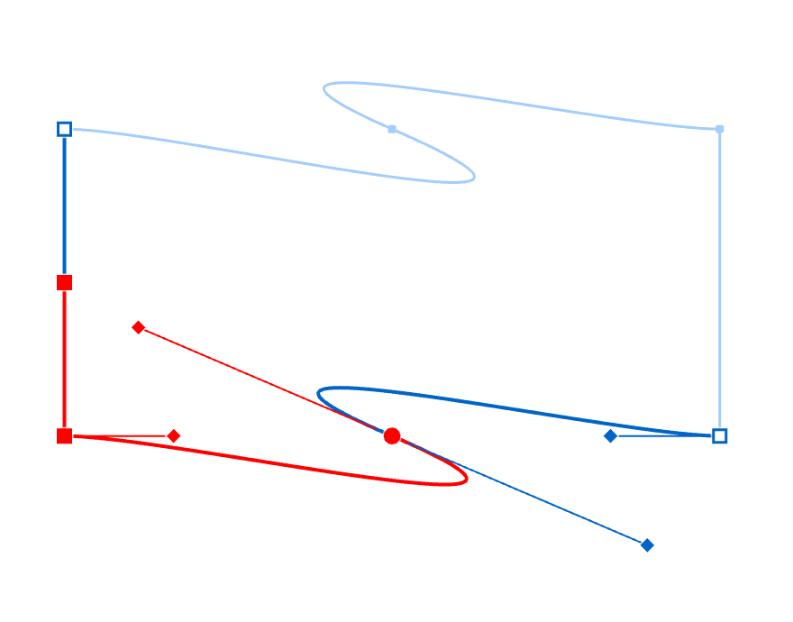
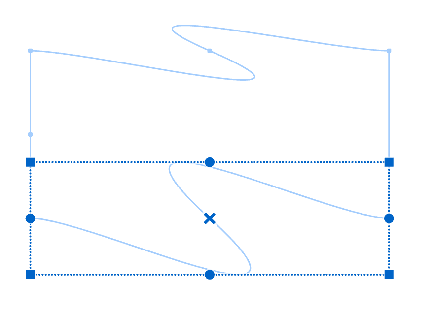
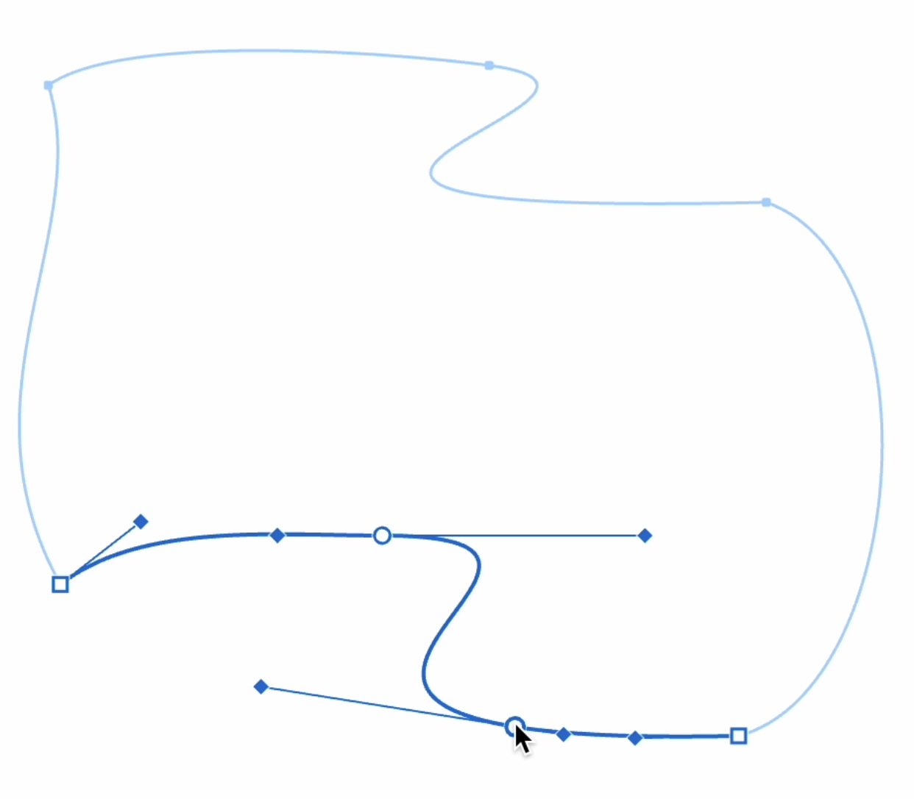
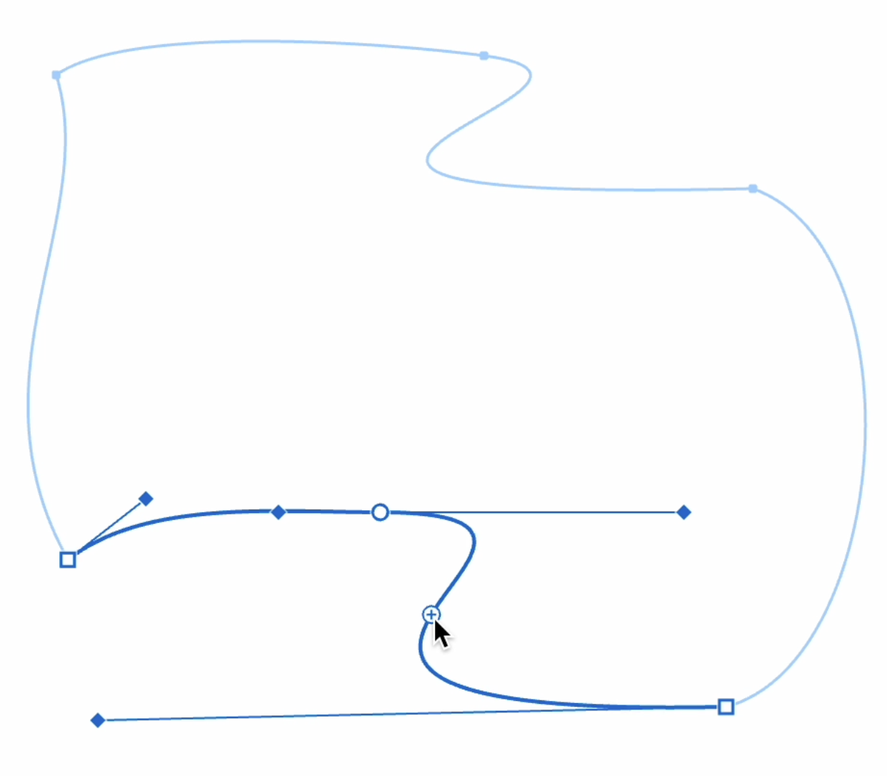
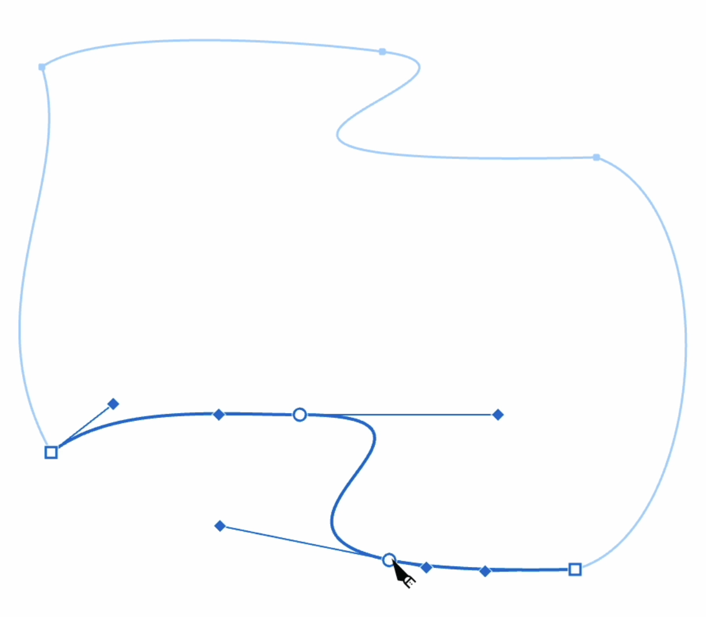
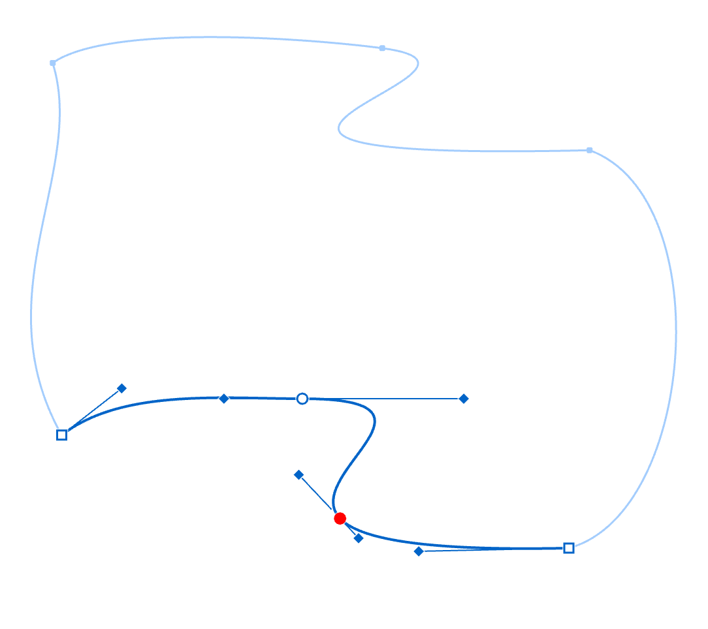
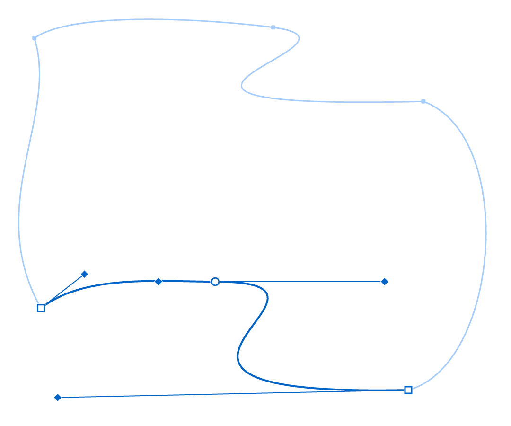

After adding a mesh to your layer, you can customize it to achieve your desired effect. 

## Basic Editing

Use the **Editor** tool to begin editing your mesh. Click on any edge to make it active. Active edges show points available for editing.

Hold the {*⇧*} key to **select multiple edges** at once.

You can move individual points, select groups of points, move groups, and delete points as needed.

{width="440"}

Use the **transformation tool** (⌘T) to transform selected edges by scaling, rotating, or reshaping them.

{width="440"}

## Adding Points

You can add points to mesh edges using three methods:

#### Using {*⌥*} Key
Hold the {*⌥*} key and click where you want to add a point. On straight segments, this adds Bezier curve points. On curve segments, this adds a simple point at the clicked location.

> **Note**: A point on an edge differs from a vertex. Vertices occur where horizontal and vertical edges intersect. Regular points can exist anywhere along an edge.

{width="621"}

#### Using Quick Add Buttons
Click the {[+]} buttons that appear between points on your selected edge to add a new point between existing ones.

{width="621"}

#### Using the Knife Tool
For precise placement:

1. Select the **Knife** tool from the tools panel
2. Click on your edge where you want to add a point
3. A new point will appear at the clicked location

{width="621"}

## Deleting Points

To delete points, select them and press {*Backspace*} or {*Del*}. Only regular points can be deleted, not vertices where edges intersect.

{width="542"}

Vexy Lines preserves the shape of curves when points are deleted.

{width="542"}

## Deleting Edges

To delete an edge, select it and press {*Backspace*} or {*Del*}.

> **Important**: Only added edges can be deleted. Original edges that came with the mesh cannot be removed.

## Helpful Tips

These techniques can improve your mesh editing workflow:

- Hold {*⌘*}/{*⌃*} while dragging points for more precise movements
- Add extra points in areas that need smoother curves
- Use only as many points as necessary to achieve your desired shape
- Save your work regularly when editing complex meshes

For more information about mesh properties and Hidden Strokes Removal, see the [Mesh Properties](vb://article/mesh-properties) article.