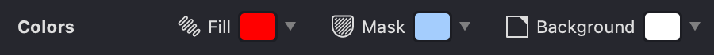

{width="450"}

* **Fill:** Adjust the highlight color for selected fills. This allows you to highlight the selected fills along their contour with the chosen color.
* **Mask:** Set the highlight color for masks and the mesh grid.
* **Background:** Set the color for the workspace background.

These options can also be found in the [View](vb://article/view-2) panel.

 Use the Reset button to restore values to their default settings.
