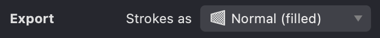
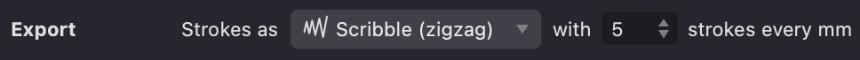
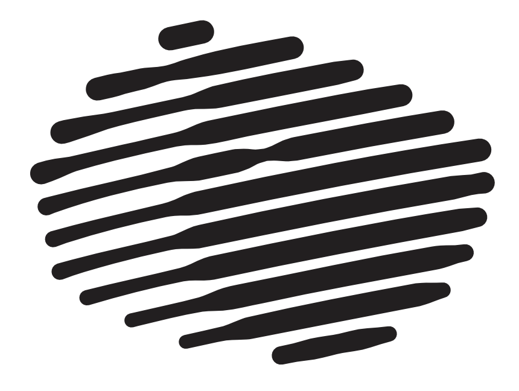
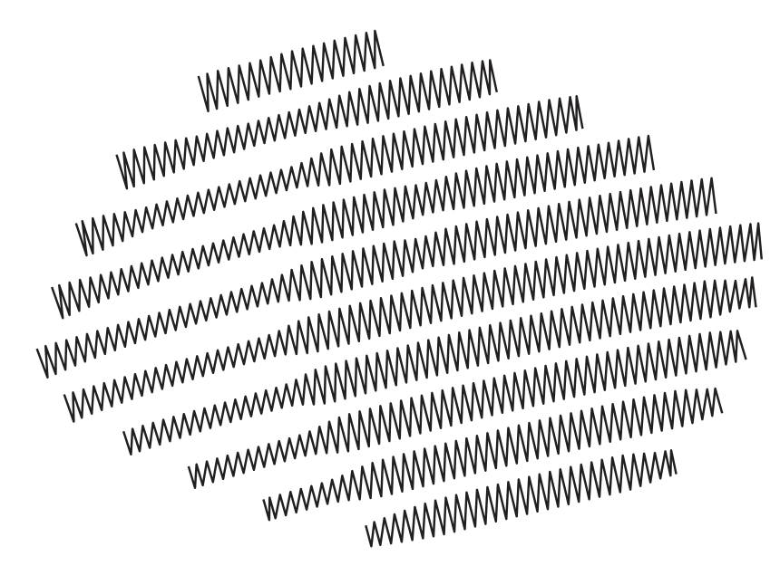

The "Export Strokes as" option determines how strokes are exported to vector format:
  * **Normal**: Strokes are displayed as closed shapes with fill.
{width="314"}
  * **Scribble**: Strokes are displayed as a simple zigzag line, evenly filling the fill line at a specified interval. The interval is determined by the number of vertical zigzag segments per 1mm of the fill line.
{width="484"}

The SCRIBBLE mode can be useful if you intend to use the exported file for CNC machine output and similar purposes. 

| normal | scribble |
| --- | --- |
|{width="300"}|{width="300"}|

Scribble export is not applicable to Halftone, Traced, and Text fills.