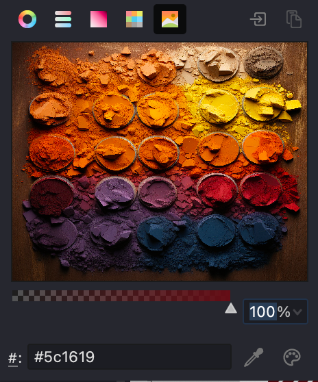
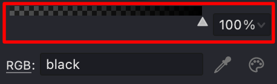
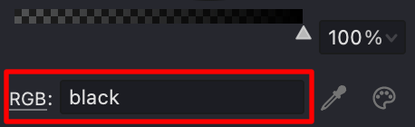
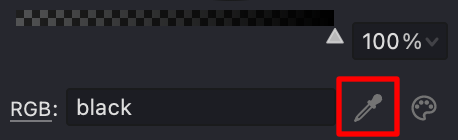
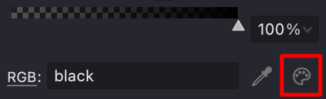

Vexy Lines offers two ways to set colors for your fills:

- **Static:** A fixed color is applied to your artwork.
- **Dynamic:** The fill color is automatically determined by the colors underneath each element.

| Static Color | Dynamic Color |
| --- | --- |
| {width="300"} | .png){width="300"} |

### Dynamic Color Options
When you use dynamic color fills, the color of each element or segment is picked up from the corresponding area of your source image.

If your fill uses closed elements (like in Trace, Halftone, or Text fills), each element displays the color from the image beneath it. For fills that involve curves, the curve is divided into segments. Each segment is colored based on the underlying image, making the overall effect adapt naturally to your picture.

You can adjust how many segments are created by changing the **Color segment length** parameter:

| Length: 1 | Length: 4 | Length: 10 |
| --- | --- | --- |
| {width="300"} | .png){width="300"} | .png){width="300"} |

To add a more natural look, use the **Color segment length variation** parameter. This randomizes the segment lengths so the fill doesn't appear too regular or mechanical.

| 0% | 50% | 100% |
| --- | --- | --- |
| {width="300"} | .png){width="300"} | .png){width="300"} |

> Note: In Trace, Halftone, and Text fills, the "Color segment length" and "Variation" parameters are not available.

### Static Color Option

To set a fixed color for your fill, Vexy Lines offers a robust color panel with several useful tools:

#### Wheel Panel

The color wheel helps you choose and fine-tune your color. It displays a circular palette with various colors and shades. You can adjust saturation and brightness, and use the internal triangle to mix and match different tones.

{width="300"}

#### Sliders Panel

This panel provides precise control over your color settings. For the RGB model, adjust each of the red, green, and blue sliders. For the HSB model, modify hue, saturation, and brightness. The Grayscale model uses a single slider to move between black and white.

{width="300"}

#### Box Panel

The Box panel offers a quick-access set of colored squares. Click on any square to apply that color immediately. This is useful for quickly assembling attractive color schemes from a variety of models.

{width="300"}

#### Swatches Panel

The Swatches panel displays preset color samples, making it simple to choose and combine colors. Options include:

* Custom
* Standard
* Light
* Dark
* Photoshop

{width="300"}

#### Picture Panel

Use the Picture panel to load an image and extract its color values for your fill. Click the **Open picture** button to select an image from your device, or paste an image from your clipboard.

{width="300"}

#### Opacity

Adjust the transparency of your color using the slider at the bottom of the Color panel. You can also type in a specific transparency value if you prefer greater precision.

{width="300"}

#### Color Name and Value

You can directly enter a color name or a specific color value in the chosen color model. The dropdown to the left lets you switch between different value types:

* RGB
* Name
* HSB

{width="300"}

#### Pick Screen Color

This tool lets you choose a color from anywhere on your computer screen. It's a handy way to match a color exactly as seen in another application or image.

{width="300"}

> Before using this tool, you may need to grant the appropriate permissions in your operating system settings.

#### System Color Dialog

Alternatively, use the System Color Dialog to choose a color from your operating system's standard color picker. Just click the **System Color Dialog** button.

{width="300"}

