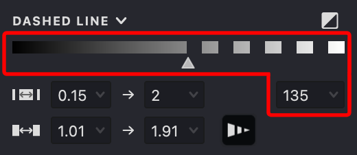
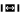
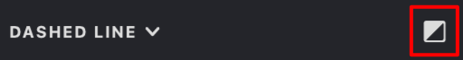
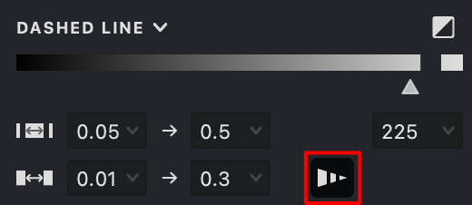
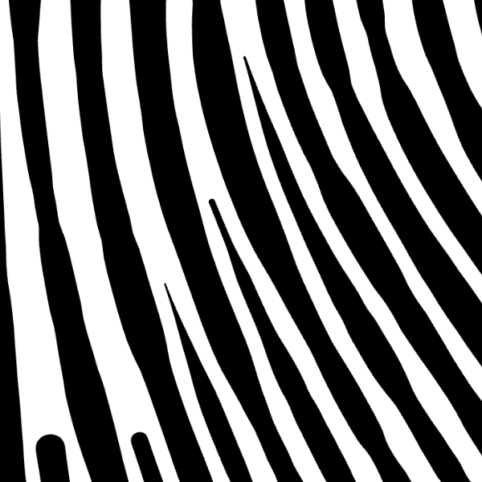
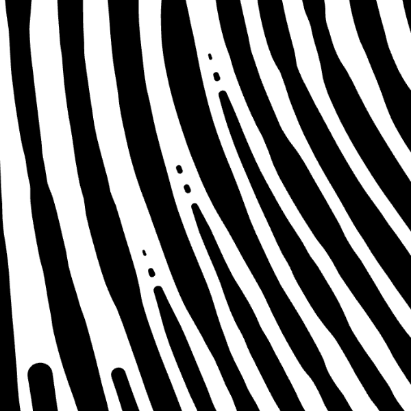

These options allow you to control the dashed pattern of your fill lines.

{height="" width="300"}

> Note: This setting is not applicable to Text, Trace, and Halftone fills.

### Threshold

The threshold determines when a fill line becomes dotted based on the halftone values in your image. When the halftone exceeds the threshold, the line turns dotted. By default, areas lighter than the threshold show dotted lines, and at a threshold of 255 the dotted effect is disabled. Adjust this value using the slider or input field.
Alternatively, double-click the indicator to automatically set the optimal threshold value.

{width="300"}

| threshold: 130 | threshold: 50 | threshold: 0 |
| --- | --- | --- |
| {height="" width="300"} | .png){height="" width="300"} | .png){height="" width="300"} |

### Additional Options

Access additional dash settings by clicking the expand icon on the panel header. This section lets you fine-tune the dash and gap lengths.

It includes:

 Minimum and maximum dash length.
 Minimum and maximum gap length.

By default, the longest dash appears at the darkest gray, and the shortest dash at the lightest. Similarly, the smallest gap is on the darkest part, and the largest gap on the lightest.

| dash: 0.1→2 gap: 1→2 | dash: 0.1→0.2 gap: 1→2 | dash: 0.1→1.5 gap: 0.2→2 |
| --- | --- | --- |
| {height="" width="300"} | .png){height="" width="300"} | .png){height="" width="300"} |

### Inverted Mode

{width="300"}

In Inverted Mode the dashed line is built from the threshold value down to pure black (zero). In this mode, the shortest dash appears on the darkest part of the image, while the longest dash appears on the lightest. Similarly, the gaps reverse—the smallest gap is on the lightest area, and the largest on the darkest. This setup is ideal for white stroke applications.

| dash: 0.1→2 gap: 1→2 | dash: 0.1→0.2 gap: 1→2 | dash: 0.1→1.5 gap: 0.2→2 |
| --- | --- | --- |
| {height="" width="300"} | .png){height="" width="300"} | .png){height="" width="300"} |

### Dash by <!--@OE33{-->Thickness<!--@OE33}-->

{width="300"}

Controls dash generation based on local stroke thickness. Thinner parts of the stroke are converted into dashed segments, which is especially useful when combined with Gap control.

| off | on |
| --- | --- |
|{width="300"}|{width="300"}|
