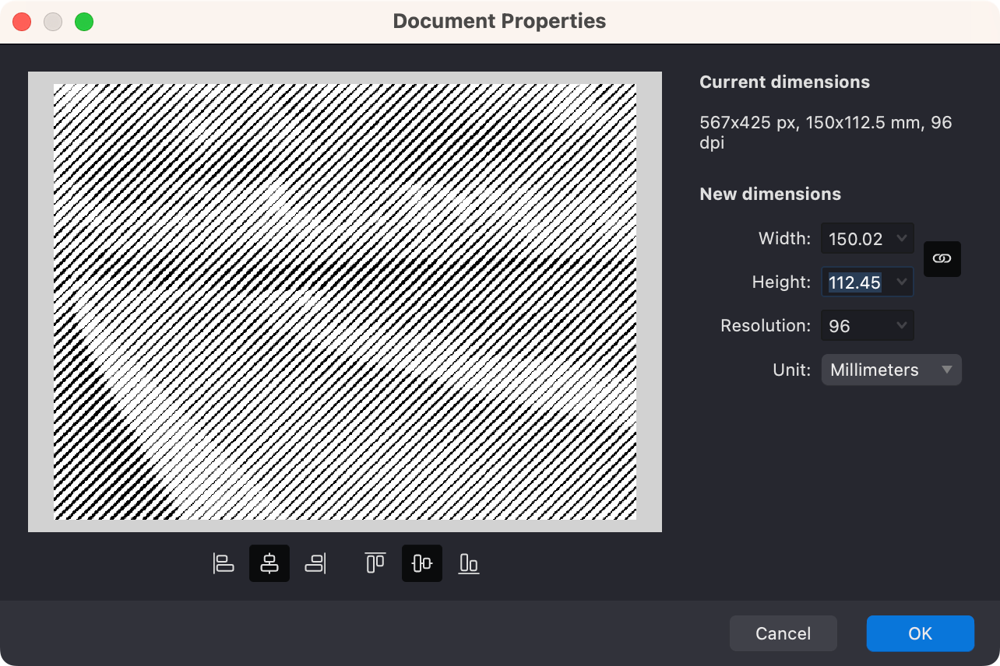
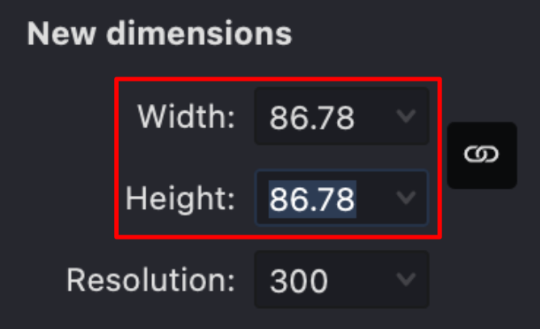
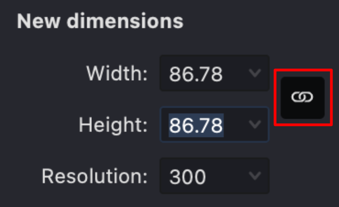
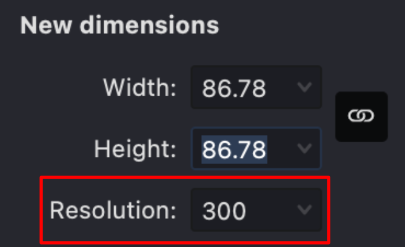

The Document Properties dialog allows you to modify key parameters of your document including size, resolution, and units of measurement.

## Accessing Document Properties

To open the Document Properties dialog:

1. Click on the **View** panel in the right sidebar
2. Locate the **Document Size** section at the bottom
3. Click the **"..."** button next to the dimensions

Alternatively, you can access it from the **File** menu by selecting **Document Properties**.

{width="600"}

## Adjusting Document Size

Note: Adjusting the document's size will not affect the size and properties of the objects within. Modifications are confined to the positions of the objects relative to the new dimensions. To reposition objects in the resized document, utilize the horizontal and vertical positioning buttons.

{width="300"}

Upon resizing, object placement can be centred horizontally or vertically, or aligned to the right, left, top, or bottom edges of the document.

To change the size of the document, use sliders or input fields.

{width="300"}

To preserve aspect ratio during resizing, enable the **Link** option.

{width="300"}

## Changing Resolution

To modify the document's resolution, utilize the corresponding input field.

{width="300"}