# Filters

# Image Filters Overview

This article describes the available image filters and explains what each one does.

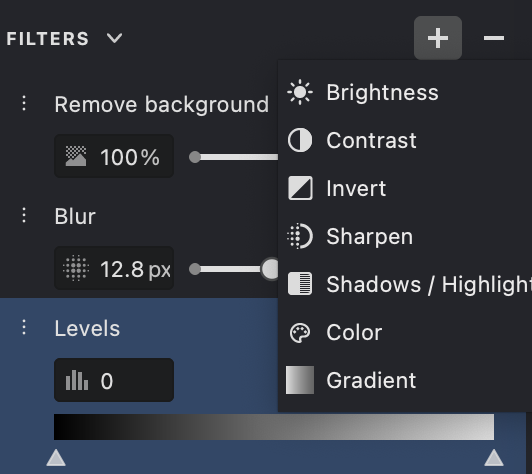{width="266"}

## Quick Overview

 **Brightness** adjusts the overall lightness of the image.
 **Contrast** increases or decreases the difference between dark and light areas.
 **Invert** reverses the image tones, turning light areas dark and dark areas light.
 **Levels** adjusts the tonal range of the image.
 **Blur** softens the image and reduces fine detail.
  **Sharpen** enhances edges and fine details to make the image appear clearer.
  **Shadows / Highlights** helps recover detail in very dark or very bright areas of the image.
 **Remove Background** separates the main subject from the background and removes unwanted surrounding areas.
 **Color** changes the color intensity and overall color appearance of the image.
{width="16"} **Gradient** applies a gradual tonal or color transition across the image.

---

## Detailed Description

### Brightness
{width="300"}

The **Brightness** filter changes how light or dark the entire image appears.  
It is useful when the source image is underexposed, too dark, or simply needs better overall visibility.

Increasing  brightness makes the image lighter and can reveal hidden detail in darker areas.  
Decreasing brightness makes the image darker and can help reduce washed-out areas or overly bright regions.

|0| 25 |
|---|---|
|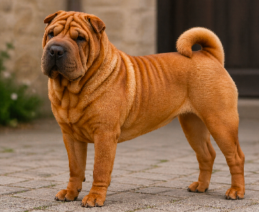{width="188"}|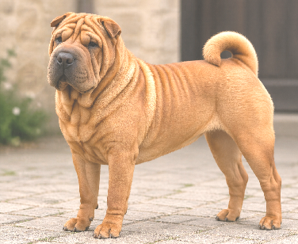{width="188"}|
|{width="188"}|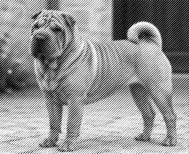{width="188"}|

---

### Contrast
{width="300"}

The **Contrast** filter controls the difference between the darkest and brightest parts of the image.  
It affects how strong, flat, soft, or vivid the image looks.

Higher  contrast makes shadows darker and highlights brighter, which can improve clarity and visual impact.  
Lower contrast reduces the difference between tones, producing a softer and flatter appearance.

| -50 | 50 |
|---|---|
|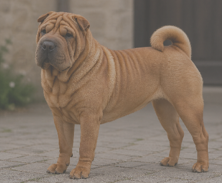{width="189"}|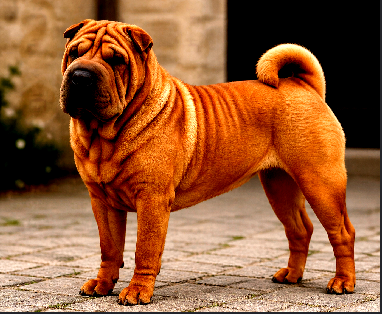{width="188"}|
|{width="188"}|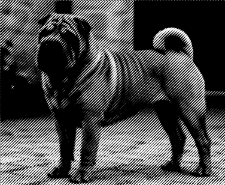{width="188"}|

---

### Invert

{width="300"}

The **Invert** filter reverses the tonal values of the image.  
Black becomes white, white becomes black, and intermediate tones are inverted accordingly.

This can be useful for analyzing tonal structure, preparing alternative visual effects, or simplifying work with light objects on dark backgrounds.  
In some workflows, invert mode also makes white fills or bright details easier to inspect and edit.

| off | on |
|---|---|
|{width="188"}|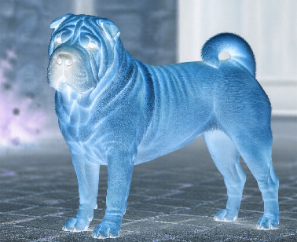{width="188"}|
|{width="188"}|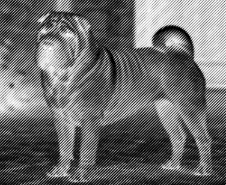{width="188"}|

---
### Levels
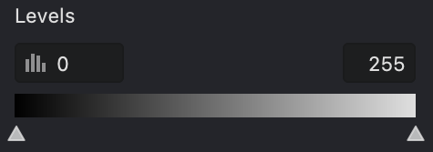{width="300"}

The **Levels** filter adjusts the tonal range of the image by controlling dark tones, midtones, and bright tones.  
It helps improve balance, visibility, and overall contrast.

You can use this filter to make shadows deeper, highlights brighter, or midtones more balanced.  
It is especially useful when the image looks flat, faded, or lacks clear separation between light and dark areas.

Levels is often used for basic tonal correction before applying other filters.  
It gives you more precise control over the image than simple brightness adjustment.

| 0-150 | 40-100 |
|---|---|
|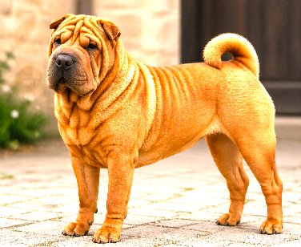{width="188"}|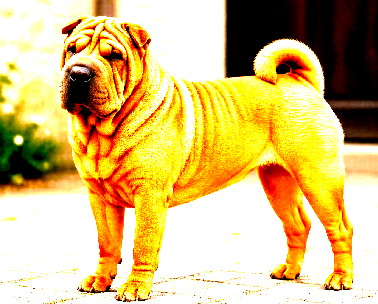{width="188"}|
|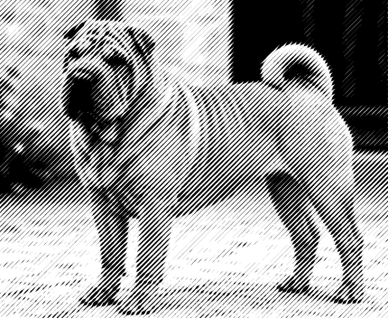{width="188"}|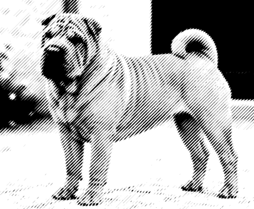{width="188"}|

---

### Blur

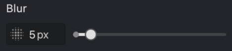{width="300"}

The **Blur** filter softens the image by reducing edge sharpness and fine detail.  
It creates a smoother and less defined appearance.

This filter is useful for reducing noise, softening harsh transitions, or creating a less distracting background.  
It can also be used as part of an artistic effect or to prepare the image for further processing.

A small amount of  blur can make the image look smoother, while a stronger blur can significantly reduce detail.  
Because of this, it should be used carefully when edge definition is important.

| 5 | 25 |
|---|---|
|{width="188"}|{width="188"}|
|{width="188"}|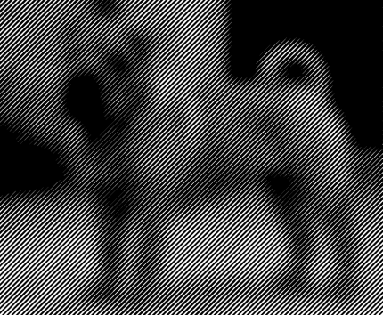{width="188"}|

---

### Sharpen

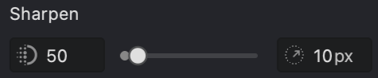{width="300"}

The **Sharpen** filter enhances edges and local contrast to make the image look more defined.  
It increases the visibility of small details and can improve the perception of focus.

This is helpful when an image looks slightly soft or blurred.  
The   Amount setting controls the sharpening strength, while  Radius defines the size of the affected area.

| 50-10 | 250-20 |
|---|---|
|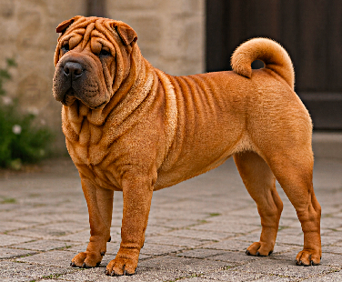{width="188"}|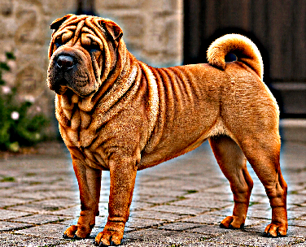{width="188"}|
|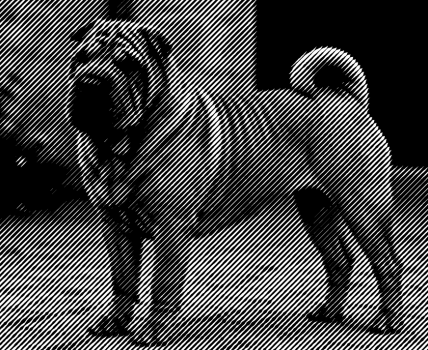{width="188"}|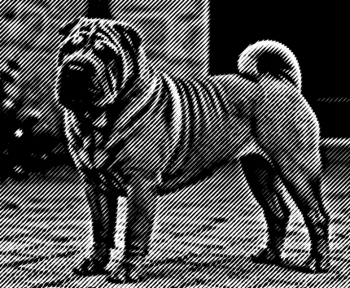{width="188"}|

---

### Shadows / Highlights

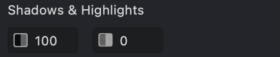{width="300"}

The **Shadows / Highlights** filter adjusts dark and bright regions separately.  
Its main purpose is to recover detail that may be hidden in deep shadows or strong highlights.

 Brightening shadows can reveal information in dark parts of the image without affecting the rest too much.  
 Reducing highlights can restore visibility in overexposed or very bright areas.

| 100-0 | 250-20 |
|---|---|
|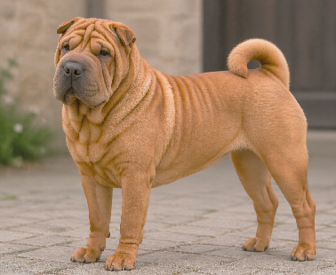{width="188"}|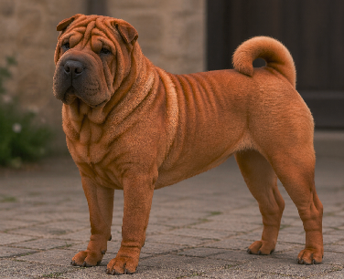{width="188"}|
|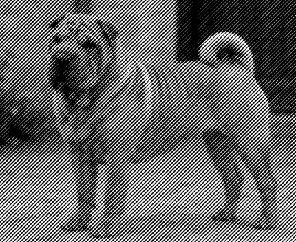{width="188"}|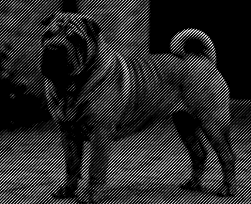{width="188"}|

---

### Remove Background

The **Remove Background** filter isolates the main subject and removes or suppresses the background.  
This helps focus attention on the important object in the image.

It is useful for product images, object extraction, design workflows, and compositions where the background is distracting or unnecessary.  
Depending on the image, this filter may work best when the subject is clearly separated from its surroundings.

| 25 | 100 |
|---|---|
|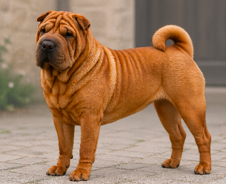{width="188"}|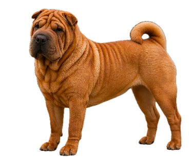{width="188"}|
|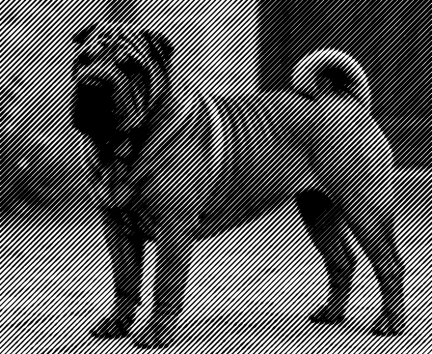{width="188"}|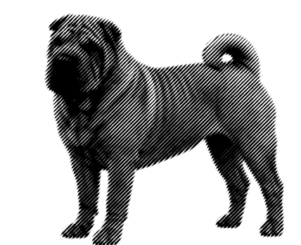{width="188"}|

---

### Color

{width="300"}

The **Color** filter adjusts the target color used for image processing.  
You can define it by choosing a color from  the palette or by sampling it directly from the image with    the eyedropper tool.

 The Diameter setting controls the size of the sampled area.  
A larger diameter averages a wider region, while a smaller one gives a more precise color sample.

|{width="16"}|{width="16"}|
|---|---|
|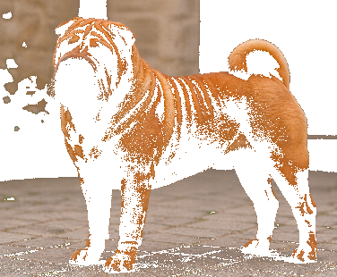{width="188"}|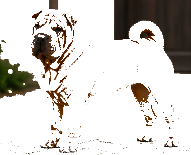{width="188"}|
|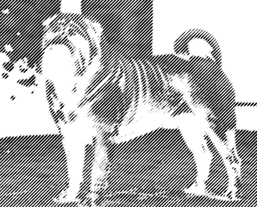{width="188"}|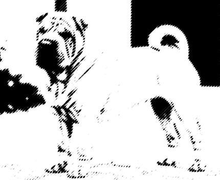{width="188"}|

---

### Gradient

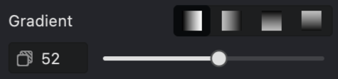{width="300"}

The **Gradient** filter applies a smooth tonal or color transition across the image.  
It can be used to create depth, emphasis, stylized shading, or controlled visual blending.

A gradient may be used to brighten one side of the image, darken another, or introduce a gradual transition between two tones or colors.  
The value setting controls  the strength of the transition, affecting how strongly the gradient blends into the image.

|{width="16"}|{width="16"}|
|---|---|
|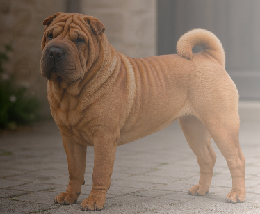{width="188"}|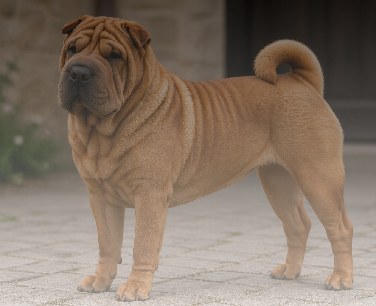{width="188"}|
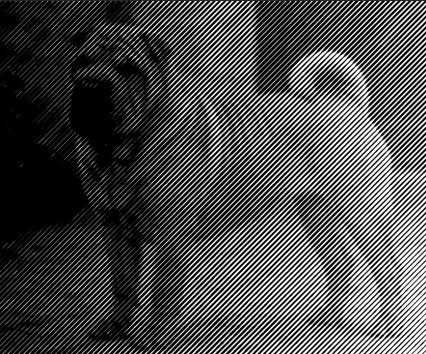{width="188"}|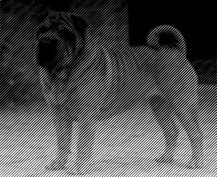{width="188"}|

---

## Summary

These filters can be used individually or combined to improve image quality, correct tonal balance, enhance details, simplify editing, or create specific visual effects.  
A common workflow is to start with **Brightness** and **Contrast**, refine the image with **Shadows / Highlights** and **Sharpen**, and then apply **Color**, **Gradient**, or **Remove Background** depending on the final goal.