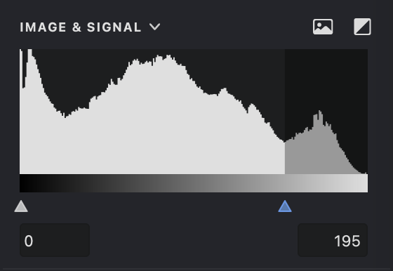
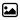
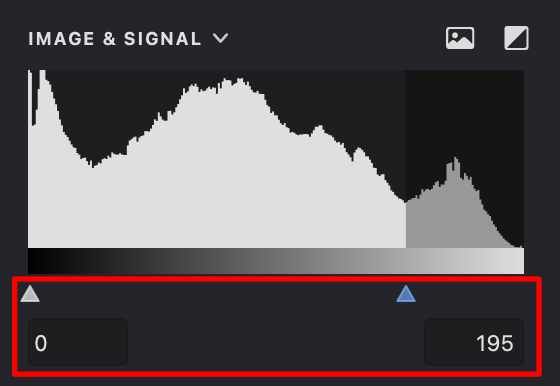
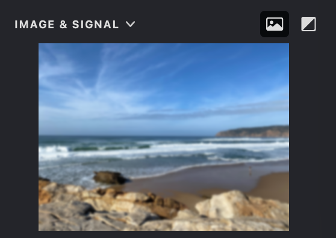

The IMAGE & SIGNAL setting defines the range of gray shades—from pure black to pure white—that Vexy Lines considers when processing your image.

{width="280"}
Imagine a scale from 0 to 255, where 0 is pure black and 255 is pure white. Every number in between represents a different shade of gray. The diagram shows taller columns for the gray values that appear most often in your image—darker on the left and lighter on the right.

 **Invert**: switches the threshold or signal to inverted mode.

 **Image**: displays the source image.

| image | diagram |
| --- | --- |
|{width="300"}|.png){width="300"}|

When using fills with varying line thickness, the darkest parts of your image produce the thickest lines, while the lightest parts produce the thinnest. By adjusting the white color threshold, you can control the precise balance of line thickness in different areas.

| threshold: 0 - 255 | threshold: 0 - 170 | threshold: 0 - 60 |
| --- | --- | --- |
|{width="300"}|.png){width="300"}|.png){width="300"}|

You can set the range of acceptable gray shades using the sliders or by entering values manually into the input fields.

Or you can double-click the indicator to set the optimal threshold value.
{width="280"}

In this example, any part of the source image with a gray value below the minimum or above the maximum is ignored.

| image | threshold: 0 - 255 | threshold: 0 - 150 | threshold: 75 - 150|
| --- | --- | --- | --- |
|{width="300"}|.png){width="300"}|.png){width="300"}|.png){width="300"}|

The fill trace outlines only those parts of the image that fall within the gray value range you've specified.

| image | threshold: 0 - 180 | threshold: 0 - 125 | threshold: 100 - 125 |
| --- | --- | --- | --- |
|{width="300"}|.png){width="300"}|.png){width="300"}|.png){width="300"}

### Inverted Mode

To simplify working with white fills, you can invert the threshold diagram. In inverted mode , the highest gray value (255) appears as black, and the lowest (0) appears as white.

### Show Source Image
Displays the original source image  for reference, making it easier to compare the current result and preview the effect of filters.

{width="280"}

