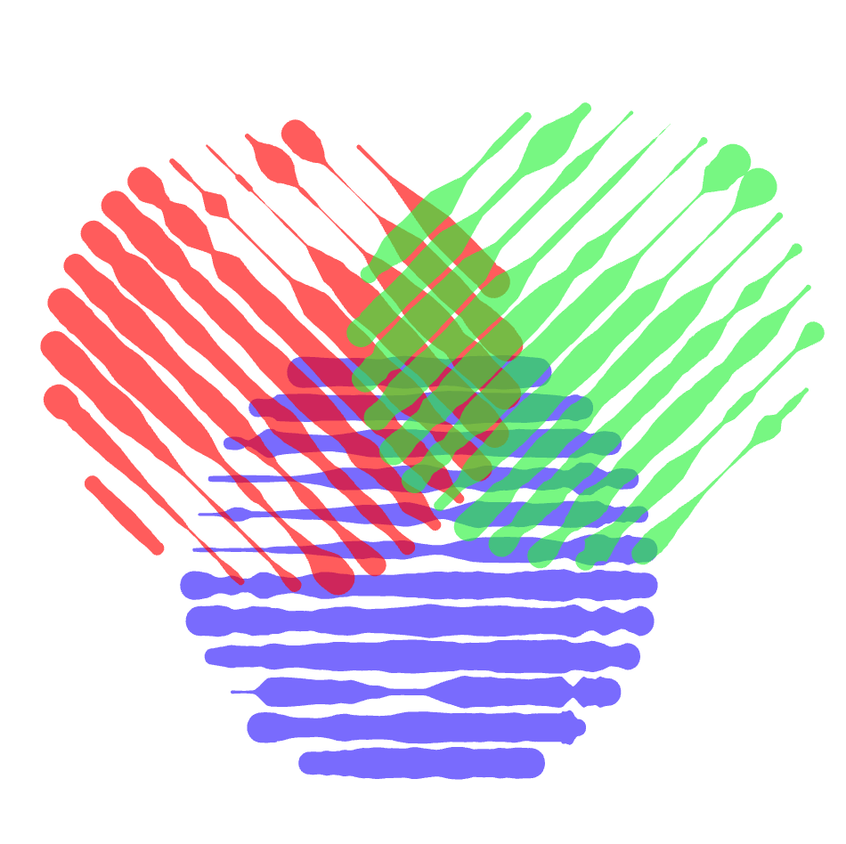

In Vexy Lines, you can control the transparency of fills, layers, and groups using the **Opacity** parameter. This allows for more flexible and nuanced visual compositions.

{width="300"}

When objects overlap, their opacities are combined, resulting in increased transparency effects. This behavior can be used creatively to achieve depth, shading, or subtle layering in your artwork.

{width="472"}