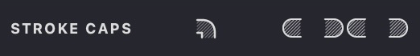

The **STROKE CAPS** section lets you control the appearance of your fill line endings. By adjusting these settings, you can create different visual effects for the start, end, and corners of your strokes.

{width="300"}

> Note: This setting is not applicable to Text, Trace, and Halftone fills.

### Stroke Caps on the Edges

You can individually customize the shape of both left and right stroke caps, as well as the caps at intervals, break points, and dashes throughout your fill lines.

Choose from three cap shapes:

 flat
 round
 triangle

| flat | round | triangle |
| --- | --- | --- |
|{width="300"}|.png){width="300"}|.png){width="300"}|

When using the "triangle" mode, you can adjust the length parameter to control how pointed the cap appears. Higher values create sharper, more elongated caps.

{width="300"}

| length: 1 | length: 2 | length: 5 |
| --- | --- | --- |
|{width="300"}| .png){width="300"}|.png){width="300"}|

This feature is particularly useful for creating fine details like hair or grass.

{width="300"}

### Intermediate Stroke Caps

For gaps and breaks within your fill lines, you can choose between two cap styles:

 round 

 flat

| round | flat |
| --- | --- |
|{width="300"}|.png){width="300"}|

### Join Strokes Caps
When stroke segments meet at corners, you can control how they connect:

**Bevel Join:** Creates a flattened corner by trimming off the point where segments meet.

**Round Join:** Forms smooth, curved corners between connecting stroke segments.

| bevel | round |
| --- | --- |
|.png){width="300"}|.png){width="300"}|

