Use the **STROKE THICKNESS** settings to adjust the thickness of your fill lines and the size of Halftone fill dots.

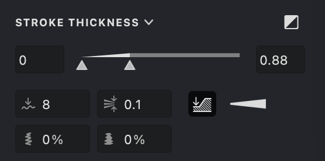{width="280"}

> Note: This setting is not applicable to Text and Trace fills.

Here is an overview of the main settings:

 **Inverted Mode**: reverses thickness behavior so white strokes become thicker instead of darker ones.
 **Smoothing**: smooths transitions between thickness values for softer edges.
 **Line Break Mode**: controls whether new lines start with current or minimum thickness.
 **Auto-thin**: reduces stroke thickness in dense areas to improve clarity.
 **Wobble** (%): adds subtle hand-drawn variation for a more natural look.
 **Rough** (%): introduces fine texture to simulate dry or rough drawing materials.

## Stroke <!--@CVFH{-->Thickness<!--@CVFH}-->

Within the Stroke Thickness section of the Properties panel, you'll find one integrated widget for setting both minimum and maximum thickness values. The left control sets the minimum, the right control sets the maximum, and dragging the stroke in between adjusts both at once.

| thickness: 0 - 0.5 | thickness: 0 - 1 | thickness: 0.2 - 1 |
| --- | --- | --- |
|{height="" width="300"}|.png){height="" width="300"}|.png){height="" width="300"}|

In collapsed mode, only the widget is visible; in expanded mode, numerical fields appear for precise adjustments.

Double-click the thickness indicator to set the optimal stroke width.

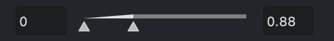{width="300"}

### Inverted Mode

When working with white strokes, you can enable the Inverted Mode option . This reverses the usual effect so that the stroke thickness increases for white rather than dark colors.

| default thickness for black strokes | default thickness for white strokes | inverted thickness for white strokes |
| --- | --- | --- |
|{height="" width="300"}|.png){height="" width="300"}|.png){height="" width="300"}|

Click the expand button  to access additional settings.

### Thickness Transition

Within the additional options, you can choose the mode for how gray shades translate to line thickness. Click the control between the thickness value inputs to select your preferred 
transition mode.

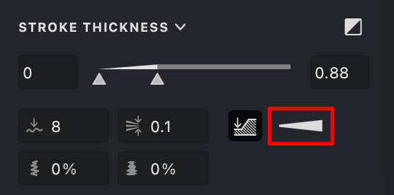{width="300"}

The available transition modes are:
 
 **Linear** The default linear transition.
 **Thick** An ease-out transition where the line thickens quickly at first, then slows down.
 **Thin** An ease-in transition where the line starts thin, then increases rapidly.

*Note:* Switching between these modes does not change the current minimum and maximum thickness values.

| linear | thick | thin |
| --- | --- | --- |
|{height="" width="300"}|.png){height="" width="300"}|.png){height="" width="300"}|

### Smoothing

Use the thickness smoothing parameter  to achieve smoother stroke edges. This setting helps create gentle transitions between different thickness values.

| 0 | 5 | 10 |
| --- | --- | --- |
|{height="" width="300"}|.png){height="" width="300"}|.png){height="" width="300"}|

### Thickness at Line Break Points

The line break setting  determines how stroke thickness resets at the start of a new line:

**on:** The new line begins with the actual (current) thickness.
**off:** The new line always starts with the minimum thickness.

| on | off |
| --- | --- |
|{height="" width="300"}|.png){height="" width="300"}|

### Auto-thin strokes

When enabled,  this feature detects crowded regions in the drawing and automatically <!--@COP8{-->decreases<!--@COP8}--> stroke thickness to reduce visual density and enhance visual clarity.

| 0 | 0.1 | 0.2 * |
| --- | --- | --- |
|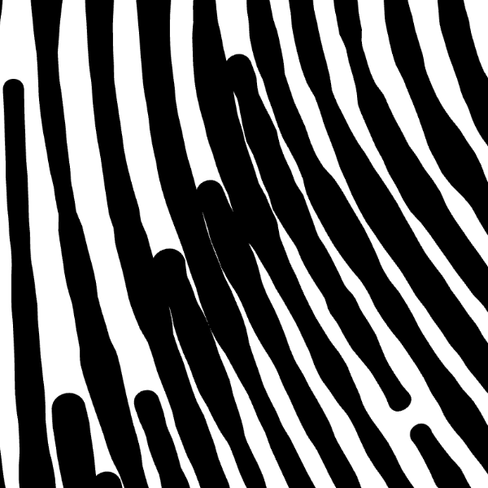{width="300"}|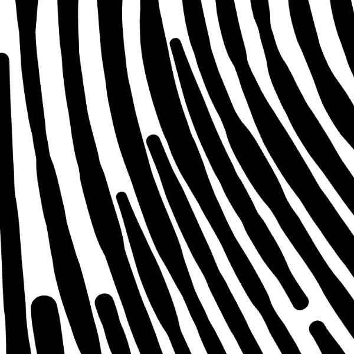{width="300"}|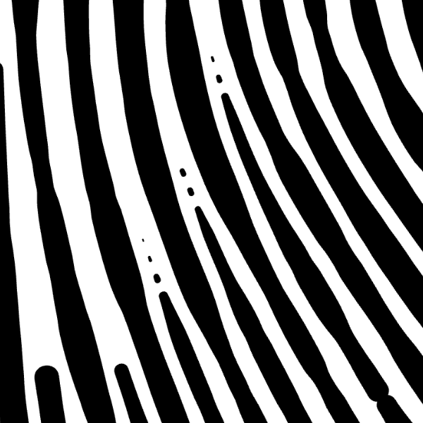{width="300"}|

**Note:* Use the "DASHED LINE" option for a more expressive visual effect.

### Wobble
A subtle hand-drawn **wobble**  that adds natural variation to pen-like strokes. Use it to break perfect curves and give lines an organic, sketchbook feel.

| 0% - off | 20% | 50% |
| --- | --- | --- |
|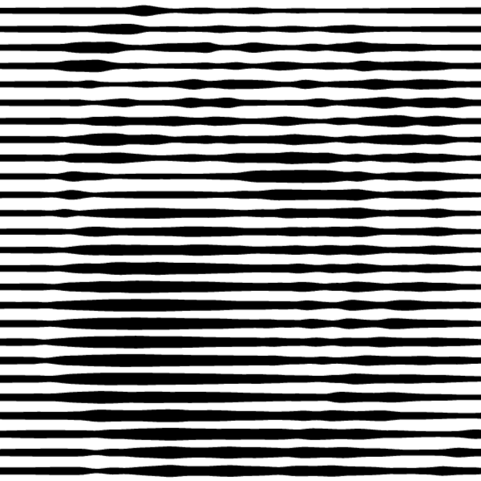{width="300"}|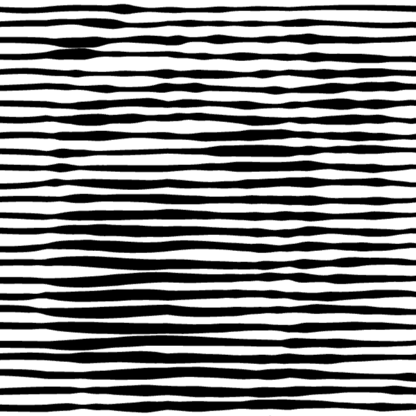{width="300"}|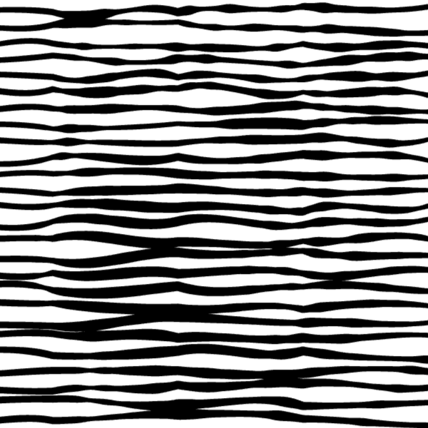{width="300"}|

### Rough strokes
High-frequency paper-grain roughness   that introduces fine texture into strokes. It’s ideal for simulating dry ink, graphite drag, or a lightly abrasive surface.

| 0 - off | 50% | 100% |
| --- | --- | --- |
|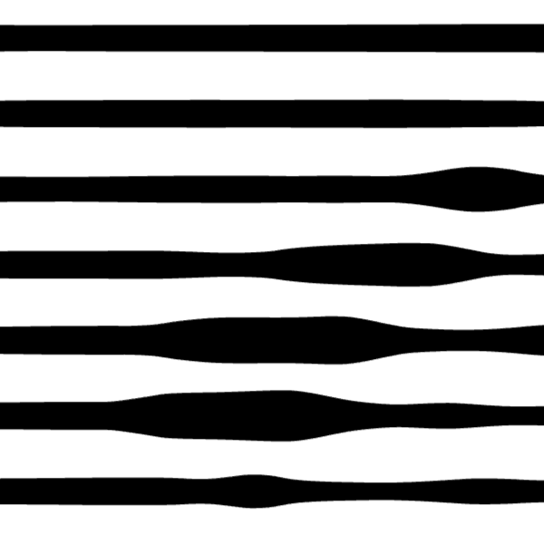{width="300"}|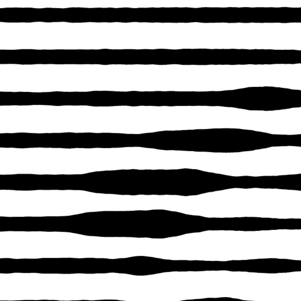{width="300"}|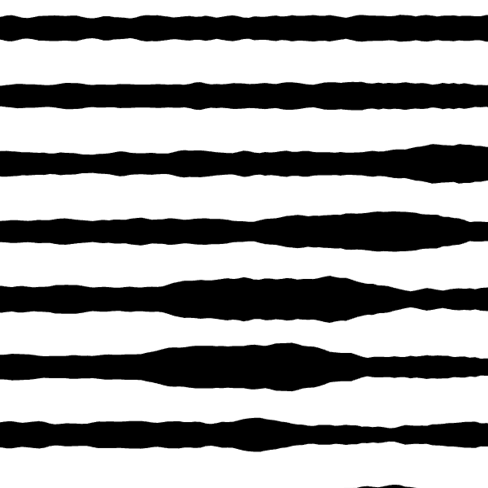{width="300"}|
