The **VIEW** section contains settings that control the appearance of your workspace and interface elements.

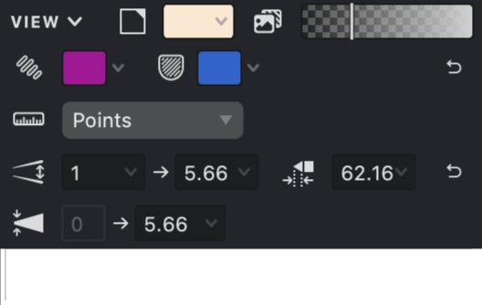{width="300"}

### Visible Image Opacity
This slider controls how visible your imported background image appears while you work. Adjusting the opacity helps you focus on your vector artwork while still maintaining reference to the original image.

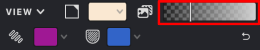{width="300"}

| Opacity: 100% | Opacity: 50% | Opacity: 15% |
| --- | --- | --- |
| {height="" width="300"} | .jpg){height="" width="300"} | .png){height="" width="300"} |
<!--qh-->

### Fill Highlight Color

This setting determines the color used to highlight selected fills. The highlight appears along the contour of your selected objects, making them easy to identify.

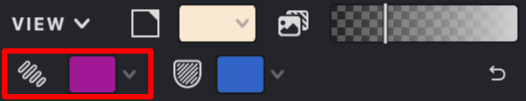{width="300"}

| Red | Green | Cyan |
| --- | --- | --- |
| {height="" width="300"} | .png){height="" width="300"} | .png){height="" width="300"} |

### Mask Highlight Color
This setting controls the color used to highlight masks and mesh grids, making them more visible when selected or edited.

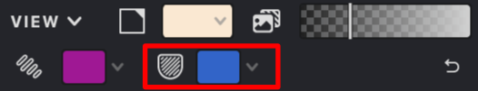{width="300"}

| Red | Green | Cyan |
| --- | --- | --- |
| {height="" width="300"} | .png){height="" width="300"} | .png){height="" width="300"} |

### Background Color

This setting lets you change the color of your workspace background to suit your preferences and improve visibility of your artwork.

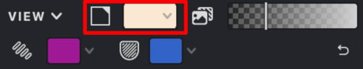{width="300"}

| White | Old Paper | Black |
| --- | --- | --- |
| {height="" width="300"} | .png){height="" width="300"} | .png){height="" width="300"} |

### Measurement Units

This setting determines which measurement system is used throughout your document. The selected unit will appear in input fields, on rulers, and in all measurement-related settings.

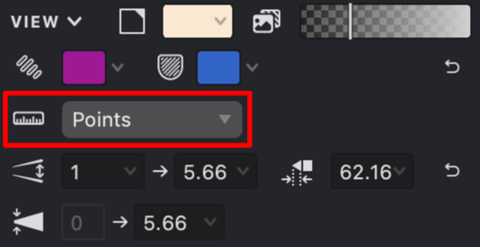{width="300"}

Currently available units:

- Pixels
- Millimeters
- Inches
- Points

### Interval Value Range

These settings define the minimum and maximum values for the Interval parameter. When editing, the Interval parameter cannot exceed or fall below these specified limits.

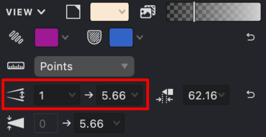{width="300"}

### Thickness Value Range

These settings define the minimum and maximum values for the fill line thickness parameter. The Thickness parameter cannot exceed or fall below these values during editing.

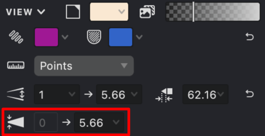{width="300"}

### Maximum Triangular Cap Stroke Length

This setting controls the maximum length allowed for triangular stroke endings, limiting how pointed your stroke caps can become.

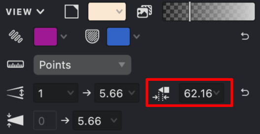{width="300"}

### Document Size

This field displays your document's current dimensions. These values represent the boundaries of your working area.

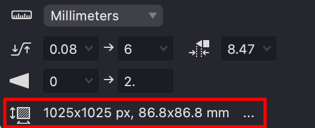{width="300"}

To change these parameters, click the **"..."** button.
As a result, a document size settings window will open, where you can enter the required document dimensions.
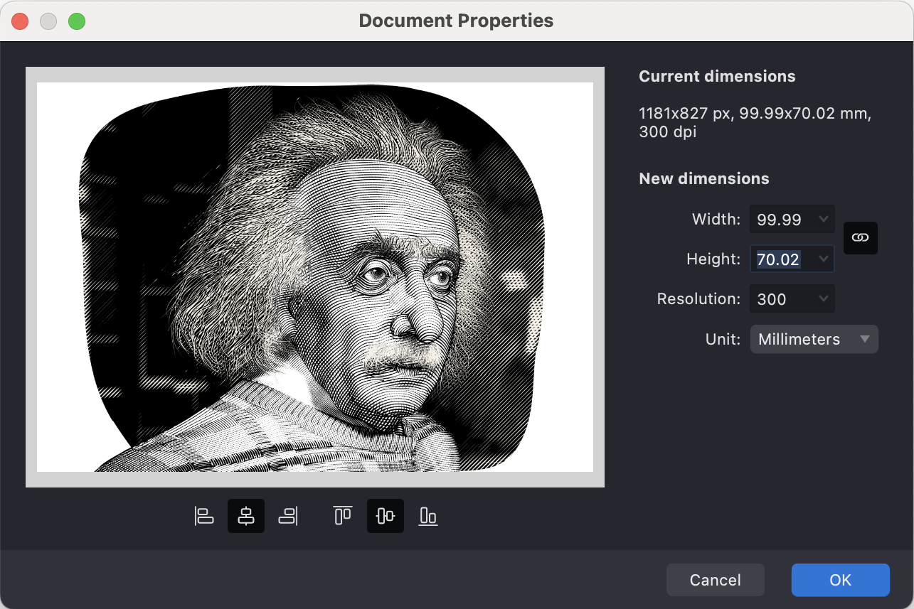{height="" width="642"}

