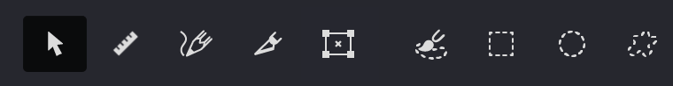
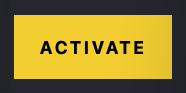

The **Toolbar** gives you quick access to essential tools and controls. Located at the top of the workspace, it's designed to streamline your workflow.

### Tool Buttons
These tools help you create, select, and modify objects in your designs.

{width="380"}

 **Editor tool** {*V*} - Your primary selection and manipulation tool. Use it to select objects, move and transform elements, edit curve points, and modify nodes with precision.

 **Meter tool** {*R*} - Measure distances and angles in your chosen unit system. Displays length in current document units and angles in degrees, perfect for precise alignment and planning.

 **Pencil tool** {*P*} - Draw freehand strokes to create and edit Handmade fills. Ideal for tracing irregular shapes and adding natural-looking artistic details.

 **Knife tool** {*K*} - Insert points, split curves, or cut paths. Perfect for dividing shapes and refining contours in Handmade fills and mask editing.

 **Transform tool** {*Cmd+T*} - Rotate, resize, move, and skew objects with precision controls.

 **Brush tool** {*B*} - Paint mask areas with natural brush strokes, with pressure sensitivity support for tablets. Ideal for creating organic, painterly mask effects.

 **Rectangle tool** {*I*} - Create rectangular masks for applying fills to specific areas. Hold {*⇧*} for perfect squares and use auto-detection to capture shapes in images.

 **Ellipse tool** {*O*} - Create circular or oval masks for applying fills to specific areas. Hold {*⇧*} for perfect circles and use auto-detection features for existing shapes.

 **Freeform tool** {*S*} - Create custom-shaped masks by drawing freehand or using automatic shape detection. Perfect for complex or irregular mask areas.

You can toggle text labels for tools through **Window -> Toolbar -> Text Labels**.

### Refresh buttons
These controls determine how and when fills update after making changes to your document.

{width="134"}

 **Auto Refresh** - When active, fills and layers update automatically as you make changes.

 **Refresh Fill** - Updates only the currently selected fill.

 **Refresh All** - Updates all fills and layers throughout your document.

> To show this panel in your toolbar, go to **Window → Toolbar → Refresh Buttons**.

### Undo buttons
These buttons let you step backward or forward through your editing history.

{width="87"}

 **Undo** {*⌘Z*}/{*⌃Z*} - Reverses your last action, letting you step back through your editing history.

 **Redo** {*⌘⇧Z*}/{*⌃{*⇧Z*} - Restores actions that were previously undone, allowing you to move forward in your editing history.

> To show this panel in your toolbar, go to **Window → Toolbar → Undo Buttons**.

### Zoom buttons
These controls adjust your view of the artwork, helping you focus on details or see the big picture.

{width="170"}

> To show this panel in your toolbar, go to **Window → Toolbar → Zoom Buttons**.

$~$

 **Zoom in** - Magnifies your view to see fine details.

 **Zoom out** - Reduces magnification to see more of your artwork at once.

 **Zoom to Selected** - Automatically zooms to frame your currently selected objects.

 **Zoom to Actual Size** - Shows your artwork at 100% scale.

### View mode buttons
These buttons control what elements are visible in your workspace, helping you focus on specific aspects of your design.

{width="182"}

 **Highlight edges** - Makes stroke and shape edges more visible for easier selection and editing.

 **Show masks** - Toggles visibility of masks and mesh edges in your document.

 **Show fills** - Toggles visibility of all fill patterns in your document.

 **Show images** - Toggles visibility of imported reference images.

### Activation button

This button appears only in unregistered copies of Vexy Lines. Click it to activate your software and unlock all features.

{width="93"}

