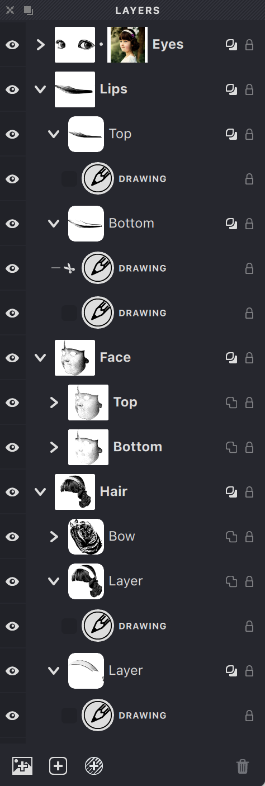

Vexy Lines turns a photograph into vector lines. You drop in a bitmap, stack some layers with different fill types, and the app produces strokes that thicken where the image is dark and vanish where it’s light. The result exports as SVG, PDF, or EPS.

## The rendering pipeline

At the heart of every Vexy Lines document is a **source image** — a bitmap that supplies brightness data. A photograph of a face, a scanned texture, a flat gradient, anything with light and dark areas. Vexy Lines is primarily guided by the differences in the brightness of your Source Image, but may use its colors. The Source Image never appears in the final exported artwork. 

A **fill** takes that source image and turns it into vector strokes. It does this in three steps:

**1. It generates pattern paths.** The fill lays down base geometry across the canvas: it produces pattern paths based on the fill parameters like pattern size (interval), angle, interval randomization etc. These pattern paths, like parallel lines for a Linear fill, sinusoids for Wave, dot grids for Halftone, are scaffolding: they describe where strokes can exist, not how thick they’ll be. 

**2. It filters the source image into a signal.** Through its Image Properties (Brightness, Contrast, and Image Threshold) the fill reads the source image and produces a grayscale **signal**: a continuous field of “how dark is this point?” Two fills looking at the same photograph can see completely different tonal landscapes — one tuned for highlights, another for shadows.

**3. It combines pattern paths and signal into rendered strokes.** The fill walks each pattern path and modulates thickness according to the local signal value and the fill’s parameters like the thickness range, smoothing and auto thinning. Where the signal is strong, strokes fatten. Where it’s weak, they thin or disappear. The result is then rendered as closed vector outlines: the strokes you see on the canvas and that land in your export.

That’s the core pipeline: **source image → signal + pattern paths → rendered strokes**.

## Layers

**Layer** is a transparent sheet that holds one or more fills. Every document needs at least one layer with at least one fill.

A layer adds two things on top of the rendering pipeline: a mask and a mesh.

**Mask** is a vector stencil that restricts where the layer’s fills can draw. Transparent areas reveal, opaque areas hide. Without a mask, the layer covers the entire canvas. 

If a layer higher in the same group has **Mask Overlay** turned on, then the transparent regions of its mask are treated as fully opaque regions of the masks of every layer below. So with just one mask, you can fill part of the canvas with one fill, and the complementing part with another fill.

A normal mask defines the edge of the pattern paths: the terminals of a stroke rendered from this path may exceed the edge, and a halftone dot is either fully visible or fully hidden. A sharp mask cuts right through the rendered strokes and dots. The smooth mask feathers the stroke thickess at the edges, and offers optional Mask Overlay strength.  

**Mesh** is a deformation grid applied to the entire layer, bending all its fills at once. The mesh warps the rendered strokes after the tonal work is done — purely spatial.

So the full sequence for a single layer is: resolve the drawing region (mask + overlay) → each fill renders its strokes → the mesh deforms the result.

{width="227"}

## Groups

**Group** bundles layers together and carries its own **source image** — the bitmap that feeds every layer inside. Think of it as a folder:

* Layers
* Other groups (sub-groups)
* A source image

The document itself is the top-level group. 

If a group has no source image, it inherits its parent’s. This cascades to the document root. Set one photograph at the top level and every nested group rides on it — or override at any depth with a different image. Vexy Lines accepts PNG, JPEG, SVG, and PDF.

Groups let you toggle visibility across layers at once, move them together, or swap a source image and watch every layer inside react.

Vexy Lines walks the Layers panel top to bottom, group by group, layer by layer, rendering each fill in order.

## When something looks wrong

The pipeline flows one direction. Trace backwards from the symptom:

* **Wrong tones?** Adjust the fill’s Image Properties — Brightness, Contrast, or Image Threshold.
* **Strokes where they shouldn’t be?** Check the mask. Check whether a higher layer’s Mask Overlay should be cutting them out.
* **Right tones, wrong line shape?** Change the fill type or its pattern parameters.
* **Right shape, wrong thickness?** Tune the fill’s Contrast or Image Threshold — these control how signal maps to stroke weight.
* **Right strokes, wrong distortion?** Adjust or remove the mesh.

## Building

One source image, one layer, one fill: that alone exports vector art.

Everything else is stacking:

* Multiple fills per layer — combine line styles, each reading the signal its own way.
* Masks — carve the canvas so different layers handle different regions.
* Mask Overlay — let upper layers protect lower ones from overdraw.
* Groups — organize layers around distinct source images.
* Nested groups — source image inheritance keeps the setup clean.
* Meshes — bend the result after the fact.

The next sections will explore each of these components in more detail.
