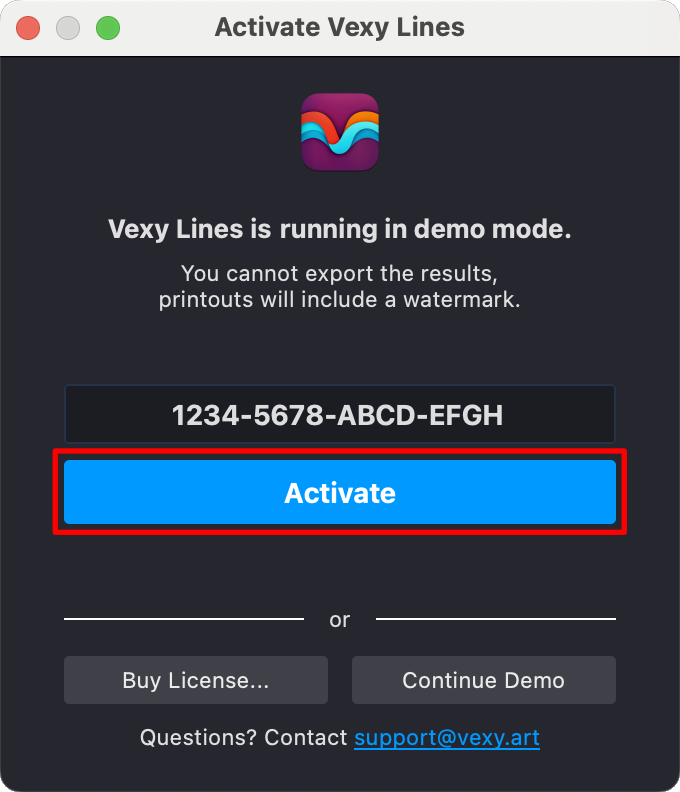
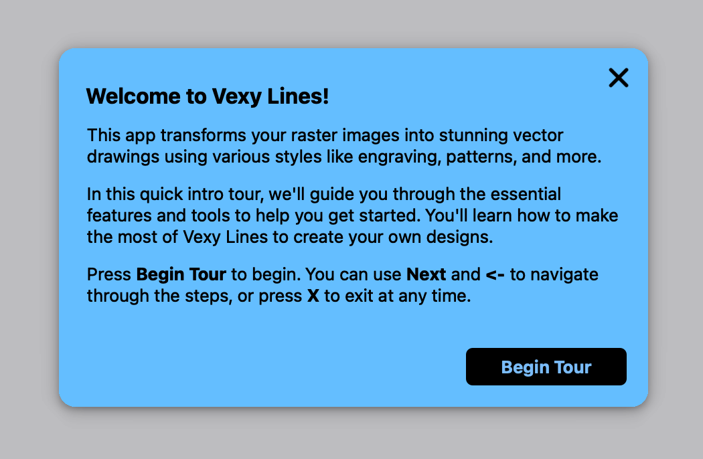
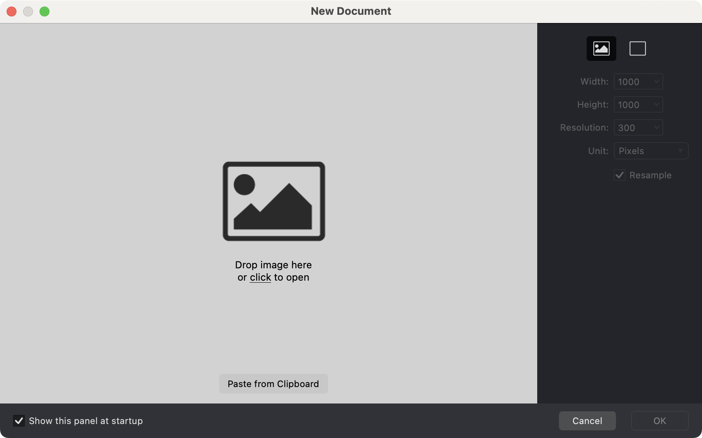
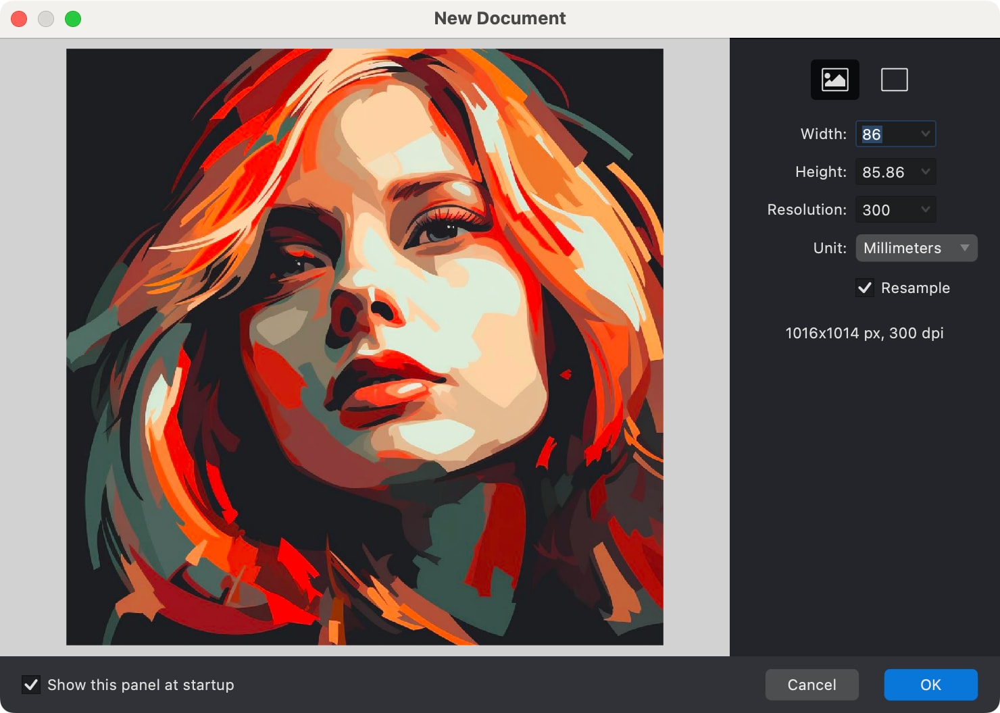
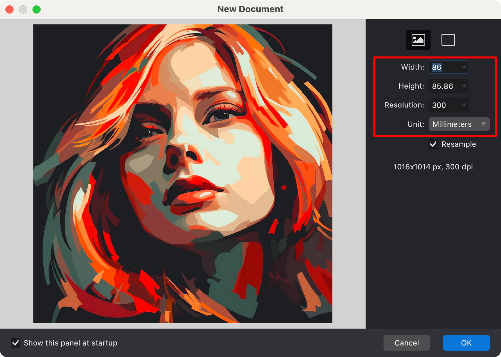
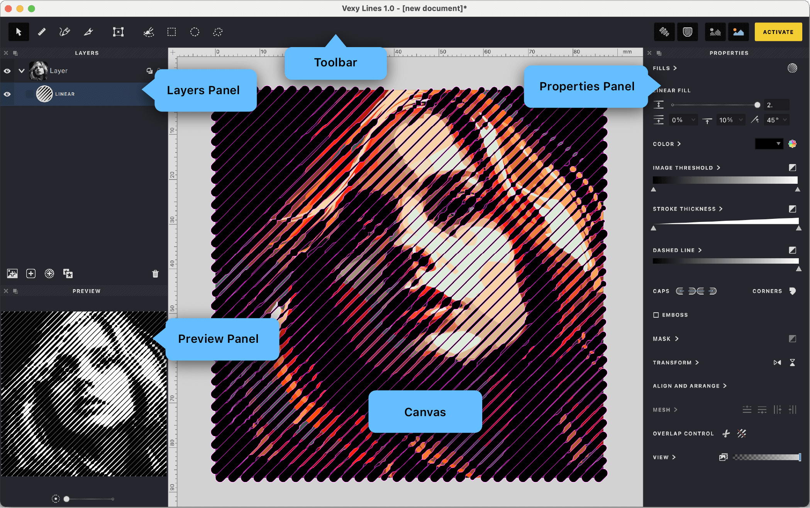
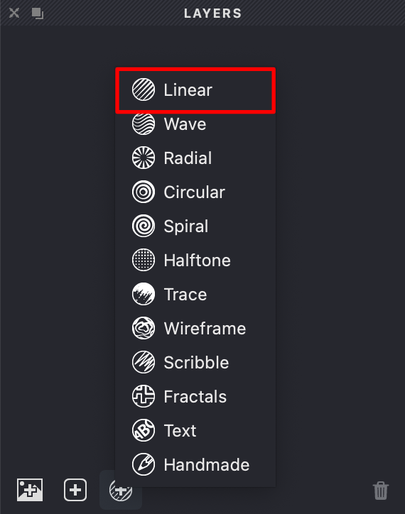
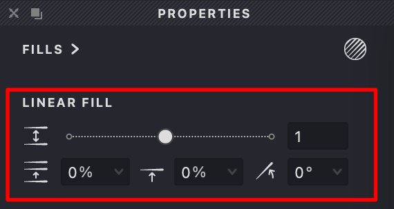
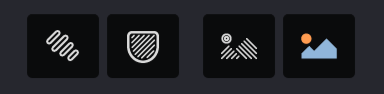

*Welcome!*

Let’s quickly set up Vexy Lines so you can start creating stunning vector artwork. This guide is designed to be easy to follow, even if you’re new to design software.

## Before You Begin

Ensure your computer meets these **system requirements**:

* **Mac**: macOS 12 (Monterey) or newer.
* **Windows**: Windows 10 or later.
* **Memory**: Minimum 4 GB RAM.
* **Internet**: An internet connection is required for initial setup.

## Installation

Follow these steps to download and install Vexy Lines:

1. Visit [https://www.vexy.art](https://www.vexy.art).
2. Click the **TRY FREE** button and select your operating system.
3. Double-click the downloaded installer file and follow the on-screen instructions.
4. After installation, launch **Vexy Lines** by clicking its icon in your **Applications** folder or **Start menu**.

{height="64" width=""}

## Activation

**Activate Vexy Lines upon first launch:**

1. The activation window appears automatically, or you can click **ACTIVATE** in the top-right corner.
   {width="267"}
2. Enter the serial number from your purchase confirmation email.
   {width="340"}
3. Click **Activate** to finish.
   {width="340"}

No license yet? Click **Continue Demo** to explore Vexy Lines in trial mode.

## Intro Tour

An interactive Intro Tour starts automatically the first time you launch Vexy Lines:

{width="400"}

This tour introduces essential features:

* **Toolbar**: Main tools for creating and editing.
* **Editor Tools**: Tools like Meter, Pencil, and Transform.
* **Masking Tools**: Shape and refine artwork.
* **Layers Panel**: Organize document structure.
* **Properties Panel**: Customize fills, colors, and settings.
* **View Controls**: Toggle visibility of fills and images.

Navigate the tour using {[Next]}, {[Back]}, or press {[X]} to exit. Access it anytime via **Help > Intro Tour**.

## Create Your First Document

1. Select **File > New** in the main menu.

   {width="852"}

3. Drag and drop your inspiration image into the window.

   {width="740"}

You can download sample images from the [Vexy Lines website](https://samples.vexy.art).

3. Adjust the document size if needed.

   {width="740"}

5. Click {[OK]} to start creating!

## Workspace Overview

Familiarize yourself with the layout:

{width="1049"}

* **Canvas**: Your main drawing area.
* **Tools Panel**: Essential tools for vector art.
* **Properties Panel**: Adjust details of selected items.
* **Layers Panel**: Organize artwork layers.
* **Preview Panel**: Real-time artwork preview.

**Navigation Tips:**

* **Zoom**: {*⌘+*} / {*⌘−*} (Mac) or {*⌃+*} / {*⌃−*} (Windows).
* **Pan**: Hold {*Space*} and drag.
* **Reset View**: Double-click the **Hand** tool.

## Create Your First Fill

* A fill is a pattern of lines that forms your artwork.
* Select **Fill > New > Linear** for straight lines or **Wave** for curves.
* Or click  in the **Layers Panel**.

{width="285"}

## Experiment with Fill Properties

* Use sliders in the **Properties Panel** to adjust interval, angle, and thickness.
* Watch your artwork update instantly.

{width="285"}

## Switch Between Views

* Use **View Controls** to compare your vector art with the original image.
* Adjust image opacity to check your progress.

{width="192"}

## Save Your Work

* Regularly save using {*⌘S*} (Mac) or {*⌃S*} (Windows).
* Document are saved as `.lines` files.

## Helpful Tips

* Start with simple images like silhouettes or outlines.
* Use the **Preview Panel** frequently to review the final result.
* Experiment with different fill types.
* Regularly save your work, even though automatic backups are available.
* Visit our community forum for support and inspiration.

## Need Help?

We’re here to assist:

* **Documentation**: Access via **Help > User Manual**.
* **Tutorials**: Beginner-friendly videos at [vexy.tv](https://vexy.tv).
* **Support**: Contact our team at [support.vexy.art](https://support.vexy.art).
* **Community**: Join discussions in our [forum](https://forum.fontlab.com/vexy-lines/).

Ready to create something amazing? Let’s explore more features in the following sections!