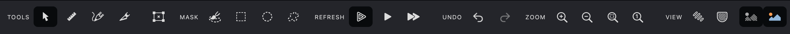

Vexy Lines converts raster images into beautiful vector artwork. This guide introduces the main interface elements to help you start creating quickly.

{width="600"}

## Main Canvas

Your primary workspace for visualizing and editing artwork.

### Essential Navigation

Navigate your canvas efficiently with these shortcuts:

**Zooming**

* {*Z*}: Zoom in toward the cursor.
* {*X*}: Zoom out.
* {*⌘+*} / {*⌘−*} (Mac) or {*⌃+*} / {*⌃−*} (Windows): Quick zoom.
* {*⌘2*}: Zoom to the selected area.
* {*⌘3*}: Fit artwork to screen.
* {*⌥*} + **Mouse Wheel** or trackpad pinch: *Dynamic zoom adjustment*.

**Moving**

* {*␣*} + **Drag**: Pan across the canvas.
* {*⌘␣*}: Dynamic zoom or frame zoom on specific areas.

## Toolbar

Quick access to essential drawing and editing tools.

{width="600"}

### Editor Tools

 **Editor Tool** {*V*}: Select, move, and modify objects and nodes.
 **Meter Tool** {*R*}: Measure distances and angles.
 **Pencil Tool** {*P*}: Draw freehand strokes.
 **Knife Tool** {*K*}: Split and edit curves and paths.
 **Transform Tool** {*⌘T*}/{*⌃T*}: Scale, rotate, and precisely adjust objects.

### Masking Tools

 **Brush Tool** {*B*}: Paint masks freehand with adjustable brush size.
 **Rectangle Tool** {*I*}: Create rectangular masks, including perfect squares.
 **Ellipse Tool** {*O*}: Draw circular or oval masks.
 **Freeform Tool** {*S*}: Create custom shapes or auto-detect complex areas.

### Refresh Options

 **Auto Refresh**: Automatically update artwork as you work.
 **Refresh Fill**: Quickly update the active fill.
 **Refresh All**: Update all fills simultaneously.

### Undo & Redo

 **Undo** {*⌘Z*}/{*⌘Z*}: Step backward through recent actions.
 **Redo** {*⌘Z*}/{*⌘Z*}: Restore previously undone actions.

### Zoom Commands

 **Zoom In**: Magnify the view for detailed editing.
 **Zoom Out**: Reduce magnification to see more of your artwork.
 **Zoom to Selected**: Frame selected objects automatically.
 **Zoom to Actual Size**: Display artwork at 100% scale.

### View Controls

 **Highlight Selection**: Emphasize edges of selected objects for easier editing.
 **Highlight Masks**: Display mask boundaries clearly.
 **Show Fills**: Toggle visibility of vector fills.
 **Show Images**: Show or hide source images.

> Use commands in the **Window > Toolbar** menu to display Refresh, Undo, and Zoom buttons.

{width="712"}

## Panels

Vexy Lines includes several panels for detailed control:

**Properties Panel**
Adjust fills, colors, masks, and effects.

**Layers Panel**
Organize layers for structured, editable documents.

**History Panel**
Track and manage recent actions.

**Preview Panel**
Instantly preview your artwork.

**Help Panel**
View contextual information about tools and features.

## Menu System

Access all features through logically grouped menus:

* **File**: Create, open, save, import, export
* **Edit**: Standard editing commands and preferences
* **View**: Workspace and viewing options
* **Layer**: Manage layers, groups, masks
* **Fill**: Create and modify vector fills
* **Tools**: Drawing and editing tools
* **Window**: Panel visibility and arrangement
* **Help**: Documentation, tutorials, Intro Tour

## Interactive Tour

Access the interactive Intro Tour anytime via **Help > Intro Tour**. This guided tour highlights key features, helping you quickly master the basics.